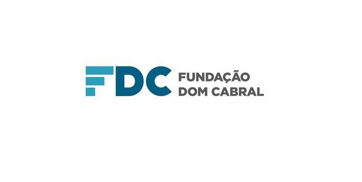
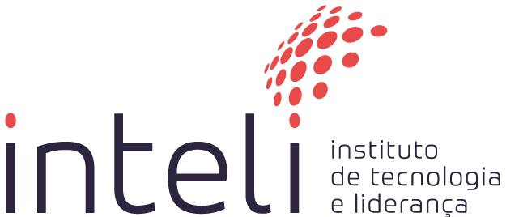

<Table>
  <tr>
    <td><a href= "https://www.fdc.org.br/"></td>
    <td>
      <a href= "https://www.inteli.edu.br/"></a>
    </td>
  </tr>
</table>

# Nome do Projeto: CLI

## Nome do Grupo: Criando Legados e Impactos (CLI)

## Integrantes:

- <a href="https://www.linkedin.com/in/eduarda-cardoso-de-souza-8bb802268/">Eduarda Cardoso de Souza</a>
- <a href="https://www.linkedin.com/in/henrique-ottoboni-magalhaes-tecnologia/">Henrique Ottoboni Magalhães</a>
- <a href="https://www.linkedin.com/in/leandro-dos-santos-gomes/">Leandro dos Santos Gomes</a>
- <a href="https://www.linkedin.com/in/rafael-coutinho2004/">Rafael Coutinho</a>
- <a href="https://www.linkedin.com/in/raphaela-guiland-ferraz/">Raphaela Guiland Ferraz</a>


## Professores:
### Orientador(a) 
- <a href="https://www.linkedin.com/in/vanunes/">Vanessa Nunes</a>
### Instrutores
- <a href="https://www.linkedin.com/in/jefferson-o-silva/">Computação - Jefferson de Oliveira</a>
- <a href="https://www.linkedin.com/in/jose-romualdo/">Computação - Josè Romualdo</a>
- <a href="https://www.linkedin.com/in/diogo-martins-gon%C3%A7alves-de-morais-96404732/">Matemática e Física - Diogo Martins</a>
- <a href="https://www.linkedin.com/in/rafael-jacomossi-6135b0a1/">Negócios - Rafael Jacomossi</a>
- <a href="https://www.linkedin.com/in/gui-cestari/">Design - Guilherme Cestari</a> 
- <a href="https://www.linkedin.com/in/anacristinadossantos/">Liderança - Ana Cristina dos Santos</a>

## 📝 Descrição

&emsp; O projeto proposto para a Fundação Dom Cabral envolve o desenvolvimento de uma plataforma tecnológica que visa facilitar a gestão eficiente e produtiva do cadastro e da interação entre os projetos dos executivos participantes do CEO's Legacy. A solução será um aplicativo móvel que permitirá aos líderes executivos monitorar e colaborar ativamente em seus projetos, identificando e aproveitando sinergias potenciais entre eles. A plataforma proporcionará uma visão unificada dos projetos, facilitando a comunicação e colaboração entre os líderes e suas equipes, além de fornecer insights valiosos para a criação de valor compartilhado. Essa solução integrada melhorará significativamente a eficiência operacional das empresas lideradas pelos CEO's participantes, promovendo um ambiente colaborativo e sustentável.

## 📝 LINKS

<a href="/documentos/index-T09-M6.md">Link para a documentação geral do projeto.</a>

## 📁 Estrutura de pastas
|--> dataset<br>
|--> documentos<br>
  &emsp;| --> imagens <br>
|--> src<br>
  &emsp;|--> frontend<br>
  &emsp;&emsp;|--> .expo<br>
  &emsp;&emsp;|--> assets<br>
  &emsp;&emsp;|--> components<br>
    &emsp;&emsp;&emsp;|--> Button<br>
    &emsp;&emsp;&emsp;|--> Card<br>
    &emsp;&emsp;&emsp;|--> CardTimeline<br>
    &emsp;&emsp;&emsp;|--> CategoryButton<br>
    &emsp;&emsp;&emsp;|--> Footer<br>
    &emsp;&emsp;&emsp;|--> Header<br>
    &emsp;&emsp;&emsp;|--> IconGreen<br>
    &emsp;&emsp;&emsp;|--> Input<br>
    &emsp;&emsp;&emsp;|--> TextArea<br>
    &emsp;&emsp;&emsp;|--> Title<br>
  &emsp;&emsp;|--> layout<br>
  &emsp;&emsp;|--> navigation<br>
  &emsp;&emsp;|--> node_modules<br>
  &emsp;&emsp;|--> screens<br>
    &emsp;&emsp;&emsp;|--> AddProjectScreen<br>
    &emsp;&emsp;&emsp;|--> EditProjectScreen<br>
    &emsp;&emsp;&emsp;|--> HomeScreen<br>
    &emsp;&emsp;&emsp;|--> InterestScreen<br>
    &emsp;&emsp;&emsp;|--> LoginScreen<br>
    &emsp;&emsp;&emsp;|--> MyProjectsScreen<br>
    &emsp;&emsp;&emsp;|--> NotificationScreen<br>
    &emsp;&emsp;&emsp;|--> ProfileInformationScreen<br>
    &emsp;&emsp;&emsp;|--> ProjectScreen<br>
    &emsp;&emsp;&emsp;|--> RecommendScreen<br>
    &emsp;&emsp;&emsp;|--> RegisterScreen<br>
    &emsp;&emsp;&emsp;|--> SearchResultsScreen<br>
    &emsp;&emsp;&emsp;|--> TimelineScreen<br>
  &emsp;&emsp;|--> services<br>
  &emsp;|--> services<br>
    &emsp;&emsp;|--> avatars<br>
    &emsp;&emsp;|--> connections<br>
    &emsp;&emsp;|--> core<br>
    &emsp;&emsp;|--> model<br>
    &emsp;&emsp;|--> projects<br>

Dentre os arquivos presentes na raiz do projeto, definem-se:

- <b>dataset</b>: Está pasta contém conjuntos de dados que podem ser utilizados no projeto, como arquivos CSV, JSON, ou qualquer outro formato de dados estruturados.

- <b>README.md</b>: Arquivo que serve como guia de explicação geral sobre o projeto (o mesmo que você está lendo agora).

- <b>documentos</b>: Aqui estão todos os documentos do projeto. 

- <b>src</b>: Nesta pasta encontra-se todo o código-fonte do projeto, incluindo a parte do frontend e possíveis serviços backend.

## 💻 Configuração para desenvolvimento

Para configurar o desenvolvimento da aplicação, [instale o git](https://git-scm.com/downloads) e clone esse repositório em seu computador através do comando:

```
git clone https://github.com/Inteli-College/2024-1B-T09-ES06-G04.git
```
Em seguida siga as instruções presentes em nosso <a href="/documentos/outros/manual-instalacao.md">manual de instalação</a>.

## 🗃 Histórico de lançamentos

* 0.1.0 - 26/04/2024
    * Entendimento do negócio
    * Especificação do Sistema
    * Wireframe Mobile
    * Base de Dados para Modelo de Recomendação
* 0.2.0 - 10/05/2024
    * Documentação do Projeto e desenvolvimento do Backend
    * Mockup Navegável com Abordagem Mobile First
    * Definição e Construção do Backend
    * Modelo de Recomendação Baseado em Filtragem Colaborativa
* 0.3.0 - 24/05/2024
    * Teste de Usabilidade para Mockup
    * Testes de API Externa utilizando SOA
    * Front-end Mobile
* 0.4.0 - 07/06/2024
    * Integração das APIs, SOA, Mobile e Banco de Dados - Documentação
    * Testes de Integração do sistema
    * Análise de Usabilidade no Front-End
    * Integração das APIs, SOA, Mobile e Banco de Dados
    * Testes de Integração entre Modelo de Recomendação baseado em Filtragem Colaborativa
* 0.5.0 - 21/06/2024
    * Versão Final da Arquitetura
    * Refinamento do Código

## 📋 Licença/License

<p xmlns:cc="http://creativecommons.org/ns#" xmlns:dct="http://purl.org/dc/terms/"><a property="dct:title" rel="cc:attributionURL" href="https://github.com/2023M6T6Inteli/grupo1"><nome do projeto></a> by <a rel="cc:attributionURL dct:creator" property="cc:attributionName" href="https://github.com/2023M6T6Inteli/grupo1">INTELI, <aluno1>, <aluno2>, <aluno3>, <aluno4>, <aluno5>, <aluno6></a> is licensed under <a href="http://creativecommons.org/licenses/by/4.0/?ref=chooser-v1" target="_blank" rel="license noopener noreferrer" style="display:inline-block;">Attribution 4.0 International</a></p>
