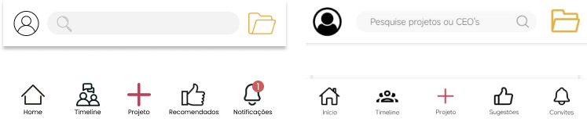
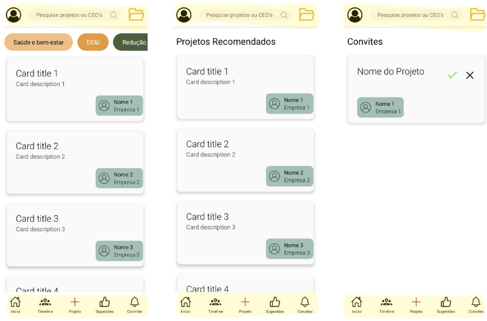
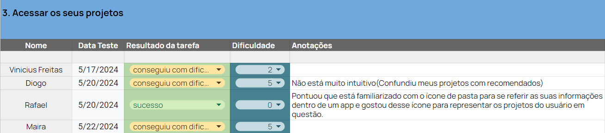

<table>
<tr>
<Table>
  <tr>
    <td><a href= "https://www.fdc.org.br/"></td>
    <td>
      <a href= "https://www.inteli.edu.br/"></a>
    </td>
  </tr>
</table>

#  CLI

## Criando Legados e Impactos (CLI)

## :student: Integrantes:

- <a href="https://www.linkedin.com/in/eduarda-cardoso-de-souza-8bb802268/" target="_blank">Eduarda Cardoso de Souza</a>
- <a href="https://www.linkedin.com/in/henrique-ottoboni-magalhaes-tecnologia/" target="_blank">Henrique Ottoboni Magalhães</a>
- <a href="https://www.linkedin.com/in/leandro-dos-santos-gomes/" target="_blank">Leandro dos Santos Gomes</a>
- <a href="https://www.linkedin.com/in/rafael-coutinho2004/" target="_blank">Rafael Coutinho</a>
- <a href="https://www.linkedin.com/in/raphaela-guiland-ferraz/" target="_blank">Raphaela Guiland Ferraz</a>

## Sumário

- [1. Termos e Abreviações](#1-termos-e-abreviações)
- [2. Visão Geral do Projeto](#2-visão-geral-do-projeto)
  - [2.1 Entendimento do Parceiro](#21-entendimento-do-parceiro)
  - [2.2 Problema](#22-problema)
- [3. Proposta da Solução](#3-proposta-da-solução)
  - [3.1 Descritivo Geral da Solução](#31-descritivo-geral-da-solução)
  - [3.2 Proposta Tecnológica e Benefícios](#32-proposta-tecnológica-e-benefícios)
  - [3.3 Proposta de Valor (Value Proposition Canvas)](#33-proposta-de-valor-value-proposition-canvas)
  - [3.4 Matriz de Risco](#34-matriz-de-risco)
  - [3.5 Matriz de Oportunidades](#35-matriz-de-oportunidades)
  - [3.6 Estimativa de Investimento](#36-estimativa-de-investimento)
- [4. Análise dos processos](#4-análise-dos-processos)
  - [4.1 Cadeia de Valor](#41-cadeia-de-valor)
  - [4.2 Modelagem de processos](#42-modelagem-de-processos) 
- [5. Requisitos](#5-requisitos)
  - [5.1 Requisitos Funcionais](#51-requisitos-funcionais)
  - [5.2 Requisitos não Funcionais](#52-requisitos-não-funcionais)
  - [5.3 Casos de Uso](#53-casos-de-uso)
  - [5.4 Casos de Uso x Requisitos Funcionais](#54-casos-de-uso-x-requisitos-funcionais)
- [6. Projeto de Solução](#6-projeto-de-solução)
  - [6.1 Diagrama de Classes](#61-diagrama-de-classes)
  - [6.2 Arquitetura da Solução](#62-arquitetura-da-solução)
  - [6.3 Diagrama de Implantação](#63-diagrama-de-implantação)
  - [6.4 Diagrama de Componentes](#64-diagrama-de-componentes)
  - [6.5 Tecnologias e Ferramentas](#65-tecnologias-e-ferramentas)
  - [6.6 Padrões de Trabalho](#66-padrões-de-trabalho)
- [7. Interface](#7-interface)
  - [7.1 Projeto de Interface (Wireframes)](#71-projeto-de-interface-wireframes)
  - [7.2 Mockup](#72-mockup)
  - [7.3 Frontend](#73-frontend)
  - [7.4 Análise de Usabilidade do Frontend](#74-análise-de-usabilidade-do-frontend)
- [8. Projeto de Banco de Dados](#8-projeto-de-banco-de-dados)
  - [8.1 Especificação da Base de Dados para Modelo de Recomendação](#81-especificação-da-base-de-dados-para-modelo-de-recomendação)
  - [8.2 - Modelo Conceitual](#82-modelo-conceitual)
  - [8.3 - Modelo Lógico](#83-modelo-lógico)
- [9. Construção da Solução](#9-construção-da-solução)
  - [9.1 Modelo de Recomendação](#91-modelo-de-recomendação)
  - [9.2 Estrutura da Solução](#92-estrutura-da-solução)
- [10. Testes de Software](#10-testes-de-software)
  - [10.1 Testes de Usabilidade para Mockup](#101-testes-de-usabilidade-para-mockup)
  - [10.2 Testes de Integração](#102-testes-de-integração)
  - [10.3 Testes da API Externa](#103-testes-da-api-externa)
  - [10.4 Testes de Integração do Modelo de Recomendação](#104-testes-de-integração-do-modelo-de-recomendação)]
  - [10.5 Diagrama de Sequência UML](#105-diagrama-de-sequência-uml)
- [11. Procedimento de Implantação da Solução](#11-procedimento-de-implantação-da-solução)
  - [11.1 Procedimento de Implantação do Sistema](#111-procedimento-de-implantação-do-sistema)
  - [11.2 Procedimento de Implantação do Banco de Dados](#112-procedimento-de-implantação-do-banco-de-dados)
  - [11.3 Documentação Automática do Sistema](#113-documentação-automática-do-sistema)
- [Referências](#referências)
- [Apêndice](#apêndice)


# 1. Termos e Abreviações 
<conteúdo>

# 2. Visão Geral do Projeto

## 2.1 Entendimento do Parceiro

&emsp;A Fundação Dom Cabral(FDC) é uma renomada escola de negócios brasileira que foi criada em 09 de agosto de 1976, reconhecida nacional e internacionalmente por seus programas de educação, consultoria e pesquisa.
Possui como principal missão contribuir para o desenvolvimento sustentável da sociedade por meio da educação, capacitação e desenvolvimento de executivos, empresários e gestores públicos.

### 2.1.1 Partes Interessadas
&emsp;Dentre os envolvidos no projeto, encontram-se:

- **Inteli - Instituto de Tecnologia e Liderança**: O instituto desempenha um papel fundamental como um dos _stakeholders_ ao contribuir para o desenvolvimento das competências dos alunos e estabelecer parcerias acadêmicas com a Fundação Dom Cabral. Além disso, reforça sua reputação como uma entidade comprometida com a inovação e responsabilidade social ao participar deste projeto.
- **Grupo Criando Legados e Impactos (CLI)**: Como responsáveis pelo desenvolvimento e implementação da solução, o grupo CLI é encarregado de criar uma plataforma que atenda às necessidades da Fundação Dom Cabral e das empresas participantes do CEOs’Legacy.
- **Fundação Dom Cabral**: Como a entidade que solicitou a solução, a Fundação é uma das beneficiadas finais da aplicação, que visa aprimorar a gestão de cadastros de projetos e promover sinergia entre as empresas participantes.
- **Empresas do CEOs’Legacy**: As empresas que integram o CEOs’Legacy são partes interessadas, pois serão usuárias diretas da solução proposta, podendo identificar sinergias entre seus projetos e manifestar interesse em iniciativas de outras empresas.
- **Empreendedores**: Os empreendedores participantes do CEOs’Legacy serão beneficiados pela solução ao terem uma plataforma que facilita a identificação de sinergias entre seus projetos e os das demais empresas.


### 2.1.2 Análise da Indústria

&emsp; A Fundação Dom Cabral (FDC) é uma das principais escolas de negócios e centros de desenvolvimento executivo do Brasil. Fundada em 1976, está localizada em Nova Lima, Minas Gerais. A FDC tem renome internacional e é reconhecida por seus programas de educação executiva, consultoria empresarial e pesquisa aplicada.

&emsp; A FDC foi fundada com o objetivo de promover a excelência na gestão empresarial e contribuir para o desenvolvimento sustentável das organizações e da sociedade. Sua missão é "Contribuir para o desenvolvimento sustentável da sociedade, capacitando pessoas, organizações e governos para a gestão comprometida com valores éticos, a melhoria contínua e o desenvolvimento humano".

&emsp; Além disso, a Fundação Dom Cabral oferece programas de educação executiva, MBA e pós graduação, pesquisa e produção de conhecimento, consultoria, entre outros. A FDC também possui parcerias estratégicas com diversas instituições de ensino e pesquisa ao redor do mundo, o que fortalece sua atuação global e permite o intercâmbio de conhecimentos e melhores práticas.

&emsp; Outra questão é que a FDC também se destaca pelo compromisso com o desenvolvimento sustentável, promovendo ações e iniciativas que visam a preservação do meio ambiente, a responsabilidade social e a promoção da diversidade e inclusão.

&emsp; Portanto, a Fundação Dom Cabral é uma instituição de grande relevância no cenário da educação executiva e da gestão empresarial, contribuindo significativamente para a formação de líderes e para o fortalecimento do ambiente de negócios no Brasil e no mundo.

### 2.1.3 Modelo de Negócio

&emsp; Um modelo de negócio descreve como uma empresa cria valor, entrega esse valor aos clientes e gera receita. Ele inclui aspectos como a proposta de valor da empresa, os segmentos de clientes atendidos, os canais de distribuição utilizados, o relacionamento com os clientes, as fontes de receita, os recursos-chave necessários e as atividades-chave realizadas pela empresa (adaptado de Osterwalder, A.).

&emsp;A Fundação Dom Cabral (FDC) tem como base um modelo de negócio sólido e abrangente, composto por três pilares principais. O primeiro deles é a Educação Executiva, que se destaca pela oferta de programas que capacitam líderes e gestores de empresas em diversas áreas, como liderança, estratégia, finanças, marketing, operações e gestão de pessoas. Esses programas são desenvolvidos para atender às demandas do mercado, proporcionando conhecimentos atualizados e práticos para os profissionais.

&emsp;Além da Educação Executiva, a FDC também atua na área de Consultoria, oferecendo serviços especializados para empresas que buscam soluções personalizadas para seus desafios de negócios. Essa consultoria envolve desde diagnósticos organizacionais até o desenvolvimento de estratégias e práticas de gestão, contribuindo para a melhoria contínua e a competitividade das empresas atendidas.

&emsp;Por fim, a Fundação investe significativamente em Pesquisa e Desenvolvimento, contribuindo para a produção de conhecimento acadêmico e aplicado nas áreas de gestão e negócios, como é o caso do CEO's Legacy, que é uma iniciativa liderada pela FDC que reúne CEOs' orientados para a construção de legados relevantes e sustentáveis, capazes de inspirar pessoas, organizações e a sociedade. Essas pesquisas alimentam diretamente a qualidade dos programas de educação executiva e consultoria, garantindo que as práticas e metodologias utilizadas estejam sempre alinhadas com as últimas tendências e melhores práticas do mercado. Esses três pilares se complementam e reforçam a posição da FDC como uma das principais instituições de educação executiva e consultoria do Brasil e do mundo.

### 2.1.4 Tendências

&emsp;Outro aspecto importante a ser considerado é a evolução das tendências do mercado, que podem impactar diretamente o modelo de negócio da Fundação Dom Cabral. Dentre as principais tendências que têm influenciado o setor de educação executiva e consultoria, destacam-se:

1. **Educação Personalizada e Flexível:** Com a crescente demanda por habilidades específicas e adaptadas às rápidas mudanças do mercado, a tendência é que instituições como a FDC aumentem a oferta de programas personalizados e flexíveis. Isso inclui formatos de aprendizado que se ajustam às agendas ocupadas dos executivos e que podem ser acessados de qualquer parte do mundo, integrando tecnologias digitais e metodologias inovadoras. Ademais, é importante ressaltar que a educação personalizada é um ponto-chave para o futuro, haja vista que, de acordo com Pinheiro, cada pessoa que ingressa em um ambiente de ensino tem uma bagagem de conhecimento e experiências que a tornam única, o que exige uma abordagem diferenciada para atender às suas necessidades e expectativas.

2. **Foco em Sustentabilidade e Responsabilidade Social:** A educação executiva no futuro deverá incorporar ainda mais os conceitos de sustentabilidade e ética empresarial nos currículos. Instituições líderes como a FDC estarão na vanguarda de preparar líderes para enfrentar desafios ambientais, sociais e de governança (ESG), alinhando estratégias de negócios com objetivos de desenvolvimento sustentável, haja vista que, de acordo com Castro, os investidores estão avaliando cada vez mais as políticas de ESG dentro de ambientes organizacionais de modo que eles consigam identificar se a empresa está comprometida com a sustentabilidade e a responsabilidade social antes de investir. 

3. **Aumento das Parcerias Globais:** A globalização da educação executiva continuará a ser uma tendência chave, com escolas de negócios expandindo suas redes de parcerias internacionais. Ademais, de acordo com E-Dialog, a busca por CEO's eficazes e humanizados em um cenário globalizado incentiva essa educação executiva. Desse modo, isso facilita o intercâmbio de conhecimentos e experiências entre diferentes culturas e economias, enriquecendo o aprendizado e abrindo novos caminhos para a cooperação internacional. 

4. **Integração de Tecnologias Avançadas**: A utilização de inteligência artificial, big data e aprendizado de máquina em programas de educação executiva se intensificará, dado que, em conformidade com essas tecnologias oferecem métodos avançados para personalizar o aprendizado, melhorar a eficiência dos programas e fornecer insights mais profundos sobre as tendências de mercado e comportamento organizacional.

5. **Desenvolvimento de Habilidades de Liderança Inclusiva:** As futuras tendências de negócios enfatizarão a importância de desenvolver líderes que valorizem a diversidade e inclusão dentro das organizações. Programas focados em liderança inclusiva e gestão de equipes diversificadas serão essenciais para criar ambientes de trabalho mais inovadores e produtivos.

&emsp;Portanto, a Fundação Dom Cabral deve estar atenta a essas tendências e buscar se adaptar a elas, incorporando novas práticas e metodologias em seus programas de educação executiva e consultoria. A capacidade de antecipar e responder às mudanças do mercado será fundamental para manter a relevância e o impacto da FDC no cenário nacional e internacional. 

### 2.1.5 Players de Mercado
&emsp; O termo "players de mercado" refere-se a empresas ou organizações que atuam em determinado setor econômico, competindo entre si para oferecer produtos ou serviços aos consumidores (SardagnaWeb, s.d.).

&emsp;Assim, os principais concorrentes da Fundação Dom Cabral incluem outras instituições de ensino executivo, consultorias renomadas e centros de pesquisa em gestão e negócios.

&emsp;Por exemplo, a FGV é uma das instituições de ensino mais tradicionais do Brasil, oferecendo cursos de graduação, pós-graduação, MBA e educação executiva. Além disso, empresas como a McKinsey são concorrentes indiretas da FDC, pois também oferecem serviços de consultoria em gestão e estratégia, além de possuir certa presença no mercado.

&emsp;No cenário internacional, outras escolas de negócios de renome, como a Harvard Business School, destacam-se como concorrentes globais em educação executiva. Seu prestígio e excelência acadêmica atraem estudantes e profissionais em busca de programas de alto nível, o que a coloca em um patamar de competição direta com a Fundação Dom Cabral. A reputação e a qualidade dos programas oferecidos por essas instituições são fatores determinantes na escolha dos alunos e na competição por mercado.

## 2.2 Problema
&emsp; Este projeto que será desenvolvido para a FDC se origina de uma necessidade identificada no CEO's Legacy, o qual se trata de uma iniciativa conduzida pela Fundação Dom Cabral para promover o desenvolvimento sustentável e a criação de valor compartilhado entre as organizações lideradas por executivos renomados. Nesse sentido, a principal proposta a ser resolvida por este projeto é a gestão eficiente e produtiva do cadastro e da interação entre os projetos variados dos executivos participantes do CEO's Legacy, com um foco específico na identificação e no aproveitamento de sinergias potenciais entre eles. 

&emsp;Atualmente, os líderes executivos participantes do CEO's Legacy enfrentam dificuldades significativas em explorar as possíveis sinergias entre os diferentes projetos da iniciativa, devido à falta de uma plataforma que facilite o entendimento compartilhado e a colaboração ativa. Dessa forma, a ausência dessa plataforma faz com que ocorra uma limitação da capacidade desses líderes de ampliar o impacto e o legado dos seus projetos para a sociedade. 

&emsp;Do ponto de vista de negócios, a falta de uma plataforma integrada para gestão e sinergia dos projetos representa uma barreira significativa para alcançar a eficiência operacional e a otimização de recursos dentro das empresas lideradas por CEO's participantes do CEO's Legacy. Nesse viés, a Fundação Dom Cabral, como uma instituição líder em educação executiva e desenvolvimento de lideranças, enfatiza a importância de práticas inovadoras e colaborativas no ambiente corporativo. Assim sendo, o desenvolvimento deste aplicativo móvel está alinhado com o modelo de negócios da FDC, que visa capacitar executivos e suas organizações a adotarem abordagens mais estratégicas e sustentáveis. Ao facilitar a identificação de sinergias entre os projetos, o aplicativo não só melhora a gestão de projetos dentro das organizações participantes, mas também potencializa a criação de valor compartilhado, essencial para o fortalecimento de relações empresariais e para o avanço de uma economia mais sustentável e inclusiva. Assim, o projeto não apenas atende às necessidades operacionais imediatas, mas também se alinha estrategicamente aos objetivos de longo prazo da FDC de fomentar uma liderança que seja proativa no progresso da sociedade.

&emsp; Portanto, a proposta deste projeto é desenvolver uma solução tecnológica que permita a gestão eficiente e produtiva do cadastro e da interação entre os projetos dos executivos participantes do CEO's Legacy, com o objetivo de identificar e aproveitar sinergias potenciais entre eles. Assim, este projeto fará com que a lacuna de comunicação e colaboração entre os líderes executivos seja preenchida, possibilitando a ampliação do impacto e do legado dos seus projetos para a sociedade.

# 3. Proposta da Solução

&emsp;Nesta seção, serão apresentados toda a proposta de solução, bem como o descritivo geral, matriz de risco, proposta tecnológica, entre outros.

## 3.1 Descritivo Geral da Solução

&emsp;A solução para a necessidade identificada pela Fundação Dom Cabral envolve o desenvolvimento de uma plataforma online dedicada à gestão eficiente dos cadastros de projetos das empresas participantes do CEOs’Legacy. Esta aplicação visa facilitar a organização e análise dos projetos, buscando identificar possíveis sinergias entre eles e permitindo que os CEOs manifestem interesse em projetos de outras empresas.

&emsp;A plataforma será capaz de armazenar informações detalhadas sobre os projetos cadastrados, incluindo suas temáticas, objetivos, datas de início e término, e demais informações relevantes. Além disso, oferecerá funcionalidades para a geração de relatórios que auxiliem na tomada de decisões estratégicas por parte das empresas e da Fundação Dom Cabral.

&emsp;Considerando a importância da acessibilidade e adaptabilidade da solução, o grupo Criando Legados e Impactos (CLI) se compromete a desenvolver uma aplicação responsiva, que funcione de forma eficaz tanto em dispositivos móveis quanto em ambientes com limitações de conectividade, especialmente nas áreas periféricas onde algumas empresas do CEOs’Legacy podem estar localizadas.

&emsp;Para garantir a eficiência e inovação da solução, serão adotadas tecnologias modernas e escaláveis. Além disso, a plataforma será hospedada na nuvem, aproveitando os benefícios de flexibilidade e escalabilidade oferecidos por esse ambiente, incluindo serviços gerenciados para banco de dados e autenticação.

&emsp;Em suma, a solução proposta pelo grupo CLI visa atender às necessidades específicas do projeto em colaboração com a Fundação Dom Cabral, agregando valor ao CEOs’Legacy e contribuindo para o fortalecimento da economia sustentável e inclusiva, conforme a missão e valores da Fundação.

## 3.2 Proposta Tecnológica e Benefícios
&emsp;A proposta tecnológica deste projeto envolve o uso de tecnologias modernas e eficientes para garantir um sistema robusto e escalável. Utilizamos o Go para o backend, React Native para o desenvolvimento para aplicativos móveis, PostgreSQL como banco de dados e Python para a construção do modelo preditivo.

&emsp; A seguir, será detalhado as tecnologias utilizadas no projeto, destacando suas principais características e benefícios:

**Go (Golang)**: O Go, também conhecido como Golang, é uma linguagem de programação de código aberto desenvolvida pelo Google. Foi projetada para ser eficiente, fácil de aprender e capaz de lidar com tarefas de programação de sistemas e de rede de forma concorrente. O Go se destaca, principalmente, por sua eficiência e desempenho, sendo uma escolha sólida para sistemas que exigem alta perfomance.

**React Native**: O React Native é um framework de desenvolvimento de aplicativos móveis criado pelo Facebook. Ele permite que os desenvolvedores criem aplicativos nativos para iOS e Android usando JavaScript e React, uma biblioteca para criar interfaces de usuário. Uma de suas principais vantagens é a capacidade de criar aplicações com uma base de código compartilhada entre as plataformas, o que resulta em uma economia de tempo e esforço no desenvolvimento. Além disso, o React Native proporciona uma experiência de usuário rápida e responsiva, pois os aplicativos são compilados para código nativo.

**PostgreSQL**: O PostgreSQL é um sistema de gerenciamento de banco de dados relacional de código aberto e um dos mais avançados da atualidade. É conhecido pela sua confiabilidade, robustez e conformidade com padrões SQL. O Postgre oferece recursos avançados de escalabilidade, segurança e extensibilidade. Ele suporta uma grande variedade de tipos de dados, incluindo tipos compostos, arrays e JSON, além de oferecer recursos avançados de indexação e consulta para maior desempenho.

**Python**: O Python é uma linguagem de programação de alto nível conhecida por sua simplicidade e legibilidade. No contexto de modelos preditivos, o Python é muito utilizado devido à vasta quantidade de bibliotecas disponíveis para aprendizado de máquina e ciência de dados. Essas bibliotecas oferecem ferramentas poderosas para criar, treinar e avaliar modelos preditivos. Além disso, a sintaxe clara e concisa do Python facilita a prototipagem rápida e a experimentação com diferentes algoritmos e técnicas de modelagem.

&emsp;A hospedagem da aplicação será realizada na Amazon Web Services (AWS), que oferece uma ampla gama de serviços que se integram perfeitamente com as tecnologias escolhidas para garantir um sistema robusto e escalável. Abaixo estão os principais serviços AWS que serão utilizados:

**Amazon RDS (Relational Database Service)**: O Amazon RDS será utilizado para hospedar o banco de dados PostgreSQL. Ele oferece gerenciamento fácil, escalabilidade automática e backups automatizados, garantindo alta disponibilidade e desempenho para o banco de dados.

**Amazon VPC (Virtual Private Cloud)**: O Amazon VPC será utilizado para criar uma rede virtual isolada para a aplicação. Isso permite controlar de forma mais detalhada a segurança e o acesso à aplicação, garantindo que ela esteja protegida contra acessos não autorizados.

**Amazon EC2 (Elastic Compute Cloud)**: O Amazon EC2 será utilizado para hospedar a aplicação backend desenvolvida em Go. Ele oferece servidores virtuais escaláveis e altamente configuráveis, permitindo ajustar a capacidade de computação de acordo com a demanda da aplicação.

&emsp;A arquitetura da aplicação na AWS será baseada em microserviços, onde cada componente da aplicação será implementado como um serviço independente, permitindo escalar e atualizar partes específicas da aplicação de forma mais eficiente. O uso de serviços gerenciados pela AWS garantirá alta disponibilidade, segurança e escalabilidade para a aplicação.

&emsp;Sendo assim, as tecnologias foram escolhidas por sua capacidade de oferecer um ambiente de desenvolvimento ágil e produtivo, além de garantir alta performance e segurança. A integração dessas ferramentas permite a criação de uma solução completa e eficaz, capaz de atender às necessidades do projeto de forma eficiente e contribuir para o aprendizado do módulo.

## 3.3 Proposta de Valor (Value Proposition Canvas)

- **Ganhos ("*Gains*"):** Os Ganhos representam os benefícios, metas e resultados positivos que os clientes buscam alcançar. O foco nesse tópico ajuda a destacar o valor que o produto ou serviço oferece e a criar uma proposta de valor atraente.

- **Criadores de Ganho ("*Gain Creators*"):** Esta seção descreve como o produto ou serviço cria benefícios e ganhos para os clientes, enfatizando como ele atende aos objetivos desejados.

Essa ferramenta é particularmente útil em processos de inovação, desenvolvimento de novos produtos ou serviços, e na análise contínua do valor percebido pelos clientes em relação às ofertas da empresa. A seguir, tem-se o Cnavas de Proposta de Valor do prsente projeto:
&emsp;O *Value Proposition Canvas*, ou Canvas de Proposta de Valor, é uma ferramenta de gerenciamento estratégico utilizada para desenvolver e visualizar a proposta de valor de um produto ou serviço. Criado por Alexander Osterwalder e Yves Pigneur como parte da metodologia *Business Model Canvas*, o *Value Proposition Canvas* concentra-se especificamente na relação entre um produto ou serviço e seus clientes. O Canvas de Proposta de Valor é composto por dois blocos principais:

- Segmento de Cliente (*Customer Segment*): Este bloco identifica os diferentes grupos de clientes para os quais a proposta de valor é direcionada. Os segmentos de clientes podem ser definidos com base em características demográficas, comportamentais, geográficas ou outras.

- Proposta de Valor (*Value Proposition*): Neste bloco, você descreve os benefícios e valores específicos que seu produto ou serviço oferece aos clientes. Isso inclui os problemas que seu produto resolve, os benefícios que proporciona e as características únicas que o diferenciam da concorrência.

O Canvas de Proposta de Valor ajuda as empresas a alinhar suas ofertas com as necessidades e desejos dos clientes, garantindo que o produto ou serviço forneça um valor significativo. Ao preencher o canvas, as organizações podem visualizar claramente como suas propostas de valor atendem aos requisitos dos clientes-alvo e ajustar estrategicamente seus produtos ou serviços para melhor atender às expectativas do mercado.

&emsp;Este documento apresenta uma análise dos componentes-chave do "*Value Proposition Canvas*", ressaltando sua importância na criação de uma proposta de valor sólida. A análise é dividida em seis tópicos essenciais, sendo eles: "Aliviam as Dores (*Pain Relievers*)," "Segmento de Cliente (*Customer Segment*)," "Dores (*Pains*)," "Tarefas do Cliente (*Customer Jobs*)," "Ganhos (*Gains*)," e "Criadores de Ganho (*Gain Creators*)."

- **Aliviam as Dores ("*Pain Relievers*"):** Este componente destaca como o produto ou serviço oferecido pode aliviar os problemas e preocupações enfrentados pelos clientes, tornando-se um elemento fundamental na criação de uma proposta de valor atraente.

- **Segmento de Cliente ("*Customer Segment*"):** A análise do Segmento de Cliente identifica claramente os grupos de público-alvo para os quais o produto ou serviço é destinado. Isso é fundamental para direcionar estrategicamente os esforços de "*marketing*" e atender às necessidades específicas de cada grupo de clientes.

- **Dores ("*Pains*"):** As Dores representam os desafios, problemas e frustrações cotidianas dos clientes. Compreender essas dores é crucial para a criação de soluções eficazes que atendam às necessidades dos clientes e solucionem seus problemas.

- **Tarefas do Cliente ("*Customer Jobs*"):** Este componente se concentra nas tarefas que os clientes precisam realizar e como o produto ou serviço pode otimizá-las, economizando tempo e esforço.

<div align="center">
<sub>Figura 1 - Canvas de Proposta de Valor</sub>

<sup>Fonte: Material produzido pelos autores (2024)</sup>
</div>

## 3.4 Matriz de Risco

&emsp; De início, é válido destacar o conceito de matriz de risco. Isto é: uma ferramenta visual que auxilia na identificação e priorização dos riscos de um projeto. Para representar essa prioridade dos riscos, utilizamos cores para marcar a probabilidade e o impacto de tal risco acontecer, sendo classificados em baixo, médio ou alto. Por outro lado, a matriz também pode destacar as oportunidades para o projeto, também dividido em probabilidade e impacto, assim como em alto, baixo ou médio.

&emsp; Seguindo este conceito, cita-se abaixo a matriz de risco do grupo CLI:

<h6 align="center"> Figura 2: Matriz de Risco </h6>


<h6 align="center"> Fonte: Material produzido pelos autores (2024) </h6>

&emsp; Para cada risco, um plano de ação para superá-lo caso ocorra durante o desenvolvimento do projeto:

- O grupo ter dificuldade na utilização e ambientação com as tecnologias utilizadas neste projeto: classificado como um risco de probabilidade alta e impacto baixo, a equipe CLI buscará ajuda de colegas e professores, bem como cursos online e fóruns a fim de compreender tal tecnologia para então desenvolver um bom projeto.

- Dados inconsistentes gerados para a análise geral da Fundação Dom Cabral: classificado como um risco de probabilidade alta e impacto médio, o grupo trabalhará com assertividade para que os dados e informações dos CEO’s, projetos e atividades, por exemplo, sejam coerentes e reais quando mostrados para a Fundação Dom Cabral. Ou seja, uma boa conectividade entre os dados e sistemas de recomendações.

- Não acesso à plataforma em diferentes dispositivos móveis: classificado como um risco de probabilidade alta e impacto alto, a equipe CLI buscará desenvolver uma plataforma simples e funcional em dispositivos diversos visando funcionar adequadamente em diferentes ambientes.

- CEO’s não adaptados à plataforma: classificado como um risco de probabilidade média e impacto baixo, o grupo construirá um sistema que seja bastante simples e intuitivo para os usuários, visando uma plataforma direta e autoexplicativa para o usuário final.

- Software utilizado apresentando falhas técnicas: classificado como um risco de probabilidade média e impacto médio, a equipe desenvolverá um sistema em que terá bastante assertividade e conexão em todas as partes a fim de entregar uma solução final correta.

- Divisão inadequada da equipe em funções do projeto: classificado como um risco de probabilidade média e impacto alto, o grupo, juntamente com a orientação dos professores, dividirá de maneira adequada todas as tarefas a fim de não sobrecarregar um indivíduo e, além disso, contribuir com o aprendizado igualitário, fazendo com que todos passem por todas as áreas.

- Alteração no software e no design escolhido para o projeto: classificado como um risco de probabilidade baixa e impacto baixo, a equipe já está bem definida em relação às tecnologias que serão utilizadas, bem como todo o design system, visto que foi validado com o parceiro. No entanto, caso esse risco ocorra, o grupo trabalhará de maneira clara e objetiva para que essas mudanças não afetem na usabilidade do sistema.

- Ausência de um integrante do grupo: classificado como um risco de probabilidade baixa e impacto médio, o grupo está bem unido, com todas as tarefas bem divididas e sempre adiantadas, para caso alguém fique impossibilitado de realizar sua função, outra pessoa pode desenvolver.

- O sistema de recomendação não funcionar adequadamente: classificado como um risco de probabilidade baixa e impacto alto, a equipe CLI definiu como prioridade esta função, visto que é uma das principais dificuldades apresentadas pelo parceiro. No entanto, caso esse risco ocorra, o grupo imediatamente trabalhará na manutenção para que fique funcional o mais rápido possível.


## 3.5 Matriz de Oportunidades

&emsp; Assim como a matriz de risco desenvolvida, a equipe Fly trabalhou no desenvolvimento da matriz de oportunidades.

<h6 align="center"> Figura 3: Matriz de Oportunidades </h6>


<h6 align="center"> Fonte: Material produzido pelos autores (2024) </h6>

&emsp; Desse modo, cita-se em forma de lista as oportunidades que o grupo poderá ter no decorrer deste módulo:

- Integrantes do grupo em harmonia no desenvolvimento do projeto: boa relação entre a equipe e com todos desempenhando suas respectivas tarefas de maneira assertiva.

- Fundação Dom Cabral divulgar novas informações e feedbacks que auxiliarão na construção e melhoria do sistema.

- Equipe aprimorar os conhecimentos em arquitetura SOA, sistema de recomendação, desenvolvimento mobile e gestão de equipe;

- CEO’s se adaptarem com facilidade na plataforma;

- Maior propagação da Fundação Dom Cabral a partir do avanço e entrega do projeto;

- Experiência agradável e funcional para o usuário final;

- Ajuda externa de colegas com a utilização das tecnologias utilizadas no projeto;

- Continuar o projeto com a Fundação Dom Cabral após a entrega final;

- Expansão da plataforma para demais redes de contatos de CEO’s.


&emsp; Assim, fechando a matriz de oportunidades.


## 3.6 Estimativa de Investimento

### Time de desenvolvimento e infraestrutura em Cloud 

&emsp;A simulação de custo desempenha um papel crucial na fase de planejamento de qualquer projeto na nuvem. A análise cuidadosa dos potenciais gastos permite uma tomada de decisão informada e eficiente, garantindo que os recursos financeiros sejam alocados de maneira estratégica.

&emsp;Ao realizar uma estimativa de investimento, é possível antecipar e compreender os custos associados à infraestrutura e aos serviços necessários para a implementação do projeto. Isso possibilita uma melhor gestão financeira, evitando surpresas desagradáveis no futuro.

&emsp;Além disso, a simulação de custo permite a otimização dos recursos, identificando possíveis áreas de economia e ajustes na configuração da infraestrutura. Dessa forma, é possível maximizar o retorno sobre o investimento e garantir a eficiência operacional ao longo do tempo.

&emsp;Portanto, a estimativa de investimento não é apenas uma etapa preliminar, mas sim um processo contínuo e iterativo que acompanha o desenvolvimento do projeto. É uma ferramenta fundamental para o sucesso e sustentabilidade de qualquer iniciativa na nuvem.

[Estimativa de valor e Simulação de custos no ambiente AWS](https://colab.research.google.com/drive/1RBwL_CMdVwUFKPZTeg6IC9zIjonhaBQZ?usp=sharing)

### Manutenção

&emsp;Para estimar o valor mensal para manter a plataforma com um profissional de dados, um DevOps, um desenvolvedor pleno em Golang e um desenvolvedor em React Native, precisamos considerar os salários médios desses profissionais e os custos associados à infraestrutura da plataforma. Valores de acordo com pesquisa salarial por "Código Fonte TV", creditados nas referências desta documentação.

1. **Profissional de Dados:**
   O salário médio de um profissional de dados varia de acordo com a experiência e a localização, mas podemos estimar em torno de $80.000 a $120.000 por ano. Isso se traduz em aproximadamente $6.667 a $10.000 por mês.

2. **DevOps:**
   Um engenheiro DevOps geralmente ganha entre $90.000 e $130.000 por ano. Assumindo a média, isso seria cerca de $7.500 a $10.833 por mês.

3. **Desenvolvedor Pleno em Golang:**
   O salário de um desenvolvedor pleno em Golang varia de acordo com a localização e a experiência, mas podemos considerar algo entre $70.000 e $110.000 por ano, o que seria em torno de $5.833 a $9.167 por mês.

4. **Desenvolvedor em React Native:**
   Assim como com Golang, o salário de um desenvolvedor em React Native depende da experiência e da localização, mas pode variar de $60.000 a $100.000 por ano. Isso equivale a cerca de $5.000 a $8.333 por mês.

&emsp;Além dos salários, é importante considerar os custos de infraestrutura da plataforma, como servidores, serviços em nuvem, licenças de software, entre outros. Esses custos podem variar significativamente dependendo das necessidades específicas da plataforma.

&emsp;Portanto, o valor total mensal para manter a plataforma com esses profissionais pode variar de aproximadamente $24.500 a $38.333, considerando apenas os salários dos profissionais mencionados. Os custos adicionais de infraestrutura devem ser adicionados a essa estimativa para obter um valor mais preciso.


# 4. Análise dos processos

&emsp;A análise de processo é uma ferramenta essencial para compreender, otimizar e controlar as operações de uma organização. Ao modelar um processo, estamos descrevendo e visualizando as atividades, os fluxos de trabalho e as interações que ocorrem para alcançar um objetivo específico. Isso nos permite identificar pontos de melhoria, eliminar redundâncias, e aumentar a eficiência. Ao entender como os processos funcionam, podemos tomar decisões informadas para aprimorá-los e garantir que estejam alinhados com os objetivos estratégicos da organização. Nesta análise de processo, examinaremos detalhadamente o modelo de conexão de projetos entre CEOs, destacando suas etapas, partes envolvidas e pontos de controle.

## 4.1 Cadeia de Valor

&emsp; Uma cadeia de valor é um modelo conceitual que descreve as atividades que uma organização realiza para criar valor para seus clientes. Esse conceito foi desenvolvido por Michael Porter em 1985 e é amplamente utilizado em estratégia empresarial e gestão.

&emsp; A ideia fundamental por trás da cadeia de valor é que uma empresa não é apenas uma entidade isolada que produz produtos ou serviços. Em vez disso, ela faz parte de uma série de atividades interligadas que começam com a obtenção de matérias-primas e terminam com a entrega do produto ou serviço ao cliente final. Todas essas atividades contribuem para a criação de valor e para a diferenciação da empresa no mercado.

&emsp; Ao analisar a cadeia de valor, as empresas podem identificar áreas onde podem reduzir custos, melhorar a eficiência operacional, agregar valor aos produtos/serviços e, consequentemente, aumentar sua competitividade no mercado. A gestão eficaz da cadeia de valor é essencial para o sucesso a longo prazo de uma organização.

&emsp; Abaixo, a representação da Cadeia de Valor voltada ao programa CEO Legacy da Fundação Dom Cabral:

<h6 align="center"> Figura 4: Cadeia de Valor</h6>


<h6 align="center"> Fonte: Material produzido pelos autores (2024) </h6>

&emsp; A cadeia de valor é dividida em duas categorias principais de atividades:

### Atividades Primárias:

- Cadastro de projeto (Logística Interna): refere-se ao cadastro de projetos feito pelos CEO's na plataforma, como a captação de novos CEO's e projetos que, posteriormente, serão transformados em produtos.
- Atividades (Operações): encontros e atividades organizadas pela FDC a fim de unir os CEO's/projetos.
- Conexões de projetos (Logística Externa): uma vez ocorrida as operações e o surgimento de interesse dos projetos pelos CEO's, estes podem realizar conexões para estabelecerem sinergia dos produtos. 
- Marketing: promoção e comercialização dos produtos que foram unidos e então aprimorados com as sinergias estabelecidas.
- Serviços: conhecido também como pós-vendas, esse processo é responsável por garantir o relacionamento com os clientes após a venda e por manter e aumentar o valor dos produtos/serviços. Desse modo, uma vez que projetos de CEO's foram conectados, são transformados em serviços que impactarão positivamente na sociedade.

### Atividades de Suporte:

- Infraestrutura: inclui a gestão da área administrativa, legal, financeira e contábil;
- Exploração de diferentes temas: FDC oferece diferentes categorias e subcategorias em que CEO's podem cadastrar seus projetos;
- Gestão de Recursos Humanos: recrutamento, treinamento, desenvolvimento de pessoal e acompanhamento das conexões estabelecidas
- Desenvolvimento Tecnológico: pesquisa, desenvolvimento de novos produtos/processos e criação de uma plataforma online para cadastro de projetos e recomendação de projetos.

### Margem (Sinergia de Ideias, projetos e inovações): 

&emsp; Nesta seção se encontra o resultado esperado pela empresa, a qual é a sinergia de ideias, projetos e inovações, uma vez que é alcançado com a junção e colaboração dos processos primários e de apoio.


## 4.2 Modelagem de Processos

**Modelo de Processo: Conexão de Projetos entre CEOs**

<h6 align="center"> Figura 5: modelagem do processo de conexão entre CEOs </h6>


<h6 align="center"> Fonte: Material produzido pelos autores (2024) </h6>


**Objetivo do Processo:** Facilitar a conexão entre projetos de diferentes CEOs, promovendo colaboração e parcerias estratégicas.

**Partes Envolvidas:**
1. CEO (Proponente do projeto)
2. Sistema de Gerenciamento
3. Outro CEO (Potencial interessado)
4. Fundação Dom Cabral (FDC)

**Etapas do Processo:**

1. **CEO Inicia o Projeto:**
   - O CEO decide criar um novo projeto e inicia o processo.
   - Ele preenche as informações necessárias sobre o projeto no sistema de gerenciamento.

2. **Avaliação pela FDC:**
   - O sistema de gerenciamento encaminha o projeto para a Fundação Dom Cabral (FDC).
   - A FDC avalia o projeto e tem duas opções:
     - Não aprovar o projeto: Neste caso, o processo é encerrado.
     - Aprovar o projeto: O processo continua para a próxima etapa.

3. **Salvamento e Exibição do Projeto:**
   - O sistema de gerenciamento salva o projeto.
   - O projeto é exibido para o CEO no sistema.

4. **Compartilhamento pelo CEO:**
   - O CEO tem a opção de compartilhar seu projeto com outros CEOs.
   - Se o CEO optar por não compartilhar, o processo é encerrado.
   - Se o CEO optar por compartilhar, o processo continua para a próxima etapa.

5. **Exibição para Outros CEOs:**
   - O sistema de gerenciamento exibe o projeto compartilhado para outros CEOs cadastrados.
   - Outro CEO pode demonstrar interesse no projeto ou não.

6. **Interesse Demonstrado:**
   - Se o Outro CEO demonstrar interesse, o processo continua.
   - Se o Outro CEO não demonstrar interesse, o processo é encerrado.

7. **Solicitação de Conexão:**
   - O Outro CEO envia uma solicitação de conexão com o projeto.
   - O CEO original tem a opção de aceitar ou negar a solicitação.

8. **Aceitação da Conexão:**
   - Se o CEO original aceitar a conexão, o processo continua.
   - Se o CEO original negar a conexão, o processo é encerrado.

9. **Salvamento da Conexão e Acompanhamento pela FDC:**
   - O sistema de gerenciamento salva a conexão entre os CEOs.
   - A FDC acompanha a conexão entre os CEOs para fins de monitoramento.


&emsp;Esta modelagem detalhada do processo proporciona uma visão clara das etapas envolvidas na conexão de projetos entre CEOs.

# 5. Requisitos
&emsp;Nesta seção, serão apresentados os requisitos funcionais e não funcionais do projeto, bem como os casos de uso e a relação entre eles.

## 5.1 Requisitos Funcionais
&emsp; Os requisitos funcionais, de acordo com Argolo, são as funcionalidades que o sistema deve possuir para atender às necessidades dos usuários. Eles descrevem as ações que o sistema deve ser capaz de realizar, como cadastro de usuários, consulta de informações, geração de relatórios, entre outros.

&emsp;Nesse sentido, os requisitos funcionais do projeto "Criando Legados e Impactos (CLI)" são essenciais para garantir que a solução proposta atenda aos objetivos e expectativas dos usuários. Assim, eles serão detalhados a seguir:

### RF-001: Login 

**Descrição:** O sistema deve permitir que os usuários façam login utilizando credenciais válidas.

**Critérios de Aceitação:**
1. Usuários devem poder inserir suas credenciais de usuário e senha.
2. O sistema deve autenticar as credenciais e conceder acesso apenas a usuários com credenciais válidas.
3. Em caso de falha na autenticação, o sistema deve exibir uma mensagem de erro apropriada.

### RF-002: Listagem de Projetos por Categoria

**Descrição:** O sistema deve permitir que os usuários visualizem diversos projetos através de categorias específicas. 

**Critérios de Aceitação:**
1. Projetos devem ser agrupados por categorias pré-definidas.
2. Usuários devem ser capazes de selecionar uma categoria e visualizar apenas os projetos relacionados.
3. A interface deve atualizar os resultados de forma responsiva ao selecionar uma categoria.

### RF-003: Recomendação de Projetos por Afinidade

**Descrição:** O sistema deve oferecer uma aba que recomenda projetos baseados nas afinidades e interesses do usuário.

**Critérios de Aceitação:**
1. Recomendações devem ser baseadas no histórico de interações e preferências do usuário.
2. Usuários podem visualizar detalhes de cada projeto recomendado.
3. A aba deve atualizar as recomendações periodicamente ou quando o perfil do usuário for atualizado.

### RF-004: **Cadastro/Edição/Deleção de Projeto**

**Descrição:** O sistema deve permitir que o usuário crie, edite ou exclua projetos.

**Critérios de Aceitação:**
1. O sistema deve fornecer formulários para inserir ou atualizar informações do projeto.
2. Deve existir uma opção para excluir projetos, incluindo uma confirmação de segurança antes da exclusão ser efetivada.

### RF-005: **Demonstração de Interesse de Conexão por um Projeto**

**Descrição:** A aplicação deve permitir que os usuários demonstrem interesse em conectar-se a um projeto específico.

**Critérios de Aceitação:**
1. Usuários podem enviar uma solicitação de interesse para os projetos listados.
2. O sistema deve notificar o responsável pelo projeto sobre a solicitação de interesse.
3. Deve haver uma seção onde o responsável pelo projeto pode revisar todas as solicitações recebidas.

### RF-006: Demonstração de uma Cronologia após a Conexão de um Projeto

**Descrição:** Após uma conexão ser estabelecida, o sistema deve manter um registro cronológico dos eventos relacionados a essa conexão. 

**Critérios de Aceitação:**
1. Todos os eventos e interações pós-conexão devem ser registrados automaticamente pelo sistema.
2. Os registros devem ser acessíveis e visualizáveis pelos usuários envolvidos na conexão.

### RF-007: Visualização de Informações de um Projeto

**Descrição:** O sistema deve permitir que os usuários visualizem as informações de um determinado projeto. 

**Critérios de Aceitação:**
1. Deve haver uma interface para que o usuário consiga selecionar um projeto específico.
2. Após selecionar um projeto em específico, deve haver uma interface para demonstrar informações de um projeto, como o seu nome, a descrição e o responsável por ele.

### RF-008: Visualização de Informações de Perfil

**Descrição:** O sistema deve permitir que o usuário consiga visualizar as suas informações de perfil.

**Critérios de Aceitação:**
1. Deve haver uma interface específica para que sejam listadas as opções de informações de perfil que podem ser visualizadas. 
2. O sistema deve fornecer uma opção para que o usuário retorne à tela anterior ou à página inicial após visualizar suas informações, facilitando a navegação.

### RF-009: Visualização dos Projetos Específicos do Usuário

**Descrição:** O sistema deve permitir que o usuário consiga visualizar os seus próprios projetos. 

**Critérios de Aceitação:**
1. O sistema deve apresentar uma interface específica onde os projetos do usuário são listados.
2. Os projetos devem ser apresentados em ordem cronológica, dos mais recentes aos mais antigos.

### RF-010: Cadastro de Usuário

**Descrição:** O sistema deve permitir que novos usuários sejam cadastrados. 

**Critérios de Aceitação:**
1. O sistema deve fornecer um formulário de cadastro acessível a partir da tela inicial ou página de login.
2. O formulário de cadastro deve solicitar informações essenciais, incluindo mas não se limitando a: nome completo, endereço de e-mail, senha e confirmação de senha.

### RF-011: Barra de Pesquisa

**Descrição:** O sistema deve oferecer uma barra de pesquisa para que os usuários possam buscar projetos específicos.

**Critérios de Aceitação:**
1. A barra de pesquisa deve ser facilmente acessível a partir de qualquer página do sistema.
2. Os resultados da pesquisa devem ser exibidos de forma clara e organizada, permitindo que o usuário encontre facilmente o que procura.

## 5.2 Requisitos não Funcionais
&emsp;Os requisitos não funcionais, conforme Cunha,  são características do sistema que não estão diretamente relacionadas às funcionalidades, mas que são essenciais para garantir a qualidade, desempenho, segurança e usabilidade da aplicação. Eles descrevem as restrições e condições que o sistema deve atender para ser considerado eficaz e eficiente.

&emsp;Nesse sentido, os requisitos não funcionais do projeto "Criando Legados e Impactos (CLI)" são fundamentais para garantir que a solução proposta atenda aos padrões de qualidade e desempenho esperados. Assim, eles serão detalhados a seguir:

### RNF-001: Performance Aceitável 

**Descrição:** O sistema deve apresentar um tempo de resposta rápido e ser capaz de lidar com uma quantidade aceitável de solicitações simultâneas sem degradação significativa no desempenho.

**Critérios de Aceitação:**
1. As respostas para as ações do usuário devem ocorrer em menos de 5 segundos em 95% das transações.
2. O sistema deve suportar até 20 usuários simultâneos sem impactar a performance.
3. O tempo de carregamento das páginas não deve exceder 15 segundos.

### RNF-002: Compatibilidade com Diferentes Dispositivos

**Descrição:** O sistema deve ser compatível com uma diferentes de sistemas operacionais de dispositivos mobile.

**Critérios de Aceitação:**
1. O sistema deve ser acessível e totalmente funcional em dispositivos iOS e Android.
2. A interface do usuário deve ser responsiva e adaptar-se corretamente a diferentes tamanhos de tela, desde 320px até dispositivos maiores.

### RNF-003: Escalabilidade 

**Descrição:** O sistema deve ser capaz de crescer em capacidade, seja aumentando o número de usuários, a carga de trabalho ou ambos, sem que haja necessidade de alterações significativas na arquitetura.

**Critérios de Aceitação:**
1. O sistema deve ser projetado para suportar um aumento de até 50% o número inicial de usuários previstos sem alteração na infraestrutura.
3. Testes de carga devem ser realizados para garantir que o sistema possa lidar com o dobro da demanda inicial prevista sem degradação do desempenho.

### RNF-004: Manutenibilidade

**Descrição:** O sistema deve ser fácil de manter, permitindo atualizações, correções de erros e melhorias sem interrupções significativas do serviço.

**Critérios de Aceitação:**
1. O código-fonte do sistema deve conter uma padronização e consistência interna, de acordo com o que foi decidido pela equipe.
2. O sistema deve permitir a inclusão de novas bibliotecas ou ferramentas de desenvolvimento sem afetar o seu funcionamento como um todo.

## 5.3 Casos de Uso

&emsp; Segundo o artigo publicado na página "Lucidchart", os casos de uso visam gerenciar a complexidade do domínio do problema, fragmentando as funcionalidades do sistema em casos individuais. Isso possibilita a realização de discussões e descrições textuais em contextos mais específicos e menores. O objetivo do diagrama de caso de uso em UML é demonstrar as diferentes maneiras que o usuário pode interagir com um sistema. Neste diagrama, são resumidos os detalhes dos usuários (atores) e as interações deles com o sistema.

### Atores

&emsp; Segundo o artigo publicado na página "Lucidchart" em "Diagrama de caso de uso UML: O que é, como fazer e exemplos", um ator trata-se de qualquer coisa que precise interagir com o sistema, tais como usuários e outros sistemas que se comunicam com o sistema em questão. Nesse sentido, foram definidos os seguintes atores para o projeto desse documento:

CEO: Representante de tal empresa/projeto

FDC: Representante da Fundação Dom Cabral

### Criação de Projetos e compartilhamento

<h6 align="center"> Figura 6: Primeiro Caso de Uso </h6>


<h6 align="center"> Fonte: Material produzido pelos autores (2024) </h6>

A imagem acima representa o primeiro caso de uso, que consiste na criação de projetos:

**História de Usuário:** "Eu, enquanto CEO de empresa, desejo poder cadastrar novos projetos em nossa plataforma, para oferecer diferentes ideias e inovações aos demais participantes"
    
**Descrição:** Este caso de uso aborda o cadastro de novos projetos realizados pelo CEO na plataforma. Para tal, o usuário inicia selecionando o ícone de "+" na seção inferior do sistema. Em seguida, são inseridas informações como nome do projeto, categoria e uma descrição. Após isso, seleciona o botão de "Adicionar" para confirmar. Além disso, uma vez que um projeto é cadastrado, ele já é compartilhado no sistema para que posteriormente a plataforma possa fazer um sistema de recomendação.

### Edição e exclusão de projetos

<h6 align="center"> Figura 7: Segundo Caso de Uso </h6>


<h6 align="center"> Fonte: Material produzido pelos autores (2024) </h6>

A imagem acima representa o segundo caso de uso, que consiste na edição e exclusão de projetos:

**História de Usuário:** "Eu, enquanto CEO de empresa, desejo poder editar e/ou excluir meus projetos em nossa plataforma, para manter sempre atualizado os projetos existentes e suas alterações"
    
**Descrição:** Este caso de uso aborda a edição e deleção de projetos do CEO na plataforma. Para tal, o usuário inicia selecionando o ícone de "pasta" na seção superior do sistema, que representa "seus projetos". Em seguida, uma lista dos projetos cadastrados é exibida. Após isso, o usuário pode selecionar o ícone de exclusão, representado por uma lixeira; ou o ícone de edição, representado por um lápis. Uma vez selecionado um projeto para editar, a mesma tela de cadastro de novos projetos é aberta para o CEO atualizar os dados.

### Curtir os Projetos Recomendados

<h6 align="center"> Figura 8: Terceiro Caso de Uso </h6>


<h6 align="center"> Fonte: Material produzido pelos autores (2024) </h6>

A imagem acima representa o terceiro caso de uso, que consiste em curtir os projetos recomendados:

**História de Usuário:** "Eu, enquanto CEO de empresa, desejo poder curtir os projetos recomendados pelo sistema, para contribuir na sinergia de ideias e inovações entre projetos." 
    
**Descrição:** Este caso de uso aborda a atividade de curtir os projetos compartilhados dos CEO's na plataforma. Para tal, o usuário inicia selecionando o ícone de "like" (gostar) na seção inferior do sistema. Em seguida, são exibidos projetos recomendados a partir de gostos e interesses de tal CEO para que ele possa curtir e favoritar os interessados. 


### Aceitação da conexão

<h6 align="center"> Figura 10: Quinto Caso de Uso </h6>


<h6 align="center"> Fonte: Material produzido pelos autores (2024) </h6>

A imagem acima representa o quarto caso de uso, que consiste na aceitação da conexão entre CEO's:

**História de Usuário:** "Eu, enquanto CEO de empresa, desejo poder aceitar o pedido de conexão de outro CEO em nossa plataforma, para então estabelecer um pré contato e, possivelmente, unificar as inovações."

**Descrição:** Este caso de uso aborda a aceitação do envio de solicitação de conexão feito pelo CEO na plataforma. Para tal, o usuário direciona para a tela de "Convites", a qual pode ser acessada pelo ícone de notificações na seção inferior do sistema. Em seguida, pode visualizar quem foi o CEO que enviou a solicitação e seu respectivo projeto e, então, aceitar ou recusar a solicitação através dos ícones de aprovação ou recusão.


### Acompanhamento de Conexão

<h6 align="center"> Figura 11: Sexto Caso de Uso </h6>


<h6 align="center"> Fonte: Material produzido pelos autores (2024) </h6>

A imagem acima representa o sexto caso de uso, que consiste no acompanhamento de conexão entre CEO's:

**História de Usuário:** "Eu, enquanto CEO, desejo poder acompanhar a conexão entre os projetos de CEO's em nossa plataforma, para então alinhar e contribuir na rede de contato entre os CEO's conectados a fim de trabalhar na sinergia destes projetos."
    
**Descrição:** Este caso de uso aborda o acompanhamento da FDC a respeito da conexão entre CEO's na plataforma. Para tal, o usuário visualiza as conexões estabelecidas e trabalha para facilitar a rede de contatos e na unificação das ideias, inovações e projetos dos CEO's conectados.

&emsp; Portanto, os casos de uso abordados nesta seção englobam uma diversidade de atividades fundamentais, desde o processo de cadastro de novos projetos até o acompanhamento de conexões de CEO's. Cada caso de uso é cuidadosamente acompanhado por uma história de usuário que descreve precisamente a necessidade específica que ele visa atender. Essa abordagem garante que as funcionalidades do sistema sejam desenvolvidas de forma alinhada com as expectativas e necessidades dos usuários, resultando em uma plataforma que atende efetivamente às demandas do ambiente operacional.

## 5.4 Casos de Uso x Requisitos Funcionais

&emsp;A seção a seguir detalha os casos de uso e sua correlação com os requisitos funcionais da aplicação CLI (Criando Legados e Impactos). Os casos de uso representam uma ferramenta fundamental para compreender e descrever as interações entre os atores e o sistema, enquanto os requisitos funcionais definem as funcionalidades essenciais que o sistema deve oferecer para atender às necessidades dos usuários. Por meio dessa análise detalhada, busca-se estabelecer uma compreensão clara das funcionalidades da aplicação, assim como sua relação direta com os objetivos e expectativas dos usuários. Cada caso de uso será examinado em relação aos requisitos funcionais correspondentes, fornecendo uma visão abrangente das operações essenciais que a aplicação deve realizar para cumprir seu propósito de forma eficaz e eficiente.

&emsp;De maneira ordenada o primeiro caso de uso, que trata da criação de projetos, está vinculado ao requisito funcional RF-004, que diz respeito ao cadastro, edição e deleção de projetos. Isso significa que a funcionalidade de criar projetos atende à necessidade de cadastrar novos projetos no sistema. Além disso, uma vez que tal projeto é cadastrado, o mesmo é compartilhado para os demais participantes da plataforma. Este compartilhamento, então, encontramos conexões com os requisitos funcionais RF-002 e RF-008. A listagem de projetos por categoria (RF-002) é essencial para organizar os projetos compartilhados, enquanto a visualização de informações específicas do projeto (RF-008) permite que outros usuários vejam os detalhes dos projetos compartilhados.


&emsp;No segundo caso de uso, relacionado ao ato de "curtir" projetos recomendados, ele está ligado ao requisito funcional RF-003, que trata da recomendação de projetos por afinidade. Isso implica que a função de "curtir" projetos contribui para a geração de recomendações personalizadas com base nos interesses dos usuários.

&emsp;O envio de conexão para um projeto de outro CEO, conforme descrito no terceiro caso de uso, está alinhado com o requisito funcional RF-005, que diz respeito à demonstração de interesse de conexão por um projeto. Essa funcionalidade permite que os usuários expressem interesse em se conectar a projetos específicos. Vale destacar que neste mesmo caso de uso, é verificado se o pedido de conexão já existe, visto que não é possível enviar uma solicitação de conexão para o mesmo destinatário.

&emsp;Por fim, no quarto caso de uso, que aborda o acompanhamento de conexões entre CEOs, encontramos relação com o requisito funcional RF-007, que trata da demonstração de uma cronologia após a conexão de um projeto. Isso implica que o sistema deve registrar e exibir eventos relacionados às conexões estabelecidas entre os usuários.

&emsp;A correlação estabelecida entre os casos de uso e os requisitos funcionais da aplicação CLI evidencia uma abordagem meticulosa na concepção e desenvolvimento do sistema, garantindo que cada funcionalidade esteja diretamente alinhada com as necessidades e expectativas dos usuários. Essa integração cuidadosa proporciona um produto final capaz de não apenas atender, mas também exceder, as demandas do ambiente operacional. Essa estruturação dos casos de uso, em conjunto com os requisitos funcionais, fornece uma base sólida para o desenvolvimento e implementação da aplicação CLI, inspirando confiança nos stakeholders quanto à capacidade do sistema de proporcionar uma experiência de usuário satisfatória e eficiente, impulsionando, assim, o sucesso e a adoção da plataforma no contexto empresarial e social em que se destina.

## 5.5 Rastreabilidade dos requisitos

&emsp;A matriz de rastreabilidade dos RFs e RNFs para os serviços implementados ajuda a garantir que todos os requisitos são devidamente atendidos e monitorados ao longo do ciclo de vida do projeto. Abaixo está a matriz de rastreabilidade para os requisitos fornecidos.

### Matriz de Rastreabilidade 

| Serviço     | Descrição do Serviço                                        | RFs Atendidos                                    | RNFs Atendidos                                   | Casos de Uso Relacionados                             |
|-------------|-------------------------------------------------------------|--------------------------------------------------|--------------------------------------------------|--------------------------------------------------------|
| **Auth**    | Serviço de autenticação e autorização                       | RF-001, RF-010                                   | RNF-001 (Performance), RNF-002 (Compatibilidade) | -                                                      |
| **User**    | Serviço de gestão de informações de usuários                | RF-008                                           | RNF-001 (Performance), RNF-002 (Compatibilidade) | -                                                      |
| **Connections** | Serviço para gestão de conexões entre usuários e projetos | RF-005 e RF-006                           | RNF-001 (Performance), RNF-002 (Compatibilidade) | 4. Enviar conexão para um projeto, 5. Aceitação da conexão, 6. Acompanhamento de Conexão |
| **Projects** | Serviço de gestão de projetos                              | RF-002, RF-003, RF-004, RF-007, RF-009, RF-011   | RNF-001 (Performance), RNF-002 (Compatibilidade), RNF-003 (Escalabilidade), RNF-004 (Manutenibilidade) | 1. Criação de Projetos e compartilhamento, 2. Edição e exclusão de projetos, 3. Curtir os Projetos Recomendados |
| **Model**   | Serviço de recomendação e cronologia                        | RF-003, RF-008                                   | RNF-001 (Performance), RNF-003 (Escalabilidade), RNF-004 (Manutenibilidade) | 3. Curtir os Projetos Recomendados                       |

### Documentação Detalhada

#### Auth
**Descrição:** Serviço de autenticação e autorização

**RFs Atendidos:**
- **RF-001:** Login
- **RF-010:** Cadastro de Usuário

**RNFs Atendidos:**
- **RNF-001:** Performance Aceitável
- **RNF-002:** Compatibilidade com Diferentes Dispositivos

#### User
**Descrição:** Serviço de gestão de informações de usuários

**RFs Atendidos:**
- **RF-008:** Visualização de Informações de Perfil

**RNFs Atendidos:**
- **RNF-001:** Performance Aceitável
- **RNF-002:** Compatibilidade com Diferentes Dispositivos

#### Connections
**Descrição:** Serviço para gestão de conexões entre usuários e projetos

**RFs Atendidos:**
- **RF-005:** Demonstração de Interesse de Conexão por um Projeto
- **RF-006:** Demonstração de uma Cronologia após a Conexão de um Projeto

**RNFs Atendidos:**
- **RNF-001:** Performance Aceitável
- **RNF-002:** Compatibilidade com Diferentes Dispositivos

**Casos de Uso Relacionados:**
- 4. Enviar conexão para um projeto
- 5. Aceitação da conexão
- 6. Acompanhamento de Conexão

#### Projects
**Descrição:** Serviço de gestão de projetos

**RFs Atendidos:**
- **RF-002:** Listagem de Projetos por Categoria
- **RF-003:** Recomendação de Projetos por Afinidade
- **RF-004:** Cadastro/Edição/Deleção de Projeto
- **RF-007:** Visualização de Informações de um Projeto
- **RF-009:** Visualização dos Projetos Específicos do Usuário
- **RF-011:** Barra de Pesquisa

**RNFs Atendidos:**
- **RNF-001:** Performance Aceitável
- **RNF-002:** Compatibilidade com Diferentes Dispositivos
- **RNF-003:** Escalabilidade
- **RNF-004:** Manutenibilidade

**Casos de Uso Relacionados:**
- 1. Criação de Projetos e compartilhamento
- 2. Edição e exclusão de projetos
- 3. Curtir os Projetos Recomendados

**Teste relacionado**
- Os testes relacioandos ao serviço de projeto pode ser visto detalhadamente na [Seção 10.2](#102-testes-de-integração) da documentação.

#### Model
**Descrição:** Serviço de recomendação e cronologia

**RFs Atendidos:**
- **RF-003:** Recomendação de Projetos por Afinidade
- **RF-006:** Demonstração de uma Cronologia após a Conexão de um Projeto

**RNFs Atendidos:**
- **RNF-001:** Performance Aceitável
- **RNF-003:** Escalabilidade
- **RNF-004:** Manutenibilidade

**Casos de Uso Relacionados:**
- 3. Curtir os Projetos Recomendados

**Teste relacionado**
- Os testes relacioandos ao serviço de projeto pode ser visto detalhadamente na [Seção 10.4](#104-testes-de-integração-do-modelo-de-recomendação) da documentação

# 6. Projeto de Solução
&emsp; Neste tópico, serão apresentados o diagrama de classes, a arquitetura da solução e o diagrama de implantação do projeto "Criando Legados e Impactos (CLI)". Esses elementos são essenciais para a compreensão da estrutura e organização do sistema, bem como para a visualização das interações entre os diferentes componentes da aplicação.

## 6.1 Diagrama de Classes
&emsp; De acordo com a IBM, em UML, o diagrama de classes é um tipo de diagrama de estrutura estática que descreve a estrutura de um sistema, mostrando as classes do sistema, seus atributos, métodos e as relações entre elas. Ele é uma ferramenta essencial para modelar a estrutura de um sistema orientado a objetos, permitindo visualizar as entidades e suas interações de forma clara e organizada.

&emsp; Nesse sentido, o diagrama de classes do projeto "Criando Legados e Impactos (CLI)" foi elaborado para representar as principais classes e suas relações no sistema. A seguir, o diagrama de classes da aplicação:

<h6 align="center"> Figura 11: Diagrama de Classes </h6>


<h6 align="center"> Fonte: Material produzido pelos autores (2024) </h6>

&emsp; Assim, a imagem acima demonstra as classes principais do projeto que está sendo desenvolvido. Porém, é válido ressaltar que essas classes estão separadas em diferentes serviços. Nesse sentido, o sistema é dividido em quatro principais serviços:
- Projects: Gerencia a criação, modificação, recuperação e exclusão de projetos.
- User/Core: Administra o cadastro, atualização, autenticação e exclusão de usuários.
- Connections: Controla a criação e atualização de conexões entre usuários e projetos, além de fornecer funcionalidades para buscar conexões aceitas.
- Model/app: Responsável por recomendar projetos com base nas afinidades e interesses do usuário.
- AvatarHandler: Responsável por gerenciar as imagens de perfil dos usuários.

&emsp; Assim, cada um desses serviços são representados no diagrama de classes por classes específicas que manipulam a lógica de negócios e pela interação com o banco de dados, além de interfaces que definem os contratos para as operações de banco de dados. 

### 6.1.1 Descrição dos Serviços e Componentes do Diagrama de Classes

1. **Connections:**
- Classes e Interfaces:
  - Connection: Modelo de dados para conexões entre projetos e usuários.
  - ConnectionStore (Interface): Define operações para gerenciar conexões.
- Handlers:
  - ConnectionHandler: Gerencia requisições HTTP relacionadas a conexões, utilizando ``ConnectionStore``.

2. **User/Core:**
- Classes e Interfaces:
  - User: Modelo de dados para usuários.
  - UserStore (Interface): Define operações CRUD para usuários.
- Handlers:
  - UserHandler: Gerencia requisições HTTP relacionadas a usuários, utilizando ``UserStore``.

3. **Project:**
- Classes e Interfaces:
  - Project: Modelo de dados para projetos.
  - ProjectStore (Interface): Define operações CRUD para projetos.
- Handlers:
  - ProjectHandler: Gerencia requisições HTTP relacionadas a projetos, utilizando ``ProjectStore``.

4. **Recommendation:**
- Classes e Interfaces:
  - Recommendation: Modelo de dados para recomendações de projetos.
  - RecommendationStore (Interface): Define operações para gerar recomendações.
- Handlers:
  - RecommendationHandler: Gerencia requisições HTTP relacionadas a recomendações, utilizando ``RecommendationStore``.

### 6.1.2 Detalhamento do Diagrama de Classes

- **Relações entre as Classes:**
  - ``User`` e ``Project``: Estas classes estão relacionadas através do atributo ``UserId`` em ``Project``, indicando que um usuário pode ter vários projetos. 
  - ``Project`` e ``Connection``: Relacionados através do atributo ``ProjectId`` em ``Connection``, indicando que um projeto pode ter várias conexões.
  - ``User`` e ``Recommendation``: Relacionados pelo ``UserId`` em ``Recommendation``, sugerindo que um usuário pode ter várias recomendações.
  - ``Project`` e ``Recommendation``: Relacionados pelo ``ProjectId`` em ``Recommendation``, indicando que um projeto pode receber várias avaliações.

- **Operações das Interfaces:**
  - Cada ``Store`` interface define métodos específicos para acessar e manipular dados no banco de dados, refletindo as operações necessárias para suportar a lógica de negócios dos respectivos ``handlers``.

- **Funcionalidades dos Handlers:**
  - Os ``handlers`` são responsáveis por registrar rotas e manipular requisições HTTP, interagindo com as Stores para realizar operações de dados, e respondendo às requisições dos clientes.

&emsp; Portanto, o diagrama de classes fornece uma visão detalhada da estrutura do sistema, mostrando as classes principais, suas relações e operações. Ele é essencial para compreender a organização e interação dos componentes do sistema, facilitando o desenvolvimento, manutenção e escalabilidade da aplicação. Através desse diagrama, é possível visualizar de forma clara e organizada as entidades e suas interações, proporcionando uma base sólida para o desenvolvimento e implementação do projeto "Criando Legados e Impactos (CLI)".

## 6.2 Arquitetura da Solução
&emsp; A arquitetura de solução é o projeto detalhado de uma solução tecnológica para um determinado problema ou necessidade. Nesse contexto, desenvolvemos um diagrama que ilustra os diferentes serviços essenciais para alcançar os objetivos desejados pelo parceiro, mostrando como eles se relacionam e interagem entre si.

&emsp; Os serviços estão divididos para organizar e separar as funcionalidades da solução em áreas distintas, facilitando o desenvolvimento, manutenção e escalabilidade do sistema. Cada contexto aborda aspectos específicos da aplicação. Essa divisão permite um maior controle sobre as diferentes partes da aplicação, facilitando futuras atualizações e modificações.

A seguir, o diagrama da arquitetura da solução:

<h6 align="center"> Figura 12: Arquitetura de Solução </h6>


<h6 align="center"> Fonte: Material produzido pelos autores (2024) </h6>

**Serviço de Autenticação(Auth/Core):** Responsável por autenticar usuários com credenciais válidas, garantindo que apenas usuários autorizados tenham acesso à plataforma e seus respectivos serviços.

**Serviço de Autenticação do Usuário(Auth/Core):** Responsável por gerenciar as interações de cadastro, listagem, edição, exclusão e visualização de informações de usuários, além de autenticar usuários com credenciais válidas. Este serviço garante que apenas usuários autorizados tenham acesso à plataforma e aos seus respectivos serviços.

**Serviço de Projetos:** Responsável por listar, cadastrar, editar, deletar e visualizar informações de projetos, permitindo o gerenciamento completo dessa entidade na plataforma.

**Serviço de Recomendação:** Responsável por recomendar projetos com base nas afinidades e interesses do usuário, proporcionando uma experiência personalizada e relevante.

**Serviço de Conexão:** Responsável por permitir que os usuários demonstrem interesse, conectem-se e aceitem solicitações de conexão de outros usuários em projetos específicos. Além disso, mantém um registro cronológico de eventos relacionados à conexão de um projeto, auxiliando no acompanhamento e histórico das interações entre os usuários.

**Serviço de Avatar (Avatar Service):** Responsável por gerar avatares personalizados usando a API externa DiceBear. Este serviço permite a criação de URLs para avatares com base em um estilo e uma seed aleatória, garantindo que cada usuário ou entidade possa ter um avatar único e distintivo.

## 6.3 Diagrama de Implantação

&emsp; O diagrama de implantação é uma representação visual da arquitetura de implantação de um sistema, mostrando como os diferentes componentes de software e hardware interagem e se comunicam entre si. Ele descreve a distribuição dos componentes do sistema em diferentes servidores, máquinas virtuais ou contêineres, bem como as conexões entre eles. Sendo assim, abaixo há o diagrama de implantação do projeto CLI.

<h6 align="center"> Figura 13: Diagrama de Implantação </h6>


<h6 align="center"> Fonte: Material produzido pelos autores (2024) </h6>

&emsp; Para um entendimento melhor do diagrama acima, abaixo terá uma explicação mais detalhada sobre cada componente do diagrama:

1. **Amazon Elastic Compute Cloud (EC2)**
- **Descrição:** Serve como o servidor onde o backend da aplicação está hospedado. Esta EC2 é representada como um `<<node>>` no diagrama de implantação, pois representa uma unidade computacional virtual na qual os componentes da aplicação são executados.
- **Componentes:**
  - **Services:**
    - Auth Service: Serviço de autenticação gerenciar o processo de cadastro, login e atualização dos usuários. Este serviço é representado um `<<node>>`, pois é uma entidade responsável por processar e gerenciar as solicitações de autenticação dos usuários na aplicação.
    - Project Service: Serviço responsável pelo gerenciamento dos cadastros de projetos. Este serviço é representado um `<<node>>`, pois é uma entidade responsável por processar e gerenciar as solicitações de cadastro e edição de projetos e de listagem de informações e atualizações de usuários.
    - Connection Service: Serviço que ajuda na gestão das conexões e interesses entre diferentes projetos dos CEOs. Este serviço é representado um `<<node>>`, pois é uma entidade responsável por processar e gerenciar as solicitações de conexão e interesses entre os projetos dos CEOs.
    - Avatars Service: Serviço que se comunica com a API Externa, o `DiceBear`, para gerar avatares personalizados para os usuários. Este serviço é representado um `<<node>>`, pois é uma entidade responsável por processar e gerenciar as solicitações de geração de avatares personalizados para os usuários.
&emsp; O EC2 é escolhido por sua flexibilidade e capacidade de escalabilidade, permitindo que o backend do aplicativo se ajuste às demandas crescentes ao longo do tempo sem necessidade de intervenção física para upgrades de hardware.

2. **Amazon Relational Database Service (RDS)**
- **Descrição:** Responsável por armazenar e gerenciar os dados do aplicativo, incluindo informações de usuários, projetos e interações. O RDS é representado como `<<node>>` porque funciona como uma entidade de processamento de dados na nuvem que hospeda instâncias de banco de dados.
- **Componentes:**
  - **PostgreSQL Database:** Representa o banco de dados relacional, sendo ele o PostgreSQL, usado para armazenar os dados do aplicativo. Este é representado como `<<artifact>>`, significando que é um objeto gerenciado pelo RDS, contendo dados estruturados necessários para a aplicação. 
&emsp; O RDS em conjunto com o PostgreSQL foram escolhidos para aproveitar as capacidades robustas de um sistema de gerenciamento de banco de dados relacional, garantindo integridade de dados e suporte a transações complexas com alta disponibilidade e backup automatizado. Ademais, é válido destacar a compatibilidade do RDS com o EC2, facilitando a integração entre os dois serviços da AWS.

3. **User Device**
- **Descrição:** Dispositivos móveis dos usuários através dos quais o aplicativo será acessado. O dispositivo do usuário é representado como `<<node>>` porque é o hardware que executa o frontend da aplicação.
- **Componentes:**
  - **Frontend:** Interface através da qual os usuários interagem com o aplicativo. Este é identificado como `<<component>>` porque encapsula a interface de usuário, permitindo interações com o aplicativo.
  - **Application.apk:** Pacote de aplicativo para instalação em dispositivos Android. Este é classificado como um `<<artifact>>`, representando o pacote instalável do aplicativo Android.
&emsp; O foco em dispositivos móveis reflete a necessidade de acesso fácil e portátil para os usuários que são CEOs, permitindo interações dinâmicas e atualizações instantâneas de projetos e conexões.

4. **External Service**
- **Descrição:** Representa serviços externos que podem ser acessados pela aplicação, como APIs de terceiros. O serviço externo é representado como `<<node>>` porque é um recurso externo acessível pela aplicação.
- **Componentes:**
  - **DiceBear API:** API de terceiros para gerar avatares personalizados. Este é representado como `<<component>>`, pois é um serviço externo que fornece funcionalidades específicas para a aplicação.

&emsp; Em relação aos protocolos de comunicação, o `HTTP/HTTPS` é utilizado para a comunicação entre o frontend e a EC2 do backend, garantindo a segurança e a integridade dos dados transmitidos. Além disso, o `TCP/IP` é utilizado para a comunicação da EC2 do backend com o RDS, garantindo a entrega confiável de dados entre os serviços.


## 6.3.1 Diagrama de Deploy

&emsp; O diagrama de deploy abaixo ilustra a arquitetura de rede utilizada para a conexão entre uma instância do Amazon EC2 e um serviço de banco de dados relacional (RDS) dentro de uma VPC privada na AWS.

<h6 align="center"> Figura 14: Diagrama de Deploy </h6>


<h6 align="center"> Fonte: Material produzido pelos autores (2024) </h6>

**Componentes do Diagrama:**

1. **NAT Gateway**:
   - O NAT Gateway está configurado em uma sub-rede pública da VPC. Ele permite que as instâncias em sub-redes privadas se conectem à internet ou a outros serviços da AWS para atualizações ou comunicação com serviços externos, enquanto impede conexões iniciadas da internet para essas instâncias. Isso é crucial para manter a segurança da sub-rede privada.

2. **Instância EC2**:
   - A instância EC2 hospeda o ambiente de aplicação, que neste caso utiliza containers Docker para gerenciar e executar os serviços de aplicação. Esta instância está localizada em uma sub-rede privada, garantindo que ela não esteja diretamente acessível a partir da internet, aumentando assim a segurança. A instância EC2 é configurada para ter permissões adequadas para acessar o banco de dados RDS.

3. **Serviço de Banco de Dados Relacional (RDS)**:
   - O Amazon RDS fornece um banco de dados relacional gerenciado, que pode ser configurado para MySQL, PostgreSQL, Oracle, SQL Server ou Amazon Aurora. No diagrama, o RDS está em uma sub-rede privada ou pode ter endpoints públicos desabilitados, o que significa que só pode ser acessado dentro da VPC. O banco de dados se comunica utilizando o protocolo TCP/IP.

4. **Conexão TCP/IP**:
   - A comunicação entre a instância EC2 e o RDS ocorre através do protocolo TCP/IP. Cada tipo de banco de dados no RDS utiliza uma porta específica para essa comunicação:
     - PostgreSQL: Porta TCP 5432
   - A instância EC2 se conecta ao RDS utilizando a string de conexão apropriada, que inclui o endpoint do RDS, a porta, o nome do banco de dados, e as credenciais de autenticação.

**Descrição do Fluxo de Comunicação:**

- **Instância EC2 para RDS**:
  - A instância EC2 inicia uma conexão TCP/IP com o banco de dados RDS. Esta conexão é estabelecida através do endpoint DNS do RDS e a porta específica do banco de dados.
  - A comunicação é permitida pelos grupos de segurança configurados. O grupo de segurança do RDS é configurado para permitir tráfego de entrada (inbound) na porta específica vindo do grupo de segurança da instância EC2.
  - A instância EC2 deve ter permissões de saída (outbound) configuradas para permitir a conexão com a porta específica do RDS.

- **NAT Gateway**:
  - A instância EC2, estando em uma sub-rede privada, utiliza o NAT Gateway para acessar a internet. Isso pode ser necessário para baixar atualizações, pacotes, ou comunicar-se com serviços externos, sem expor a instância diretamente à internet.
  - O NAT Gateway é configurado em uma sub-rede pública com um IP elástico (EIP) associado, permitindo que ele funcione como um ponto de saída para a internet.

**Considerações de Segurança:**

- **Grupos de Segurança**:
  - O grupo de segurança associado ao RDS deve ser configurado para permitir tráfego de entrada apenas da instância EC2. Isso é geralmente feito especificando o ID do grupo de segurança da instância EC2 na regra de entrada do grupo de segurança do RDS.
  - O grupo de segurança da instância EC2 deve permitir tráfego de saída na porta TCP específica do banco de dados RDS, garantindo que a instância EC2 possa estabelecer a conexão necessária.

- **Sub-redes Privadas e Públicas**:
  - As sub-redes privadas, onde estão localizados o RDS e a instância EC2, não têm rotas diretas para a internet. Isso aumenta a segurança, pois as instâncias nessas sub-redes não são acessíveis diretamente da internet.
  - A sub-rede pública, onde o NAT Gateway está localizado, tem uma rota para a internet através de um Internet Gateway (IGW).

**Configurações de Rede**:
- **VPC (Virtual Private Cloud)**:
  - A VPC é configurada com sub-redes públicas e privadas para separar recursos que necessitam de acesso à internet daqueles que não precisam.
  - As tabelas de roteamento da VPC são configuradas para direcionar o tráfego corretamente entre sub-redes privadas, sub-redes públicas, o NAT Gateway, e o Internet Gateway.

&emsp; Este diagrama e descrição representam uma arquitetura segura e eficiente para a interação entre uma instância EC2 e um serviço de banco de dados RDS dentro de uma VPC privada na AWS, garantindo a segurança, conectividade, e funcionalidade necessárias para operações contínuas.

## 6.4 Diagrama de Componentes

&emsp; O diagrama de componentes é uma representação visual da estrutura de um sistema, mostrando como os diferentes componentes de software se interagem e se comunicam entre si. Ele descreve as interfaces fornecidas e necessárias de cada componente, ilustrando como os componentes colaboram para formar um sistema coeso. A seguir, apresentamos o diagrama de componentes do projeto CLI, detalhando cada um dos componentes e suas interfaces.

<h6 align="center"> Figura 14: Diagrama de Componentes </h6>


<h6 align="center"> Fonte: Material produzido pelos autores (2024) </h6>

### Explicação do Diagrama de Componentes

#### User Device
- **Frontend**: Componente responsável pela interface do usuário. Este componente fornece uma interface gráfica para interação dos usuários com o sistema.
  - **Interfaces Fornecidas**: Interface gráfica para o usuário.
  - **Interfaces Necessárias**: `UserAuth`, `ProjectAPI`, `ConnectionAPI`, `RecommendationAPI` via HTTP/HTTPS.

#### Amazon EC2 Instance
- **Auth**: Serviço de autenticação que gerencia o processo de cadastro, login e atualização dos usuários.
  - **Interfaces Fornecidas**: `UserAuth`.
  - **Interfaces Necessárias**: `DatabaseAPI` para operações CRUD no banco de dados.

- **Project**: Serviço responsável pelo gerenciamento dos cadastros de projetos.
  - **Interfaces Fornecidas**: `ProjectAPI`.
  - **Interfaces Necessárias**: `DatabaseAPI` para operações CRUD no banco de dados.

- **Connection**: Serviço que ajuda na gestão das conexões e interesses entre diferentes projetos dos CEOs.
  - **Interfaces Fornecidas**: `ConnectionAPI`.
  - **Interfaces Necessárias**: `DatabaseAPI` para operações CRUD no banco de dados.

- **Recommendation**: Serviço que sugere projetos para os usuários com base em seus interesses.
  - **Interfaces Fornecidas**: `RecommendationAPI`.
  - **Interfaces Necessárias**: `RecommendationAPI` para executar o algoritmo de recomendação.

#### Amazon RDS
- **Database**: Banco de dados relacional utilizado para armazenar os dados da aplicação.
  - **Interfaces Fornecidas**: `DatabaseAPI`.
  - **Interfaces Necessárias**: Nenhuma.

### Ligações dos Componentes com Interfaces

- **User Device**: Utiliza as interfaces `AuthAPI`, `ProjectAPI`, `ConnectionAPI`, e `RecommendationAPI` fornecidas pelo **Amazon EC2 Instance**.

- **Amazon EC2 Instance**: Invoca `DatabaseAPI` do **Amazon RDS** para operações de banco de dados, `LambdaAPI` do **AWS Lambda** para execução do algoritmo de recomendação. Além disso, usa a `AvatarAPI` do **DiceBear API** para gerar avatares.

Esse diagrama de componentes detalhado, juntamente com suas interfaces fornecidas e necessárias, proporciona uma visão clara e abrangente de como os diferentes componentes do sistema interagem, facilitando a compreensão e a manutenção do sistema.

## 6.5 Tecnologias e Ferramentas

**Frontend:**

&emsp; A seleção do React Native como framework para o desenvolvimento do frontend merece uma análise detalhada, considerando não apenas sua capacidade de criar aplicativos móveis nativos para múltiplas plataformas, mas também seu papel na eficiência do processo de desenvolvimento. Ao optar pelo React Native, a equipe de desenvolvimento se beneficia da reutilização de componentes e da coesão entre a lógica de negócios e a interface do usuário. Além disso, a escolha do JavaScript como linguagem principal proporciona flexibilidade e acessibilidade, permitindo que desenvolvedores de diferentes backgrounds contribuam para o projeto.

**Servidor:**

&emsp; A decisão de adotar a linguagem Go (Golang) para a construção do servidor reflete uma busca pela eficiência e desempenho em ambientes de produção de alta demanda, além da justificativa anteriormente mencionada. A tipagem forte e estática do Go contribui significativamente para a segurança e robustez do código, permitindo identificar erros de tipo em tempo de compilação e reduzindo a probabilidade de falhas em tempo de execução. Isso é especialmente crucial em sistemas críticos, onde a integridade dos dados e a disponibilidade do serviço são prioritárias. Além disso, a natureza de rápido desenvolvimento da linguagem Go, com sua sintaxe concisa e foco na simplicidade, acelera o ciclo de desenvolvimento e facilita a manutenção do código ao longo do tempo. Essas características combinadas tornam o Go uma escolha ideal para construir servidores robustos e escaláveis, capazes de lidar com cargas de trabalho intensivas e requisitos de tempo de resposta exigentes.

**Banco de Dados:**

&emsp; A preferência pelo RDS da AWS com PostgreSQL como banco de dados hospedado é justificada pela confiabilidade, escalabilidade e facilidade de gerenciamento oferecidas por essa solução. O PostgreSQL, como um sistema de gerenciamento de banco de dados relacional de código aberto, proporciona recursos avançados de segurança e integridade de dados, atendendo aos requisitos de uma aplicação crítica para negócios. A escolha de tecnologias open-source como PostgreSQL e RDS reforça o compromisso com a transparência, comunidade e inovação colaborativa.

**Deploy:**

&emsp; A decisão de utilizar os serviços da AWS para o deploy da aplicação é fundamentada na reputação da AWS como uma provedora líder de serviços de computação em nuvem. A escolha da AWS oferece não apenas infraestrutura altamente escalável e segura, mas também uma ampla gama de serviços gerenciados que simplificam o processo de deploy e operação da aplicação. A preferência por soluções open-source, quando disponíveis, garante a flexibilidade e a independência do fornecedor, mitigando o risco de lock-in tecnológico e promovendo a interoperabilidade com outras plataformas e ferramentas.

**Contêineres:**

&emsp; A adoção do Docker e do Docker Compose para a contêinerização da aplicação reflete uma abordagem moderna e eficiente para o empacotamento, distribuição e execução de software. O uso de contêineres proporciona isolamento de recursos, facilita a padronização do ambiente de execução e simplifica o processo de implantação em diferentes ambientes. A preferência por tecnologias open-source como Docker reforça o compromisso com a transparência, colaboração e liberdade de escolha, permitindo que a aplicação seja executada em qualquer ambiente compatível com contêineres, independentemente do fornecedor de nuvem ou infraestrutura subjacente.

**Serviço de Recomendação de Conteúdo:**

&emsp; A escolha de um serviço para hospedar o serviço de recomendação de conteúdo representa uma abordagem inovadora e eficiente para a implementação de microserviços sem servidor. A natureza s elimina a necessidade de provisionar e gerenciar servidores, reduzindo a sobrecarga operacional e os custos de infraestrutura. Além disso, a preferência por Python como linguagem de implementação reflete o reconhecimento de sua popularidade, produtividade e ampla adoção na comunidade de desenvolvimento. O uso de tecnologias open-source como Docker e Python exemplifica o compromisso com a liberdade, flexibilidade e inovação proporcionadas pelo ecossistema open-source.

**Conclusão:**

&emsp; A escolha criteriosa das tecnologias e ferramentas apresentadas nesta seção reflete um compromisso com a excelência técnica, a eficiência operacional e a inovação contínua. Ao adotar soluções open-source, a equipe de desenvolvimento demonstra uma abertura para a colaboração, transparência e liberdade de escolha, que são pilares fundamentais do desenvolvimento de software moderno. Por meio da combinação de tecnologias robustas, arquiteturas flexíveis e boas práticas de engenharia, espera-se que a aplicação alcance seus objetivos de forma eficaz e sustentável, oferecendo uma experiência excepcional aos seus usuários finais.

## 6.6 Padrões de Trabalho

### 6.6.1 Processo de Utilização do Kanban

&emsp;O processo de utilização do Kanban é essencial para manter a transparência, o fluxo de trabalho eficiente e a colaboração na equipe de desenvolvimento. Seguimos as práticas comuns do Kanban, que incluem:

1. **Quadro Kanban**: Utilizamos um quadro Kanban visual para representar o fluxo de trabalho. As colunas representam as etapas do processo, como "A Fazer", "Em Progresso", "Revisão" e "Concluído".

2. **Cartões de Tarefas**: Cada tarefa é representada por um cartão no quadro Kanban. Os cartões contêm informações detalhadas sobre a tarefa, como descrição, responsável, prazo e qualquer outra informação relevante.

3. **Reuniões Diárias**: Realizamos reuniões diárias rápidas para revisar o progresso das tarefas, identificar possíveis impedimentos e ajustar as prioridades conforme necessário. Isso ajuda a manter todos os membros da equipe alinhados e focados nos objetivos da sprint.

4. **Feedback Contínuo**: Encorajamos o feedback contínuo entre os membros da equipe durante todo o processo de desenvolvimento. Isso inclui revisões de código, discussões sobre design e retrospetivas regulares para identificar áreas de melhoria.

### 6.6.2 Padrões de Código

&emsp;Nossa equipe segue padrões de código rigorosos para garantir a consistência, a legibilidade e a manutenibilidade do código. Alguns dos padrões de código que seguimos incluem:

1. **Convenções de Nomenclatura**: Utilizamos convenções de nomenclatura consistentes para variáveis, funções, classes e outros elementos de código, seguindo as diretrizes da linguagem de programação ou de frameworks específicos que estamos utilizando. Sendo assim, para a codificação do backend foi utilizada a linguagem Go e para as suas variáveis e funções foi seguido o padrão de nomenclatura CamelCase. Já em relação à codificação do frontend, foi utilizada o React Native e para as suas variáveis e funções foi seguido o padrão de nomenclatura camelCase.

2. **Comentários e Documentação**: Documentamos nosso código de forma clara e concisa, incluindo comentários explicativos sempre que necessário. Isso ajuda outros desenvolvedores a entenderem o propósito e o funcionamento do código.

3. **Testes Unitários e TDD**: Escrevemos testes unitários para validar o comportamento do código e seguimos a prática do Test-Driven Development (TDD) sempre que possível. Isso nos ajuda a identificar e corrigir erros mais cedo no processo de desenvolvimento.

### 6.6.3 Padrões de Commit

&emsp;Seguimos padrões de commit consistentes para garantir um histórico de controle de versão limpo e informativo. Alguns dos padrões de commit que adotamos incluem:

1. **Convenção de Mensagens**: Utilizamos uma convenção de mensagem clara e descritiva para nossos commits, começando com um verbo no imperativo, seguido por uma breve descrição da alteração realizada.

2. **Referências a Problemas**: Sempre que possível, fazemos referência a problemas ou tarefas específicas em nossos commits, usando tags como "Fix", "Feature" ou "Refactor".

3. **Atomicidade**: Mantemos nossos commits atomicamente relacionados a uma única alteração ou conjunto de alterações coesas. Isso facilita a revisão de código e o rastreamento de mudanças ao longo do tempo.

4. **Padrões de Ramificação**: Seguimos padrões de ramificação consistentes, como GitFlow, para organizar e gerenciar o fluxo de trabalho em nosso repositório Git.

### 6.6.4 Documentação do Processo de Construção do Código (TDD e OO)

&emsp;A documentação do processo de construção do código inclui informações detalhadas sobre como aplicamos os princípios de Orientação a Objetos (OO) e o Test-Driven Development (TDD) no desenvolvimento de software.

1. **Test-Driven Development (TDD)**: A construção de código com TDD é uma abordagem de desenvolvimento de software que coloca os testes automatizados no centro do processo de desenvolvimento. No TDD, o ciclo de desenvolvimento é composto por três etapas:

- Escrever o teste: Antes de escrever qualquer código de produção, o desenvolvedor escreve um teste automatizado que descreve o comportamento desejado do sistema para uma determinada funcionalidade ou requisito.

- Fazer o teste falhar: Nesta etapa, o desenvolvedor executa o teste e espera que ele falhe, já que ainda não há implementação para a funcionalidade em questão.

- Escrever o código de produção: Com o teste falhando, o desenvolvedor então implementa o código mínimo necessário para fazer o teste passar. O objetivo é escrever o código mais simples e direto possível para satisfazer os requisitos do teste.

- Refatorar: Após o teste passar, o desenvolvedor realiza a refatoração do código para melhorar sua qualidade, legibilidade e eficiência, mantendo os testes passando em todos os momentos.

2. **Orientação a Objetos (OO)**: A orientação a objetos é um paradigma de programação que se baseia no conceito de "objetos" que podem conter dados na forma de campos (também chamados de atributos ou propriedades) e códigos na forma de procedimentos (métodos, funções ou sub-rotinas).<br>
É utilizada dentro do projeto para organizar e estruturar o código de forma mais modular, reutilizável e de fácil manutenção, através de conceitos como encapsulamento, herança, polimorfismo e abstração, facilitando a colaboração entre os membros da equipe e a evolução contínua do sistema ao longo do desenvolvimento.


### 6.6.5 Padrões do Frontend

&emsp;Os padrões do frontend são essenciais para garantir a consistência, a usabilidade e a manutenibilidade da interface do usuário. Alguns dos padrões do frontend que seguimos incluem:

1. **Nomenclatura de Classes CSS:** Os elementos da interface do usuário são estilizados com classes CSS significativas e consistentes. Sendo assim, o nome das classes devem ser dadas de acordo com o seu propósito e função, seguindo padrões de nomenclatura claros e intuitivos, além de manter os nomes em inglês.

2. **Comentários:** Os comentários do frontend são utilizados para documentar o código, explicar a lógica por trás de determinadas decisões de design e fornecer informações úteis para outros desenvolvedores que possam revisar ou modificar o código no futuro. Dessa forma, eles devem ser realizados em cada função dentro do componente e em inglês.

3. **Ícones:** Os ícones são utilizados para melhorar a usabilidade e a experiência do usuário, fornecendo pistas visuais e facilitando a navegação. Desse modo, os ícones do aplicativo foram retirados de apenas um único lugar, para deixar a interface mais consistente. Sendo assim, está sendo utilizado o [react-native-vector-icons](https://oblador.github.io/react-native-vector-icons/). 

4. **Componentes:** Os componentes devem ser desenvolvidos de forma modular e reutilizável. Dessa forma, os componentes devem ser criados de forma a serem reutilizados em diferentes partes da aplicação, evitando a duplicação de código. Ademais, em relação à estrutura de pasta deste componente, a pasta deve conter o nome do componente. Em relação aos arquivos, a pasta deve possuir o arquivo lógico `index.js` e o arquivo de estilização `styles.js`.

# 7. Interface
&emsp; Nesta seção, serão apresentados os projetos de interface, o mockup, o frontend e a análise de usabilidade do frontend.
## 7.1 Projeto de Interface (Wireframes)
&emsp;Em conformidade com Francisco, os wireframes são esboços de baixa fidelidade que representam a estrutura e o layout de uma página ou aplicativo. Eles são usados para visualizar a disposição dos elementos na tela e a interação entre eles, sem se preocupar com detalhes visuais ou de design.

&emsp;Dessa forma, os wireframes do projeto "Criando Legados e Impactos (CLI)" foram desenvolvidos para representar a estrutura e a navegação da aplicação, garantindo que as funcionalidades e informações estejam organizadas de forma clara e intuitiva para o usuário. Assim, os wireframes do CLI podem ser visualizados através do Figma, por meio do link: [Wireframes do Projeto CLI](https://www.figma.com/file/izfdmdOKkwcALGUVR1N3zf/CLI?type=design&node-id=62%3A170&mode=design&t=Ly7hu8MM1hUe7Lpu-1)

### 7.1.1 Aplicativos de Inspiração 
&emsp;Para o desenvolvimento do wireframe do CLI, foram pesquisados e selecionados alguns aplicativos de inspiração. Nesse viés, a seleção desses aplicativos foi feita com base em alguns critérios, sendo eles: 
- **Facilidade de Uso:** Aplicativos que possuem uma interface intuitiva e de fácil navegação são importantes, haja vista que eles utilizam padrões de usabilidade (como ícones que já são conhecidos, botões que são posicionados em locais universais, entre outros detalhes) que facilitam a interação do usuário com o aplicativo.
- **Design Atraente:** Aplicativos que possuem um design atraente e moderno são essenciais, visto que eles são mais atrativos para o usuário e, consequentemente, faz com que eles fiquem ativos no aplicativo e não desistam de utilizá-lo.
- **Funcionalidades Relevantes:** Aplicativos que possuem funcionalidades relevantes e que são úteis para o usuário são fundamentais, haja vista que eles atendem às necessidades do usuário e proporcionam uma experiência positiva.
- **Posicionamento de Elementos:** Aplicativos que possuem um posicionamento de elementos de acordo com a posição natural da mão ao segurar um dispositivo móvel são importantes, visto que eles facilitam a interação do usuário com o aplicativo e garantem uma boa experiência de uso.
- **Popularidade:** Aplicativos que são populares e amplamente utilizados são relevantes, dado que eles possuem uma base de usuários consolidada e são referências no mercado.

&emsp;Dessa forma, os aplicativos de inspiração selecionados foram: LinkedIn, Instagram, Mercado Livre e Tinder. Esses aplicativos foram selecionados com base nos critérios descritos acima. Desse modo, a relevância de cada um desses aplicativos para o desenvolvimento do wireframe do CLI pode ser observada a seguir:
- **LinkedIn:** Após passar nos critérios acima, o LinkedIn foi utilizado como inspiração para o desenvolvimento do wireframe do CLI, visto que ele possui o posicionamento de botões principais, como o de perfil, na parte superior da tela, facilitando o acesso do usuário e seguindo padrões universais. Além disso, o LinkedIn possui a funcionalidade de conexão entre usuários, o que é relevante para o desenvolvimento do CLI, dado que este projeto terá a possibilidade de realizar a conexão dos projetos do CEO's.
- **Instagram:** O Instagram foi utilizado como inspiração para o desenvolvimento do wireframe do CLI, visto que ele possui uma interface intuitiva e de fácil navegação, o que é importante para garantir uma boa experiência de uso, bem como a presença de posicionamento de elementos de acordo com a posição natural da mão ao segurar um dispositivo móvel. Além disso, o Instagram possui a funcionalidade de listagem de conteúdos de acordo com a recomendação do algoritmo, o que é relevante para o desenvolvimento do CLI, dado que este projeto terá a possibilidade de recomendar projetos de acordo com as preferências do usuário.
- **Mercado Livre:** O Mercado Livre foi utilizado como inspiração para o desenvolvimento do wireframe do CLI, visto que ele possui a funcionalidade de listagem de conteúdos de acordo com determinadas categorias. Ademais, o Mercado Livre possui uma facilidade em sua navegação mesmo com diferentes conteúdos. Essas duas características do Mercado Livre são importantes para o desenvolvimento do CLI, dado que este projeto terá a possibilidade de listar projetos de acordo com categorias e facilitar a navegação do usuário.
- **Tinder:** O Tinder foi utilizado como inspiração para o desenvolvimento do wireframe do CLI, visto que ele possui a funcionalidade de demonstração de interesse de conexão por um projeto, o que é relevante para o desenvolvimento do CLI, dado que este projeto terá a possibilidade de realizar a conexão entre os projetos do CEO's. Além disso, o Tinder possui uma interface intuitiva e de fácil navegação, o que é importante para garantir uma boa experiência de uso.

&emsp;Portanto, os aplicativos de inspiração selecionados foram fundamentais para o desenvolvimento do wireframe do CLI, visto que eles possuem características relevantes para garantir uma boa experiência de uso e atender às necessidades dos usuários.

### 7.1.2 Posicionamento de Elementos de Acordo com a Posição da Mão
&emsp;Os wireframes do CLI foram desenvolvidos com o foco em garantir uma boa experiência de uso para o usuário, considerando a posição natural da mão ao segurar um dispositivo móvel. De acordo com Megda, 49% das pessoas utilizam apenas o dedão para executar ações dentro de um aplicativo mobile e, levando isso em consideração, os elementos interativos e de navegação do CLI foram posicionados de acordo com a facilidade de alcance do polegar, garantindo que o usuário possa acessar as funcionalidades principais com conforto e sem esforço excessivo.

&emsp;Nesse sentido, o posicionamento dos botões de navegação, menus e ações principais foi planejado para que estejam localizados na parte inferior da tela, facilitando o acesso com o polegar, conforme demontra a imagem abaixo. 

<h6 align="center"> Figura 14: Wireframe do CLI que demonstra o posicionamento do menu na parte inferior </h6>


<h6 align="center"> Fonte: Material produzido pelos autores (2024) </h6>

&emsp;Além disso, botões que levam à informações de perfil ou informações próprias do usuário foram colocadas na parte superior da tela, utilizando o lado esquerdo e direito, conforme demonstra a imagem abaixo. Isso porque a maioria dos aplicativos mobile, como Instagram, Linkedin, entre outros, deixam essas informações no topo da tela, facilitando o acesso do usuário. Desse modo, o usuário pode acessar suas informações de acordo com as suas experiências anteriores em outros aplicativos, não sendo necessário uma adaptação muito grande. 

<h6 align="center"> Figura 15: Wireframe do CLI que demonstra o posicionamento do menu na parte inferior </h6>


<h6 align="center"> Fonte: Material produzido pelos autores (2024) </h6>

### 7.1.3 Escolhas de Padrões de Design e Navegabilidade 
&emsp; Para o desenvolvimento do wireframe do CLI, foram feitas escolhas de padrões de design e navegabilidade que visam garantir uma boa experiência de uso para o usuário. Essas escolhas foram baseadas em padrões de usabilidade e design já consolidados no mercado, que são amplamente utilizados em aplicativos mobile e que contribuem para a eficiência e eficácia do usuário ao interagir com a aplicação, bem como de acordo com a definição de design do parceiro deste módulo.

#### 7.1.3.1 Cores
&emsp; As cores utilizadas no wireframe do CLI foram escolhidas de acordo com a identidade visual da Fundação Dom Cabral, que possui uma paleta de cores que transmite seriedade, confiança e profissionalismo. Assim, a divisão atual das cores pode ser observada a seguir:
- **Cores Neutras:** Serão utilizadas cores neutras, como branco, preto e cinza, para os conteúdos textuais e conteúdos que exigem uma atenção mais formal do usuário. Sendo assim, a sua aplicação principal será em textos, botões secundários, fundo de telas e sombras.
- **Cores Institucionais:** Serão utilizadas as cores institucionais da Fundação Dom Cabral, como os tons de azul e cinza escuro, para destacar elementos importantes e chamar a atenção do usuário. Ademais, serão utilizadas as cores da marca da CEO's Legacy, dado que eles possuem uma identidade única e que deve estar presente no aplicativo, uma vez que seus usuários fazem parte dessa iniciativa da FDC. Sendo assim, a aplicação dessas cores seguirá uma forma mista, de modo a alternar suas aplicações em botões principais, ícones e elementos de destaque. 
- **Cores de Destaque:** Serão utilizadas cores de destaque, como tons de verde e amarelo, para chamar a atenção do usuário para ações específicas e elementos interativos. Sendo assim, a sua aplicação principal será em respostas de ações, como alerta de sucesso ou de falha. 

#### 7.1.3.2 Espaçamento
&emsp; Para o desenvolvimento do wireframe do CLI, foi adotado um sistema de espaçamento baseado em múltiplos de 8px, comumente referido como a "Regra do 8-pixel". Dessa forma, este sistema utiliza incrementos padrão de 16px para definir margens, preenchimentos, espaçamentos entre elementos e alinhamento de layout. Tendo isso em vista, o grupo definiu que a base de espaçamentos será de 16px, haja vista que é um valor múltiplo de 8px e que facilita a criação de uma grade modular e consistente, além de que é um valor que se adapta bem ao tamanho de telas mobile. Desse modo, a consistência visual e a organização dos elementos na tela são garantidas, proporcionando uma experiência de uso mais agradável e intuitiva para o usuário.

&emsp;Nesse sentido, este método de espaçamento adotado pelo grupo assegura que todos os elementos visuais estejam harmonicamente espaçados e alinhados, promovendo uma estética mais limpa e organizada. A utilização desse sistema de espaçamento se alinha com os princípios do design system "[Magnus](https://magnus-ui.com/docs/)", que preza pela clareza e coesão visual, características essas que são vitais para a usabilidade e a acessibilidade em aplicações móveis.

#### 7.1.4 Tipografia
&emsp; A tipografia adotada para o CLI foi escolhida com base na legibilidade, acessibilidade e conformidade com o guia de estilos da FDC e do CEO's Legacy, garantindo que o conteúdo textual seja facilmente compreendido pelo usuário e que esteja em conformidade com a identidade visual da marca. Assim, a tipografia utilizada no wireframe do CLI é a "Poppins", uma fonte moderna, limpa e de fácil leitura, que possui uma ampla gama de pesos e estilos, o que permite uma maior flexibilidade na aplicação de diferentes hierarquias de texto e títulos. Ademais, é válido destacar que ela possui traços finos, algo totalmente compatível com a fonte utilizada na identidade visual da FDC e do CEO's Legacy.

#### 7.1.5 Ícones
&emsp; Os ícones utilizados no wireframe do CLI foram escolhidos com base na compatibilidade do design de interface que está sendo desenvolvido, bem como na facilidade de reconhecimento e compreensão por parte do usuário. Desse modo, os ícones serão utilizados para representar ações, funcionalidades e categorias de forma visual e intuitiva, facilitando a navegação e a interação do usuário com o aplicativo. Além disso, os ícones utilizados seguirão um estilo linear e minimalista, que se alinha com a identidade visual da Fundação Dom Cabral e do CEO's Legacy, garantindo uma consistência visual e uma experiência de uso mais agradável e intuitiva. Vale destacar que os ícones serão retirados do design system [Magnus](https://magnus-ui.com/docs/) e da biblioteca de ícones [React Icons](https://react-icons.github.io/react-icons/), garantindo a qualidade e a consistência visual dos ícones utilizados no wireframe do CLI.

#### 7.1.6 Navegabilidade 
&emsp; Em relação à navegação interna do aplicativo, foi definido que o CLI terá uma navegação baseada em abas, isto é, o usuário poderá alternar entre diferentes seções do aplicativo por meio de abas localizadas na parte inferior da tela. Essa escolha foi feita com base na facilidade de acesso e na clareza da organização das informações, garantindo que o usuário possa navegar de forma intuitiva e rápida entre as funcionalidades principais do aplicativo. Além disso, a navegação por abas é um padrão de design amplamente utilizado em aplicativos mobile, o que facilita a familiaridade do usuário com a interface e contribui para uma experiência de uso mais agradável e eficiente.

&emsp;É válido destacar que toda a parte de navegação do aplicativo foi estruturada para seguir a regra dos três cliques, isto é, o usuário deve ser capaz de acessar qualquer funcionalidade do aplicativo em no máximo três cliques, garantindo uma navegação eficiente e uma experiência de uso mais fluida e intuitiva. Isso será possível devido à implementação de navegação por abas e à organização lógica e hierárquica das informações, que permitem ao usuário encontrar rapidamente o que procura e acessar as funcionalidades do aplicativo de forma direta e simples.

&emsp; Por fim, as páginas do aplicativo foram estruturadas para ter informações que também contribuam para uma navegação mais fluída. Assim, isso será possível devido à clareza das informações em cada página, algo que o grupo prezou bastante ao desenvolver o wireframe, isto é, cada página terá um título, indicando ao usuário onde ele está, e botões de ação, indicando ao usuário o que ele pode fazer naquela página. Ademais, os cards de apresentação de conteúdo também foram utilizados para facilitar a navegação, haja vista que eles apresentam informações resumidas e relevantes para o usuário, permitindo que ele tenha uma visão geral do conteúdo antes de acessá-lo.

## 7.2 Mockup
### 7.2.1 Posicionamento de Elementos de Acordo com a Posição da Mão

&emsp; O mockup do CLI foi desenvolvido com base no wireframe, de modo a representar a interface visual da aplicação com mais detalhes e fidelidade ao design final. Nesse sentido, o posicionamento dos elementos no mockup foi planejado para garantir uma boa experiência de uso para o usuário, considerando a posição natural da mão ao segurar um dispositivo móvel. Assim, os elementos interativos e de navegação do mockup foram posicionados de acordo com a facilidade de alcance do polegar, garantindo que o usuário possa acessar as funcionalidades principais com conforto e sem esforço excessivo.

&emsp; Dessa forma, nesta etapa da formulação do design do CLI, a aplicação do espaçamentos utilizando a base de 16px foi mantida, haja vista que é um valor múltiplo de 8px e que facilita a criação de uma grade modular e consistente, além de que é um valor que se adapta bem ao tamanho de telas mobile. Desse modo, a consistência visual e a organização dos elementos na tela são garantidas, proporcionando uma experiência de uso mais agradável e intuitiva para o usuário. Ademais, a sua aplicação foi refinada, de modo a se ter o cuidado de visualizar se todos os elementos possuem esse tipo de espaçamento. Assim, a imagem abaixo há um exemplo da home com os espaçamentos refinados.

<h6 align="center"> Figura 16: Mockup do CLI da home, demonstrando aplicação final de espaçamentos </h6>


<h6 align="center"> Fonte: Material produzido pelos autores (2024) </h6>


### 7.2.2 Aplicação de Cores
&emsp; No tópico anterior foram apresentados os wireframes do projeto CLI, que representam a estrutura e o layout da aplicação. Agora, será apresentado o mockup do projeto, que consiste em uma representação visual mais detalhada e fiel do design da aplicação, incluindo elementos visuais, cores, tipografia e ícones. O mockup é uma etapa importante no processo de design de uma aplicação, pois permite visualizar como a interface será apresentada ao usuário final e garantir que todos os elementos estejam alinhados com a identidade visual da marca e as expectativas dos usuários.

&emsp; Nesse sentido, a imagem abaixo demonstra a tela inicial do aplicativo com as cores já aplicadas. Sendo assim, é notório a mudança do menu superior, haja vista que no wireframe o menu superior estava com uma cor universal cinza, enquanto agora no mockup este elemento se apresenta com uma cor branca, de modo a seguir a paleta de cores da aplicação. Ademais, este elemento apresenta uma linha sólida preta, a qual é responsável por separar o cabeçalho do corpo da tela, garantindo uma melhor organização visual.

<h6 align="center"> Figura 17: Mockup do CLI que demonstra a evolução do menu superior </h6>


<h6 align="center"> Fonte: Material produzido pelos autores (2024) </h6>

&emsp; Um outro elemento que ganhou cores de acordo com a definina pelo grupo foi o menu inferior. Nesse viés, a imagem abaixo demonstra a evolução do menu inferior, que agora apresenta, em seus ícones, cores mais vivas e chamativas, de modo a chamar a atenção do usuário para as funcionalidades principais do aplicativo. Essas cores dos ícones facilitam a identificação das funcionalidades e contribuem para uma experiência de uso mais agradável e intuitiva.

<h6 align="center"> Figura 18: Mockup do CLI que demonstra a evolução do menu inferior </h6>


<h6 align="center"> Fonte: Material produzido pelos autores (2024) </h6>

&emsp; As cores foram aplicadas em outros itens do wireframe, de modo a constituir o mockup, conforme é possível notar nas imagens anteriores. Porém, caso queira ter um acesso mais detalhado do mockup, o mesmo pode ser acessado através do link: [Mockup do Projeto CLI](https://www.figma.com/file/izfdmdOKkwcALGUVR1N3zf/CLI?type=design&node-id=62%3A170&mode=design&t=Ly7hu8MM1hUe7Lpu-1)


### 7.2.3 Adição Precisa de Conteúdos Textuais

&emsp; A adição de conteúdos textuais no mockup do CLI foi realizada de maneira fidedigna com os materiais fornecidos pelo parceiro, haja vista que o grupo utilizou as informações disponibilizadas para a criação de textos que fossem condizentes com a realidade do CEO's Legacy. Assim, esses textos garantem que a linguagem e o tom de comunicação estejam alinhados com a identidade visual da marca e as expectativas dos usuários. A imagem abaixo demonstra a presença de conteúdos textuais que são relacionados aos macrosetores dos projetos, algo que foi fornecido pelo parceiro. Ademais, este elemento em específico (menu de seleção), no contexto do projeto, se trata de uma funcionalidade que permite ao usuário visualizar os projetos de acordo com as categorias que eles estão inseridos.


<h6 align="center"> Figura 19: Mockup do CLI que demonstra os conteúdos textuais precisos no menu de seleção </h6>


<h6 align="center"> Fonte: Material produzido pelos autores (2024) </h6>

### 7.2.4 Paleta de Cores do CLI

&emsp; A paleta de cores do CLI foi desenvolvida com base na identidade visual da Fundação Dom Cabral e do CEO's Legacy, garantindo que a aplicação siga as diretrizes de design estabelecidas pela marca. As cores escolhidas para o projeto foram selecionadas com base em critérios como harmonia, contraste e legibilidade, visando proporcionar uma experiência visual agradável e eficaz para o usuário. Desse modo, a imagem abaixo demonstra as cores que serão utilizadas neste projeto. 

<h6 align="center"> Figura 20: Paleta de Cores do CLI </h6>


<h6 align="center"> Fonte: Material produzido pelos autores (2024) </h6>

&emsp; É válido destacar que cada cor, conforme apresenta a imagem acima, possui não só uma utilização específica, mas também um significado. Assim, por exemplo, a cor verde escura representa um tema específico, que seria a Redução do Impacto Ambiental, e assim por diante. Dessa forma, a paleta de cores do CLI foi formulada cuidadosamente para não só transmitir a presença da marca tanto da FDC quanto do CEO's Legacy, como também para ajudar o usuário a criar determinados hábitos, haja vista que, quando o usuário utiliza o aplicativo por um determinado tempo ele saberá naturalmente o que cada cor representa, facilitando a navegação e a compreensão do aplicativo.

## 7.3 Frontend

### 7.3.1 Header e Footer
&emsp; A partir da formulação dos wireframes e dos mockups do projeto CLI, foi possível iniciar o desenvolvimento do frontend da aplicação. O frontend é a parte da aplicação que interage diretamente com o usuário, exibindo informações, recebendo entradas e permitindo a interação com os diferentes elementos da interface. Nesse sentido, é importante ressaltar que ao realizar a implementação dos mockups em código, pode ocorrer a necessidade de alteração do design pensado anteriormente, de modo a deixar a interface mais consistente e facilitar o desenvolvimento.

&emsp; Nesse viés, a imagem abaixo destaca a diferença entre o header e o footer. No lado esquerdo há os dois componentes previstos no mockup, enquanto no lado direito há a implementação em código do header e do footer. 

<h6 align="center"> Figura 22: Header e Footer no mockup e na implementação </h6>



<h6 align="center"> Fonte: Material produzido pelos autores (2024) </h6>

&emsp; Ao analisar a imagem acima, é possível observar que há uma diferença entre o header do mockup e o header implementado. Uma das primeiras diferenças entre os dois são os ícones. O ícone de perfil do mockup e o ícone de perfil da implementação são diferentes, haja vista que a biblioteca de ícones do React Native não possuía o ícone utilizado no mockup. 

&emsp;Uma outra diferença é a barra de pesquisa, pois no mockup não há a presença do placeholder, enquanto na implementação há a presença do placeholder "Pesquisar projetos ou CEO's". Essa diferença foi feita para garantir que o usuário saiba o que fazer na barra de pesquisa, haja vista que a presença do placeholder facilita a compreensão do usuário sobre a funcionalidade da barra de pesquisa. Neste mesmo componente há uma outra diferença, que é o ícone, devido ao mesmo motivo citado anteriormente.

&emsp; Já em relação ao footer do mockup e o footer implementado, a diferença mais notável é a diferença entre os ícones. Isso se deve ao mesmo motivo citado anteriormente, haja vista que a biblioteca de ícones do React Native não possuía os ícones utilizados no mockup. Além disso, é notório que há uma diferença entre a altura e a largura dos botões, algo que foi feito para garantir que os botões sejam clicáveis e que o usuário possa interagir com eles de forma eficiente.


> É válido ressaltar que a compatibilidade dos ícones entre o mockup e a implementação é um dos desafios enfrentados no desenvolvimento do frontend, uma vez que nem sempre as bibliotecas de ícones disponíveis possuem todos os ícones utilizados no design. Nesse sentido, é importante buscar alternativas e adaptar o design conforme necessário para garantir a consistência visual e a fidelidade ao design original.


### 7.3.2 Home

&emsp; A tela inicial do aplicativo, também conhecida como home, é uma das partes mais importantes do frontend, pois é a primeira tela que o usuário visualiza ao abrir o aplicativo. Dessa forma, a imagem abaixo demonstra a diferença entre o mockup (lado esquerdo) e a implementação da tela inicial do aplicativo (lado direito).

<h6 align="center"> Figura 23: Home no mockup e na implementação </h6>


<h6 align="center"> Fonte: Material produzido pelos autores (2024) </h6>

&emsp; Ao analisar a imagem acima, é possível observar que há uma diferença entre o mockup e a implementação da tela inicial do aplicativo. Uma das primeiras diferenças entre os dois é a presença de cards maiores na implementação, haja vista que o grupo optou por aumentar o tamanho dos cards para facilitar a visualização e a interação do usuário com os projetos. Além disso, é notório a diferença entre a sombra dos cards, que foi diminuida na implementação para garantir uma aparência mais limpa e moderna.

&emsp; Uma outra diferença está nos botões de scroll horizontal, os quais representam as categorias de projetos. No mockup, esses botões possuem a fonte com a cor escura, enquanto na implementação a cor da fonte foi alterada para branca, de modo a garantir a legibilidade e a visibilidade do texto. 

### 7.3.3 Recommend

&emsp; A tela de recomendação é uma das partes mais importantes do frontend, pois é responsável por apresentar ao usuário os projetos recomendados com base em suas preferências e interesses. Dessa forma, a imagem abaixo demonstra a diferença entre o mockup (lado esquerdo) e a implementação da tela de recomendação do aplicativo (lado direito).

<h6 align="center"> Figura 24: Recommend no mockup e na implementação </h6>


<h6 align="center"> Fonte: Material produzido pelos autores (2024) </h6>

&emsp; Ao analisar a imagem acima, é possível observar que há uma diferença entre o mockup e a implementação da tela de recomendação do aplicativo. Uma das primeiras diferenças entre os dois é a presença de cards maiores na implementação, haja vista que o grupo optou por aumentar o tamanho dos cards para facilitar a visualização e a interação do usuário com os projetos recomendados. Além disso, é notório a diferença entre a sombra dos cards, que foi diminuida na implementação para garantir uma aparência mais limpa e moderna.

&emsp; Por fim, há também uma pequena diferença entre os pesos da fonte do título da tela, uma vez que na tela do mockup o título está em negrito, enquanto na implementação o título está em fonte regular. Essa diferença foi feita para garantir a consistência visual e a legibilidade do texto, haja vista que o título em fonte regular é mais fácil de ler e de compreender.

### 7.3.4 Project

&emsp; A tela de projetos também é uma das partes mais importantes do frontend, pois é responsável por apresentar ao usuário uma descrição do projeto escolhido. Ou seja, uma vez que o usuário selecionar um projeto na tela "Home", ele será redirecionado para esta seção, que contém mais especificadamente as características de tal projeto, como foto, usuário, entre outros. Dessa forma, a imagem abaixo demonstra a diferença entre o mockup (lado esquerdo) e a implementação da tela de projetos do aplicativo (lado direito).

<h6 align="center"> Figura 25: Project no mockup e na implementação </h6>


<h6 align="center"> Fonte: Material produzido pelos autores (2024) </h6>

&emsp; Ao analisar a imagem acima, é possível observar que há uma diferença entre o mockup e a implementação da tela de projetos do aplicativo. Uma das primeiras diferenças entre os dois é o tamanho da foto que representa tal projeto, haja vista que o grupo optou por aumentar o tamanho desta área para facilitar a visualização e a identificação do usuário com o projeto selecionado. 

&emsp; Por fim, assim como nas demais telas, há também uma pequena diferença entre os pesos da fonte do título da tela, uma vez que na tela do mockup o título está em negrito, enquanto na implementação o título está em fonte regular. Essa diferença foi feita para garantir a consistência visual e a legibilidade do texto, haja vista que o título em fonte regular é mais fácil de ler e de compreender.

### 7.3.5 Timeline

&emsp;A tela de timeline tem como principal objetivo fornecer ao usuário uma nova funcionalidade dentro da plataforma. Embora o objetivo principal da aplicação seja encontrar projetos semelhantes ao do usuário, a equipe do CLI considerou relevante incluir algo que incentivasse o uso contínuo do aplicativo.

&emsp;Assim, foi concebida a tela de Timeline, uma página onde o usuário pode fazer comentários juntamente com um parceiro de projeto sobre a conexão realizada. A timeline exibirá vários desses "feedbacks" de diferentes projetos, permitindo que todos os usuários possam vê-los, promovendo assim uma maior interação e engajamento na plataforma.

<h6 align="center"> Figura 26: Timeline no mockup e na implementação </h6>


<h6 align="center"> Fonte: Material produzido pelos autores (2024) </h6>

&emsp; Na imagem acima, é notável que existem algumas alterações na tela da timeline que a diferenciam em alguns aspectos do mockup. A construção e distribuição dos componentes permanecem as mesmas, mas há algumas mudanças na estilização. Optamos por reduzir as sombras, a fim de manter o padrão das outras telas desenvolvidas, e aumentar o tamanho das fontes para melhorar a legibilidade.

&emsp; As modificações na tela da timeline foram realizadas para garantir consistência com o design das outras telas e para aprimorar a experiência do usuário. Ao manter a estrutura original dos componentes e ajustar a estilização, conseguimos integrar harmoniosamente a nova funcionalidade na plataforma.

### 7.3.6 Notification

&emsp; Esta tela tem como objetivo notificar o usuário quando algum CEO demonstrar interesse pelo projeto e desejar realizar alguma conexão. Para melhor entendimento, segue-se o mesmo princípio das conexões que são feitas nas redes como "Linkedin", por exemplo. Dessa forma, a imagem abaixo demonstra a diferença entre o mockup (lado esquerdo) e a implementação da tela de convites do aplicativo (lado direito).

<h6 align="center"> Figura 27: Notification no mockup e na implementação </h6>


<h6 align="center"> Fonte: Material produzido pelos autores (2024) </h6>

&emsp; Ao analisar a imagem acima, é possível observar que há uma diferença entre o mockup e a implementação da tela de notificação do aplicativo. A diferença entre os dois é a presença da cor verde no ícone de aprovação do convite, visto que esta cor, nesse contexto, simboliza o "positivo". Ou seja, caso o usuário desejar aceitar o convite de conexão, basta selecionar o ícone verde.

&emsp; Outra ponto é a pequena diferença entre os pesos da fonte do título da tela, uma vez que na tela do mockup o título está em negrito, enquanto na implementação o título está em fonte regular. Essa diferença foi feita para garantir a consistência visual e a legibilidade do texto, haja vista que o título em fonte regular é mais fácil de ler e de compreender.

### 7.3.7 Login

&emsp; A tela de login é essencial para o acesso dos usuários à plataforma. Seu principal propósito é garantir a autenticação segura dos usuários, permitindo-lhes acesso aos recursos e funcionalidades do aplicativo.

&emsp; Na tela de login, os usuários podem inserir suas credenciais, como nome de usuário ou email e senha, para acessar suas contas. Essas informações são verificadas pelo sistema para garantir que apenas usuários autorizados possam entrar na plataforma.

&emsp; Além disso, a tela de login pode incluir recursos adicionais, como a opção de redefinir a senha ou se inscrever para uma nova conta, dependendo das necessidades da aplicação. Isso garante uma experiência de usuário fluida e eficiente, permitindo que os usuários acessem rapidamente o conteúdo e as funcionalidades do aplicativo.

&emsp; Dessa forma, é apresentado a comparação entre o mockup (lado esquerdo) e o resultado final da tela desenvolvida (lado direito):

<h6 align="center"> Figura 26: Login implementação </h6>


&emsp; É notável que houveram mudanças quanto a escala dos componentes da tela, isso foi realizado pensando em uma melhora na disposição das informações com o objetivo de construir uma interface mais coesa, moderna e que preze a experiência do usuário.

&emsp; Após realizar o login, foi desenvolvida uma tela de interesses, que tem como objetivo melhorar a recomendação com base nos interesses pré-selecionados do usuário.

<h6 align="center"> Fonte: Material produzido pelos autores (2024) </h6>

<h6 align="center"> Figura 27: Interesses implementação </h6>


<h6 align="center"> Fonte: Material produzido pelos autores (2024) </h6>

### 7.3.8 My Projects

&emsp; A tela "My Projects" é um componente crucial na plataforma pois facilita a gestão de projetos. Sua função principal é exibir uma visão geral de todos os projetos associados ao usuário, permitindo uma navegação eficiente e uma gestão simplificada.

&emsp; A seguir há a comparação entre o mockup(lado esquerdo) e a tela desenvolvida pela equipe(lado direito):

<h6 align="center"> Figura X: My Projects  </h6>


<h6 align="center"> Fonte: Material produzido pelos autores (2024) </h6>

&emsp; Algumas mudanças foram implementadas, comparadas ao mockup original, com o objetivo de proporcionar uma melhor experiência ao usuário. Uma das principais modificações foi a adição de um header e um footer, facilitando a navegação na plataforma.

### 7.3.9 Add Project

&emsp; A tela de adição de projetos é uma parte fundamental do frontend, pois permite aos usuários inserir novos projetos na plataforma. Esta funcionalidade é essencial para manter a plataforma dinâmica e atualizada com novos conteúdos e oportunidades de interação.

&emsp; A imagem abaixo demonstra a diferença entre o mockup (lado esquerdo) e a implementação da tela de adição de projetos do aplicativo (lado direito).

<h6 align="center"> Figura X: Add Project no mockup e na implementação </h6>


<h6 align="center"> Fonte: Material produzido pelos autores (2024) </h6>

&emsp; Ao analisar a imagem acima, é possível observar que há algumas diferenças notáveis entre o mockup e a implementação da tela de adição de projetos. Uma das primeiras diferenças é a adição do header e do footer na implementação. Esses componentes foram incluídos para garantir a consistência da interface com as outras telas do aplicativo, facilitando a navegação e a acessibilidade para o usuário.

&emsp; Outra diferença importante é o arredondamento do botão de adicionar projeto na implementação. No mockup, o botão possui bordas mais retas, enquanto na implementação, optou-se por um design com bordas arredondadas. Esta modificação foi feita para modernizar a aparência do botão e proporcionar uma experiência de usuário mais amigável e agradável.


## 7.4 Análise de Usabilidade do Frontend

### 7.4.1 Utilização do Design System

&emsp; Design system é um conjunto de padrões, componentes e diretrizes que ajudam a manter a consistência visual e funcional em um produto digital. Ele facilita a criação e manutenção de interfaces de usuário de maneira eficiente e escalável. Como Brad Frost, pioneiro no conceito de design atômico, explica: "Um design system é uma abordagem meticulosa para criar sistemas de design que funcionam bem juntos, ajudando equipes a construir interfaces consistentes e coesas".

&emsp; O design system escolhido foi o Magnus UI, que é um sistema de design para React Native baseado no princípio de design atômico. O design atômico é uma metodologia que cria interfaces de usuário de forma modular, começando com componentes simples como botões e inputs (átomos), que se combinam para formar conjuntos mais complexos (moléculas e organismos). Isso torna o desenvolvimento de produtos e interfaces mais escalável, facilitando a adição de novas funcionalidades. Por isso, o Magnus UI foi escolhido para o desenvolvimento deste projeto.

&emsp; A aplicação do design system é evidente em toda a estruturação das páginas. Dessa forma, os componentes foram divididos e desenvolvidos individualmente com o objetivo de garantir uma maior manutenabilidade. Cada componente segue as diretrizes do Magnus UI, assegurando consistência visual e funcional em toda a interface, como pode ser observado abaixo:


<h6 align="center"> Figura X: Exemplo Card </h6>


<h6 align="center"> Fonte: Material produzido pelos autores (2024) </h6>

&emsp; No exemplo citado a cima é apresentado como o componente de card (sinalizado em amarelo) é utilizado em diferentes partes da interface. Isso não só garante uma consistência visual, mas também simplifica a manutenção, pois qualquer atualização no estilo ou comportamento do card será refletida em todos os lugares onde ele é usado. 

<h6 align="center"> Figura X: Exemplo Navbar e Footer </h6>



<h6 align="center"> Fonte: Material produzido pelos autores (2024) </h6>

&emsp; Nesse outro exemplo, é possível identificar também os componentes da navbar e do footer e como eles possuem constância em ambas as páginas da aplicação, revelando a preocupação com uniformidade e adesão às diretrizes do design system escolhido.

### 7.4.2 Heurísticas de Nielsen
  
&emsp; As Heurísticas de Nielsen são um conjunto de princípios para a usabilidade de interfaces de usuário, desenvolvidos por Jakob Nielsen, um renomado especialista em usabilidade. Esses princípios são utilizados para avaliar a eficácia e a eficiência das interfaces, identificando problemas de usabilidade de maneira prática e rápida. Existem dez heurísticas de Nielsen, cada uma abordando um aspecto diferente da experiência do usuário (UX). Essas heurísticas, então, são de extrema importância no design de interfaces e na experiência do usuário, uma vez que facilitam a identificação de problemas de usabilidade, oferecendo uma estrutura sistemática para que designers e avaliadores encontrem áreas problemáticas de maneira rápida e eficiente. Além disso, promovem um design consistente, essencial para que os usuários aprendam e utilizem o sistema de forma eficiente, reduzindo a curva de aprendizado e evitando confusões.

&emsp; Seguir essas heurísticas melhora significativamente a satisfação do usuário, pois resulta em interfaces mais intuitivas e amigáveis. Uma experiência de usuário positiva é crucial para a retenção de usuários e para construir uma boa reputação para o produto ou serviço. Interfaces bem projetadas também aumentam a eficiência e a produtividade, permitindo que os usuários completem suas tarefas rapidamente e sem barreiras desnecessárias, o que é vital em contextos profissionais.

&emsp; Outro benefício é a redução na necessidade de treinamento e suporte. Sistemas que seguem as heurísticas de usabilidade são mais fáceis de aprender e usar, economizando tempo e recursos para as empresas. Além disso, as heurísticas ajudam a prevenir erros e aumentam a segurança, projetando interfaces que evitam erros dos usuários ou permitem que eles sejam corrigidos facilmente, crucial em áreas como aplicações médicas ou financeiras.

&emsp; Ademais, muitas heurísticas contribuem para a acessibilidade, tornando as interfaces utilizáveis por uma ampla gama de usuários, incluindo aqueles com limitações cognitivas ou motoras. Por fim, incentivam uma abordagem iterativa ao design, onde as interfaces são continuamente testadas e melhoradas com base no feedback dos usuários e na identificação de problemas de usabilidade. Desse modo, as heurísticas de Nielsen são ferramentas fundamentais para criar interfaces eficientes, intuitivas e agradáveis, beneficiando tanto os usuários finais quanto as organizações que desenvolvem produtos e serviços digitais.

Abaixo, uma representação visual das heurísticas:

<h6 align="center"> Figura X: Heurísticas de Nielsen </h6>


<h6 align="center"> Fonte: Material produzido pelos autores (2024) </h6>

&emsp; A partir da imagem acima, segue uma explicação para cada heurística:

1. **Visibilidade do status do sistema:** O sistema deve sempre manter os usuários informados sobre o que está acontecendo, através de feedback apropriado e em tempo razoável. Isso pode ser feito através de mensagens de status, barras de progresso, ou notificações que indiquem claramente o estado atual do sistema.

2. **Correspondência entre o sistema e o mundo real:** O sistema deve falar a linguagem dos usuários, com palavras, frases e conceitos familiares a eles, em vez de terminologia técnica. A informação deve ser apresentada de maneira lógica e natural, seguindo convenções do mundo real para facilitar o entendimento.

3. **Controle e liberdade do usuário:** Usuários frequentemente escolhem funções do sistema por engano e precisam de uma "saída de emergência" clara para desfazer a ação, como botões de "voltar", por exemplo. Isso ajuda a prevenir frustrações e a manter a confiança no sistema.

4. **Consistência e padronização:** Os usuários não devem ter confusões na aplicação. Seguir convenções de plataforma e padrões estabelecidos facilita a aprendizagem e o uso do sistema.

5. **Prevenção de erros:** Construção de um design adequado ao usuário que previne a ocorrência de problemas. Pode-se fornecer opções de confirmação, restrições e sugestões para ajudar a prevenir erros antes que eles aconteçam.

6. **Reconhecimento ao invés de memória:** A aplicação não deve fazer com que o usuário tenha que memorizar informações em diferentes seções que se relacionam. Instruções de uso do sistema devem estar visíveis ou facilmente acessíveis sempre que apropriado.

7. **Eficiência e flexibilidade de uso:** Aceleradores, que são atalhos e opções avançadas, podem ajudar usuários experientes a realizar tarefas mais rapidamente, enquanto os iniciantes ainda podem usar o sistema de maneira simples. É importante permitir que os usuários personalizem ações frequentes para melhorar a eficiência.

8. **Estética e design minimalista:** Construção de um design agradável e intuitivo para o usuário, visando uma estética minimalista, uma vez que na aplicação não deve conter informações irrelevamentes que competem com os dados relevantes e consequentemente diminui sua visibilidade.

9. **Recuperação diante de erros:** As mensagens de erro devem ser expressas em linguagem clara, indicar precisamente o problema, e sugerir uma solução construtiva. Isso facilita a resolução de problemas sem frustração.

10. **Ajuda e documentação:** Qualquer informação deve ser fácil de buscar, focada na tarefa do usuário, listar etapas concretas a serem realizadas e não ser muito extensa.

&emsp; Assim, dentre estas citadas acima, destaca-se a visibilidade do status do sistema, a prevenção de erros, consistência, padronização, estética e design minimalista como principais heurísticas encontradas no projeto em desenvolvimento pelo grupo CLI em parceria com a Fundação Dom Cabral. Como evidência, as duas telas abaixo representam a prevenção de erros com botões de confirmação, negação, padronização e design minimalista. Além disso, cita-se como visibilidade do status do sistema a tela de Convites, uma vez que o CEO recebe esta notificação assim que outro CEO deseja realizar uma conexão.

<h6 align="center"> Figura X: Exemplo de Heurística de Nielsen </h6>


<h6 align="center"> Fonte: Material produzido pelos autores (2024) </h6>

&emsp; Outro ponto, aplicando as técnicas avançadas, isto é, funcionalidades e ferramentas dentro de uma interface que são projetadas para aumentar a eficiência dos usuários experientes sem comprometer a simplicidade e a usabilidade para os iniciantes, podemos citar as opções de personalização, a integração com ferramentas externas e toda uma documentação detalhada que explica como usar essas funcionalidades que ajudam os usuários a aproveitarem ao máximo o sistema. Como exemplo, evidencia a tela de "meus projetos", a qual tem uma explícita padronização nos cards, além de ícones representando exclusão e edição de tal projeto. Outro ponto importante a citar como ferramenta externa é a possibilidade de colocar foto de perfil. As duas imagens abaixo representam estes exemplos:

<h6 align="center"> Figura X: Exemplo de Heurística de Nielsen </h6>


<h6 align="center"> Fonte: Material produzido pelos autores (2024) </h6>

Assim, caracterizando as Heurísticas de Nielsen presentes no projeto.

### 7.4.3 Zona do Polegar

&emsp; A zona do polegar refere-se à área da tela de um dispositivo móvel que é facilmente alcançada pelo polegar de um usuário ao segurar o dispositivo com uma mão. Avaliar a interface em relação à zona do polegar é importante para garantir a facilidade de interação e a usabilidade da aplicação.

&emsp; Com isso, houve uma certa preocupação na construção da interface, definindo o posicionamento correto para facilitar a interação do usuário com a aplicação. Alguns pontos que podem ser citados são:

#### &emsp; Posicionamento dos Elementos Interativos:
- **Botões e links:** Os principais botões e links foram posicionados dentro da zona de alcance do polegar, tornando mais fácil para os usuários acessarem as funções mais utilizadas.

- **Menus de navegação:** A navbar e o footer foram posicionados estrategicamente para garantir que os itens de menu mais importantes estejam facilmente acessíveis. É importante ressaltar que, embora os itens da navbar não estejam completamente dentro da zona do polegar considerada "natural", eles são visíveis e acessíveis com um pequeno ajuste na posição da mão. Isso ocorre porque esses itens são considerados secundários, ou seja, sua posição não prejudica a experiência do usuário.

#### &emsp; Design Adaptativo:
- **Elementos de Interface:** Grandes: Botões e ícones são suficientemente grandes para serem tocados, reduzindo a probabilidade de toques acidentais.

- **Layout Responsivo:** O design ajusta automaticamente os elementos com base no tamanho da tela, mantendo os elementos importantes dentro da zona do polegar, independente do dispositivo utilizado.


<h6 align="center"> Figura X: Zona do Polegar </h6>


<h6 align="center"> Fonte: Material produzido pelos autores (2024) </h6>

&emsp; Dentro do contexto da zona do polegar em interfaces móveis, podemos definir três áreas principais demonstradas na imagem:
<p>

- **Zona Neutra (Natural):** É a área mais facilmente alcançada pelo polegar sem a necessidade de esticar ou mover muito a mão. Nessa zona normalmente os elementos são mais fáceis de serem tocados sem esforço do usuário.

- **Stretching (Esticamento):** É a área que requer um pequeno esticamento ou movimento da mão para alcançar. Embora seja acessível, pode não ser tão confortável para interações frequentes ou prolongadas.

- **Hard (Difícil):** É a área que está fora do alcance natural do polegar e requer um estiramento significativo ou ajuste na posição da mão para ser alcançada. Essa área é menos desejável para elementos interativos importantes, pois pode causar desconforto ou dificuldade de uso.

&emsp; A interface foi cuidadosamente projetada levando em consideração a zona do polegar, o que melhora significativamente a facilidade de interação para os usuários. Ao posicionar os elementos interativos chave dentro da zona de alcance do polegar, a aplicação proporciona uma experiência de uso mais confortável e eficiente.

### 7.4.4 Verificação de Acessibilidade

&emsp; Garantir a acessibilidade do site é essencial para incluir todos os usuários, independentemente de suas habilidades. Para isso, foram tomadas diversas medidas para assegurar que a aplicação seja acessível e utilizável por pessoas com diferentes tipos de deficiência. A seguir, descrevemos as principais ações implementadas para garantir a acessibilidade:

#### 1. Ícones Grandes com Descrição Textual
&emsp; Todos os ícones do site são grandes o suficiente para serem facilmente visualizados e tocados. Além disso, cada ícone possui uma descrição textual, tornando-os acessíveis para usuários que dependem de leitores de tela. Abaixo temos uma imagem do footer da aplicação exemplicicando esse aspecto.

<div style="text-align: center;">
  <h6 align="center"> Figura X: footer </h6>
  
  <h6 align="center"> Fonte: Material produzido pelos autores (2024) </h6>
</div>

#### 2. Botões com Alto Contraste
&emsp; Os botões foram projetados com alto contraste entre a cor do texto e a cor de fundo. Isso facilita a visualização e a interação para usuários com deficiências visuais.

<div style="text-align: center;">
    <h6>Figura X: botão</h6>
    
    <h6>Fonte: Material produzido pelos autores (2024)</h6>
</div>

#### 3. Textos Alternativos para Imagens
&emsp; Todas as imagens possuem textos alternativos descritivos (`alt`). Isso permite que os leitores de tela transmitam a informação visual aos usuários com deficiências visuais.

#### 4. Estrutura Semântica Adequada
&emsp; O uso correto de elementos HTML semânticos garante que a estrutura da página seja compreensível para tecnologias assistivas. Isso melhora a navegação e a compreensão do conteúdo por parte dos usuários.

#### 5. Capacidade de Redimensionamento de Texto
&emsp; O texto no site pode ser redimensionado sem perda de conteúdo ou funcionalidade. Usuários que precisam aumentar o tamanho do texto para uma melhor legibilidade podem fazer isso sem comprometer a usabilidade do site.

#### 6. Feedback Visível
&emsp; Elementos interativos fornecem feedback visível quando recebem foco ou são ativados. Isso inclui mudanças de cor, sublinhados e outros indicadores visuais que ajudam os usuários a entender o estado atual da interface.

#### 7. Testes com Usuários Reais
&emsp; Sempre que possível, testes foram conduzidos com usuários para obter feedback valioso e prático. Esse feedback é essencial para identificar áreas de melhoria e garantir que o site atenda às necessidades de todos os usuários.

&emsp; A implementação dessas medidas assegura que nosso site é acessível, proporcionando uma experiência inclusiva e equitativa para todos os usuários. Continuaremos a melhorar a acessibilidade com base no feedback dos usuários e nas melhores práticas do setor.


# 8. Projeto de Banco de Dados
&emsp;Nesta seção, apresentaremos o projeto de banco de dados criado para suportar o Modelo de Recomendação da aplicação desenvolvida para a Fundação Dom Cabral. 

## 8.1 Especificação da Base de Dados para Modelo de Recomendação

&emsp; Para o desenvolvimento do Modelo de Recomendação, utilizando a técnica de filtragem colaborativa, se fez necessário a preparação de uma base de dados estruturada e em conformidade com a realidade do CEO's Legacy. Dessa forma, a base de dados foi projetada para armazenar informações sobre os usuários, projetos e interações entre eles, a fim de permitir a geração de recomendações personalizadas com base nas preferências e interesses dos usuários. É valido ressaltar que aqui serão demonstradas apenas informações basais e a exploração inicial mais detalhada pode ser visualizada no Google Colab deste [link](https://colab.research.google.com/drive/1YHuYHaMm0go-oMsjW5Pa_VyGYihIK4Xa?usp=sharing). Ademais, as bases de dados podem ser acessadas na pasta `dataset`.

&emsp; Nesse sentido, abaixo há um dicionário dos dados que utilizaremos, de acordo com cada um dos CVS's.

### 8.1.1 Dicionário de Dados do CSV `df_c_levels`

&emsp; O CSV `df_c_levels` contém informações relacionadas ao perfil dos CEO's participantes do CEO's Legacy, algo de extrema relevância para o desenvolvimento do Modelo de Recomendação. A seguir, temos o dicionário de dados referente a este CSV:

| Nome da Coluna        | Tipo de Dado | Descrição                                   |
|-----------------------|--------------|---------------------------------------------|
| id                    | Integer      | Identificador único para cada entrada       |
| proponent            | String       | Nome do proponente, isto é, nome da pessoa que está propondo um projeto ao CEO's Legacy                          |
| company name       | String       | Nome da empresa associada ao proponente     |
| position                 | String       | Cargo ocupado pelo proponente na empresa    |

### 8.1.2 Dicionário de Dados do CSV `df_projects`

&emsp; O CSV `df_projects` contém informações sobre os projetos propostos pelos CEO's participantes do CEO's Legacy, algo essencial para a geração de recomendações personalizadas. A seguir, temos o dicionário de dados referente a este CSV:


| Nome da Coluna        | Tipo de Dado | Descrição                                               |
|-----------------------|--------------|---------------------------------------------------------|
| id                    | Integer      | Identificador único para cada entrada                   |
| proponente_id         | Integer      | Identificador único do proponente                       |
| project               | String       | Nome do projeto                                         |
| macrosector            | String       | Categoria mais ampla de setores que inclui o setor     |

### 8.1.3 Dicionário de Dados do CSV `df_ratings`

&emsp; O CSV `df_ratings` contém informações sobre as avaliações dadas pelos CEO's aos projetos propostos, algo fundamental para a geração de recomendações personalizadas. A seguir, temos o dicionário de dados referente a este CSV:

| Nome da Coluna  | Tipo de Dado | Descrição                                       |
|-----------------|--------------|-------------------------------------------------|
| proponent_id    | Integer      | Identificador único do proponente               |
| project_id      | Integer      | Identificador único do projeto                  |
| rating          | Integer      | Avaliação dada ao projeto pelo proponente (1-5) |

&emsp; Neste arquivo CSV, é importante ressaltar que a coluna de `rating` sofreu uma modificação do seu estado original, haja vista que, originalmente, tal coluna continha as avaliações dos usuários utilizando uma escala de 1 até 5, sendo 1 a pior avaliação e 5 a melhor avaliação. No entanto, para a utilização do Modelo de Recomendação, foi necessário transformar essas avaliações em números mais fáceis de trabalhar e em menor escala. Desse modo, o grupo optou por transformar essa escala para [0, 1 e -1], onde 1 representa uma avaliação positiva, 0 uma avaliação neutra e -1 uma avaliação negativa.

&emsp; A justificativa para essa transformação é que, ao utilizar a escala original, o Modelo de Recomendação poderia ter dificuldades em identificar padrões e similaridades entre os projetos, uma vez que a escala de 1 a 5 é muito ampla e pode conter muitas variações. Assim, ao transformar as avaliações em uma escala menor e mais simples, o Modelo de Recomendação poderá identificar padrões e similaridades de forma mais eficiente, proporcionando recomendações mais precisas e personalizadas para os usuários. Ademais, essa transformação possibilita a utilização mais fluída da funcionalidade de os CEO's poderem "curtir/conectar" projetos, algo que é essencial para a geração de recomendações personalizadas.

## 8.2 Modelo Conceitual

&emsp; De acordo com a Escola DNC, o Modelo Conceitual é uma representação abstrata e simplificada da realidade, que descreve as entidades, atributos e relacionamentos de um banco de dados. Nesse sentido, o Modelo Conceitual do Banco de Dados do CLI foi projetado para representar todas as entidades e atributos necessários para atender às necessidades do parceiro. A seguir, a imagem abaixo temos o Modelo Conceitual do Banco de Dados do CLI.

<h6 align="center"> Figura 21: Modelo Conceitual do Banco de Dados do CLI </h6>


<h6 align="center"> Fonte: Material produzido pelos autores (2024) </h6>

&emsp; Na imagem a seguir é possível visualizar todas as entidades, seus respectivos atributos e os relacionamentos entre eles. Nesse sentido, a seguir terá uma explicação detalhada de cada uma das entidades e seus atributos.

### 8.2.1 Entidades

&emsp; As entidades presentes no Modelo Conceitual representam as tabelas do banco de dados do CLI, as quais são responsáveis por armazenar informações das diferentes partes envolvidas no projeto. A seguir, temos uma descrição detalhada de cada uma das entidades presentes no Modelo Conceitual:

1. **Users (Usuário)**: Representa os usuários do aplicativo, que são os CEO's participantes do CEO's Legacy. Essa entidade armazena informações sobre os usuários, como nome, cargo, empresa e setor de atuação.

2. **Projects (Projetos)**: Representa os projetos propostos pelos CEO's participantes do CEO's Legacy. Essa entidade armazena informações sobre os projetos, como nome, descrição, macrosetor, microsetor e o link de sua respectiva imagem.

3. **Ratings (Avaliações)**: Representa as avaliações dadas pelos CEO's aos projetos propostos por outros CEO's. Essa entidade armazena informações sobre a avalição dada pelo usuário em questão.

4. **Connections (Conexões)**: Representa as conexões realizadas pelos CEO's com os projetos propostos por outros CEO's. Essa entidade armazena informações sobre as conexões realizadas, o feedback dado pelo CEO em questão que está conectando ao projeto, o status dessa conexão (que pode ser `true` de conexão aceita ou `false` de conexão recusada).

### 8.2.2 Atributos

&emsp; Os atributos presentes no Modelo Conceitual representam as informações que são armazenadas em cada uma das entidades do banco de dados do CLI. A seguir, temos uma descrição detalhada de cada um dos atributos presentes no Modelo Conceitual:

1. **Users (Usuário)**:

| Atributo      | Descrição                            |
|---------------|--------------------------------------|
| id            | Identificador único do usuário       |
| name          | Nome do usuário                      |
| company_name  | Nome da empresa do usuário           |
| email         | Endereço de e-mail do usuário        |
| password      | Senha do usuário                     |
| office        | Cargo do usuário na empresa          |
| linkedin_link | Link do perfil do usuário no LinkedIn|

2. **Projects (Projetos)**:

| Atributo      | Descrição                            |
|---------------|--------------------------------------|
| id | Identificador único do projeto |
| name | Nome do projeto |
| description | Descrição do projeto |
| macro_sector | Setor macro ao qual o projeto pertence |
| micro_sector | Setor micro ao qual o projeto pertence |
| image_link | Link para a imagem do projeto |

3. **Ratings (Avaliações)**:

| Atributo      | Descrição                            |
|---------------|--------------------------------------|
| id | Identificador único da avaliação |
| rating | Nota ou classificação do projeto |

4. **Connections (Conexões)**:

| Atributo      | Descrição                            |
|---------------|--------------------------------------|
| id | Identificador único da conexão |
| feedback | Feedback fornecido na conexão |
| status | Status da conexão |

### 8.2.3 Relacionamentos

&emsp; Os relacionamentos presentes no Modelo Conceitual representam as conexões entre as diferentes entidades do banco de dados do CLI. A seguir, temos uma descrição detalhada de cada um dos relacionamentos presentes no Modelo Conceitual:

1. **Users (Usuários) - Projects (Projetos):**
- De **Users** para **Projects** há um relacionamento de um para muitos (1, N), haja vista que um usuário pode ter um ou vários projetos.
- De **Projects** para **Users** há um relacionamento de muitos para um (1, 1), haja vista que um projeto pode ter apenas um usuário.

2. **Users (Usuário) - Ratings (Avaliações):**
- De **Users** para **Ratings**, há um relacionamento de zero para muitos (0, N), haja vista que um usuário pode ter nenhuma ou várias avaliações associadas a ele.
- De **Ratings** para **Users**, há um relacionamento de um para um (1, 1), haja vista que uma avaliação só pode ser associada a um usuário.

3. **Users (Usuário) - Connections (Conexões):**
- De **Users** para **Connections**, há um relacionamento de zero para muitos (0, N), haja vista que um usuário pode ter nenhuma ou várias conexões associadas a ele.
- De **Connections** para **Users**, há um relacionamento de um para muitos (1, N), haja vista que uma conexão pode ter mais de um usuário associado a ela.

4. **Projects (Projetos) - Connections (Conexões):**
- De **Projects** para **Connections**, há um relacionamento de zero para muitos (0, N), haja vista que um projeto pode ter nenhuma ou várias conexões associadas a ele.
- De **Connections** para **Projects**, há um relacionamento de um para um (1, 1), haja vista que uma conexão só pode ser associada a um projeto.

## 8.3 Modelo Lógico
&emsp;O modelo lógico de dados é uma versão mais refinada do modelo conceitual. Ele descreve a estrutura dos dados, incluindo tabelas, colunas, chaves primárias e estrangeiras, mas não especifica como os dados serão armazenados fisicamente no disco. Em vez disso, ele se concentra na lógica e na integridade dos dados.

&emsp;No modelo lógico, as tabelas representam entidades e as colunas representam os atributos dessas entidades. As chaves primárias são usadas para identificar exclusivamente cada linha em uma tabela, enquanto as chaves estrangeiras são usadas para estabelecer relacionamentos entre tabelas. Segundo Connolly e Begg (2014), o modelo lógico é uma etapa crucial no projeto de banco de dados, pois define a estrutura geral do banco de dados e como os usuários irão interagir com ele.

&emsp;A seguir, é apresentado o modelo lógico desenvolvido pelo CLI:

<h6 align="center"> Figura 19: Modelo Lógico do CLI </h6>


<h6 align="center"> Fonte: Material produzido pelos autores (2024) </h6>

&emsp;Na imagem anterior, é possível identificar os tipos de dados, bem como as chaves primárias e estrangeiras, além dos relacionamentos entre as tabelas citados no modelo conceitual. A chave primária é responsável por identificar de forma única cada registro em uma tabela, enquanto a chave estrangeira é usada para estabelecer uma relação com a chave primária de outra tabela, garantindo que as informações sejam organizadas e conectadas corretamente entre as tabelas.

### 8.3.1 Tipos de Dados
&emsp;Tipos de dados são categorias que definem que tipo de valor pode ser armazenado em uma variável ou campo de banco de dados. Em um banco de dados, um campo pode ser do tipo texto, número inteiro, número decimal, data, entre outros. Esses tipos ajudam a garantir que os dados sejam armazenados e manipulados de forma correta e eficiente.

### Tabela `users`

| Coluna        | Tipo           | Chave          |
| ------------- | -------------- | -------------- |
| id            | inteiro        | Primária       |
| name          | texto          |                |
| company_name  | texto          |                |
| email         | texto          |                |
| password      | texto          |                |
| office        | texto          |                |
| linkedin_link | texto          |                |
| interest      | texto          |                |
| image        | texto          |                |

### Tabela `userConnections`

| Coluna        | Tipo           | Chave             | Referência           |
| ------------- | -------------- | ------------------ | -------------------- |
| id            | inteiro        | Primária           |                      |
| user_id       | inteiro        | Estrangeira | users.id             |
| connection_id | inteiro        | Estrangeira        | connections.id       |

### Tabela `projects`

| Coluna       | Tipo           | Chave          | Referência           |
| ------------ | -------------- | -------------- | -------------------- |
| id           | inteiro        | Primária       |                      |
| name         | texto          |                |                      |
| description  | texto          |                |                      |
| macro_setor  | texto          |                |                      |
| micro_setor  | texto          |                |                      |
| image_link   | texto          |                |                      |
| user_id      | inteiro        | Estrangeira    | users.id             |

### Tabela `ratings`

| Coluna      | Tipo           | Chave          | Referência           |
| ----------- | -------------- | -------------- | -------------------- |
| id          | inteiro        | Primária       |                      |
| rating      | inteiro        |                |                      |
| user_id     | inteiro        | Estrangeira    | users.id             |
| project_id  | inteiro        | Estrangeira    | projects.id          |

### Tabela `connections`

| Coluna           | Tipo           | Chave          | Referência           |
| ---------------- | -------------- | -------------- | -------------------- |
| id               | inteiro        | Primária |                      |
| feedback         | texto          |                |                      |
| status           | booleano       |                |                      |
| project_id       | inteiro        | Estrangeira    | projects.id          |
| user_id          | inteiro        | Estrangeira    | users.id             |


&emsp;Em resumo, o modelo lógico é essencial para garantir a eficiência, precisão e confiabilidade de um sistema de banco de dados, visto que facilita a compreensão do sistema, contribuindo significamente para o sucesso do projeto.

# 9. Construção da Solução

&emsp; Nesta seção, descreveremos a construção da solução, abordando aspectos importantes do modelo e do processo de desenvolvimento.

## 9.1 Modelo de Recomendação

&emsp; O modelo de recomendação foi construído com base no algoritmo de K-vizinhos mais próximos (KNN), utilizando a medida de similaridade de Jaccard para identificar usuários semelhantes. Os usuários são divididos em clusters com base em seus interesses, visando obter uma maior similaridade entre eles com um menor consumo de recursos computacionais. Essa divisão em clusters permite uma recomendação mais precisa e eficiente, reduzindo a complexidade computacional do processo. 

&emsp; A recomendação de projetos é realizada com base nos usuários semelhantes dentro do mesmo cluster de interesse. Isso significa que a recomendação é independente do conteúdo específico dos projetos, eliminando assim o problema de recomendar apenas conteúdos da zona de interesse principal do usuário. Em vez disso, o modelo recomenda projetos com base nos interesses e preferências dos usuários semelhantes, calculando a probabilidade de o usuário-alvo gostar de um projeto com base nas escolhas dos usuários similares. Essa abordagem personalizada e adaptativa visa proporcionar uma experiência de recomendação mais relevante e atraente para os usuários.
&emsp; Portanto, é possível ter acesso ao código de tal Modelo de Recomendação por meio do [Colab](https://colab.research.google.com/drive/1YHuYHaMm0go-oMsjW5Pa_VyGYihIK4Xa?usp=sharing)

## 9.2 Estrutura da Solução

&emsp; Como citado anteriormente, a solução que está sendo desenvolvida para a FDC está seguindo a arquitetura SOA (Service-Oriented Architecture), que é um estilo de arquitetura de software que permite a criação de sistemas modulares e escaláveis, com serviços independentes e reutilizáveis. Nesse sentido, a solução é composta por diferentes serviços que se comunicam entre si por meio de APIs, permitindo a integração e a interoperabilidade entre os diferentes componentes do sistema. 

&emsp;Nesse sentido, atualmente a solução é composta por três serviços principais: o serviço de recomendação, o serviço de autenticação e o serviço de projetos. Esses serviços são serviços autorais, ou seja, foram desenvolvidos pelo grupo CLI para atender às necessidades específicas do projeto. 

&emsp;Para enriquecer a solução, optamos por integrar um serviço externo que proporciona uma funcionalidade de geração de avatares. Escolhemos a [API DiceBear](https://www.dicebear.com/) para esta finalidade. DiceBear é um serviço de geração de avatares personalizáveis que permite a criação de imagens de perfil baseadas em SVG de forma dinâmica. Este serviço suporta várias coleções de avatares e oferece flexibilidade no design, sendo ideal para sistemas que requerem personalização visual do usuário. Suas principais funcionalidades incluem:

- **Geração Dinâmica de Avatares:** Cria avatares personalizados baseados em parâmetros específicos, como semente (seed), estilo e opções de personalização.
- **Suporte a Múltiplos Estilos:** Inclui vários estilos de avatares, como pixel art, avatares minimalistas, e outros, permitindo a escolha conforme a necessidade do projeto.
- **Flexibilidade de Personalização:** Permite ajustar cores, formas, acessórios e outros aspectos dos avatares através de simples parâmetros na URL.
- **Integração Simples:** A API pode ser facilmente integrada em qualquer front-end ou back-end, pois gera URLs que retornam imagens SVG diretamente.

&emsp;De acordo com a documnentação deste serviço, os requisitos para integração são:
- **Acesso à Internet:** Como a API está hospedada online, é necessário que o sistema possa realizar requisições HTTP/HTTPS.
- **Suporte a SVG:** O cliente deve ser capaz de renderizar imagens SVG, pois os avatares são retornados neste formato.

&emsp;Ademais, ainda conforme a documentação, para realizar a integração deste serviço com algum projeto, basta realizar os seguintes passos:
1. **Seleção do Estilo de Avatar:** Decidir qual estilo de avatar será utilizado. A DiceBear oferece vários estilos, como avatars, bottts, micah, entre outros.
2. **Construção da URL de Requisição:** Construir a URL que será usada para solicitar o avatar. A URL segue o formato: https://avatars.dicebear.com/api/:style/:seed.svg. Substituir :style pelo estilo escolhido e :seed por uma semente para gerar sempre o mesmo avatar para um usuário específico.
3. **Integração no Front-end ou Back-end:** Utilizar a URL construída para integrar os avatares no sistema, seja diretamente no front-end através de tags  ou no back-end, fazendo requisições para a URL e tratando a resposta conforme necessário.
4. **Customização Opcional:** Aproveitar as opções adicionais de personalização oferecidas pela API para ajustar os avatares conforme as preferências do projeto.

# 10. Testes de Software
&emsp; Nesta seção, discutiremos os diferentes tipos de testes de software realizados durante o desenvolvimento da aplicação para garantir sua qualidade e usabilidade. 

## 10.1 Testes de Usabilidade para Mockup

&emsp; De início, destaca-se a importância e a necessidade de realizar testes de usabilidade, uma vez que estes testes para mockups servem para avaliar a eficácia, eficiência e satisfação dos usuários ao interagirem com um protótipo preliminar de um produto digital, como um site ou aplicativo. Esses testes são fundamentais no processo de desenvolvimento de produtos, pois permitem identificar e corrigir problemas de usabilidade antes de a versão final ser implementada. Eles ajudam a descobrir onde os usuários enfrentam dificuldades ao navegar pelo mockup, como problemas de navegação, compreensão de funcionalidades ou clareza nas instruções. Além disso, proporcionam uma oportunidade para coletar feedback direto dos usuários sobre o layout, design e fluxo do mockup, garantindo que suas necessidades e expectativas sejam atendidas.

&emsp; Com base no feedback recebido, a equipe CLI pode fazer ajustes no mockup, melhorando a interface e a experiência do usuário antes de investir tempo e recursos na codificação do produto final. Corrigir problemas de usabilidade na fase de mockup é muito mais econômico do que após o desenvolvimento completo, evitando retrabalho significativo e custos adicionais. Os testes também ajudam a validar conceitos e hipóteses sobre como os usuários interagirão com o produto, garantindo que o design proposto realmente funcione na prática.

&emsp; Além disso, um produto que passa por testes de usabilidade tem maior probabilidade de proporcionar uma experiência satisfatória, o que pode levar a um maior engajamento e fidelidade dos usuários. Os testes ajudam ainda a identificar quais funcionalidades são mais importantes para os usuários e quais podem ser secundárias, orientando as decisões de desenvolvimento com base nas necessidades reais dos usuários. A partir disso, destaca-se os testes realizados pela equipe ao longo da sprint 3, dividido nas informações dos usuários, na tabulação dos testes e a utilização do System Usability Scale (SUS):

<h6 align="center"> Figura X: Usuários para teste </h6>


<h6 align="center"> Fonte: Material produzido pelos autores (2024) </h6>

&emsp; A imagem acima exibe as informações pessoais que foram questionadas pelo grupo, as quais são: nome, idade, cargo, empresa e a frequência da utilização de aparelhos celulares, uma vez que o projeto em desenvolvimento é com foco em dispositivos móveis. Assim, realizamos teste com o Vinicius Freitas, Diogo Morais, Rafael Henrique Ferraz e Maíra Habimorad. Todos utilizam o celular diariamente.

&emsp; Seguidamente, após captar informações essenciais dos testadores, inicia-se a tabulação dos testes, divididos em cinco tarefas:

<h6 align="center"> Figura X: Ver conteúdo do projeto </h6>


<h6 align="center"> Fonte: Material produzido pelos autores (2024) </h6>

&emsp; Como mostrado acima, a primeira tarefa dos testadores era visualizar o conteúdo do projeto. Como resposta, todos tiveram sucesso e quanto à dificuldade em uma escala de 0 a 5 (5 sendo de maior dificuldade), todos selecionaram 0. Desse modo, conclui-se que a maneira como o grupo está desenvolvendo esta seção está agradável. Para visualização em gráfico:

<h6 align="center"> Figura X: Ver conteúdo do projeto - gráfico </h6>


<h6 align="center"> Fonte: Material produzido pelos autores (2024) </h6>

&emsp; Em sequência, há a tarefa de criar um projeto:

<h6 align="center"> Figura X: Criar projeto </h6>


<h6 align="center"> Fonte: Material produzido pelos autores (2024) </h6>

&emsp; Assim como na primeira tarefa, esta foi realizada com sucesso por todos, sem alguma dificuldade, o que também evidencia a maneira adequada que o grupo está desenvolvendo esta parte da aplicação. Os usuários navegaram até a tela de criação de projetos e conseguiram preencher as informações necessárias sem problemas. Para visualização em gráfico:

<h6 align="center"> Figura X: Criar projeto - gráfico </h6>


<h6 align="center"> Fonte: Material produzido pelos autores (2024) </h6>

&emsp; Após esta tarefa de criar projetos, a terceira tarefa é de acessar os "meus" projetos:

<h6 align="center"> Figura X: Acessar meus projeto </h6>



<h6 align="center"> Fonte: Material produzido pelos autores (2024) </h6>

&emsp; Nesta tarefa, três testadores sentiram dificuldade para realizá-la, em destaque ao Diogo, que classicou como a maior dificuldade (nota 5). Com isso, evidencia a necessidade de adaptações e melhorias principalmente no design e na disposição dos elementos na tela, uma vez que os usuários sentiram-se confusos. Para visualização em gráfico:

<h6 align="center"> Figura X: Acessar meus projeto - gráfico </h6>


<h6 align="center"> Fonte: Material produzido pelos autores (2024) </h6>

&emsp; A quarta tarefa é a de gerenciamento de notificações:

<h6 align="center"> Figura X: Gerenciar notificações </h6>


<h6 align="center"> Fonte: Material produzido pelos autores (2024) </h6>

&emsp; Assim como nas duas primeiras tarefas, esta foi realizada com sucesso por todos os testadores, não apresentando sinais de confusão ou problemas. Todos os quatro usuários conseguiram visualizar e compreender a tela de notificações e a relação que esta estabelece com as demais telas e atividades do sistema. Para visualização em gráfico:

<h6 align="center"> Figura X: Gerenciar notificações - gráfico </h6>


<h6 align="center"> Fonte: Material produzido pelos autores (2024) </h6>

&emsp; Por fim, a última tarefa:

<h6 align="center"> Figura X: Acessar informações pessoais </h6>


<h6 align="center"> Fonte: Material produzido pelos autores (2024) </h6>

&emsp; Para esta tarefa, os usuários conseguiram compreender e visualizar o ícone que representa o "perfil" na plataforma. Assim, realizaram com sucesso, concluindo que o grupo está desenvolvendo esta seção de maneira adequada. Para visualização em gráfico:

<h6 align="center"> Figura X: Acessar informações pessoais- gráfico</h6>


<h6 align="center"> Fonte: Material produzido pelos autores (2024) </h6>

&emsp; Para finalizar a etapa de teste de usabilidade, foi utilizado o método SUS, o qual é um questionário de dez itens que fornece uma medida rápida e confiável da usabilidade percebida pelos usuários. Cada item do questionário é uma afirmação sobre o sistema em questão, e os participantes avaliam cada uma delas em uma escala de Likert de 5 pontos, que varia de "discordo totalmente" (nota 1), "discordo parcialmente" (nota 2), "não concordo nem discordo" (nota 3), "concordo parcialmente" (nota 4) e "concordo totalmente" (nota 5).

&emsp; Desse modo, destaca-se o sumário das perguntas:

1. Eu acho que gostaria de usar esse aplicativo com frequência.
2. Eu acho o aplicativo desnecessariamente complexo.
3. Eu achei o aplicativo fácil de usar.
4. Eu acho que precisaria de ajuda de uma pessoa com conhecimentos técnicos para usar o sistema.
5. Eu acho que este aplicativo me ajudaria a conhecer novos projetos
6. Eu acho que o aplicativo apresenta muita inconsistência.
7. Eu imagino que as pessoas aprenderão como usar esse aplicativo rapidamente.
8. Eu achei o aplicativo atrapalhado de usar.
9. Eu me senti confiante ao usar o aplicativo.
10. Eu não senti dificuldade ao gerenciar as minhas informações

&emsp; Em relação ao primeiro tópico, três concordam parcialmente e um concorda totalmente. No segundo, três discordam totalmente de que o aplicativo é desnecessariamente complexo e um não concorda nem discorda. No terceiro, há um não concorda nem discorda, dois concordam parcialmente e um concorda totalmente. No quarto, todos discordaram totalmente quanto à necessidade de ajuda externa para utilizar o aplicativo. No quinto tópico, dois concordam parcialmente e dois concordam totalmente. No sexto, três discordam totalmente e um não concorda nem discorda. No sétimo, três concordam totalmente e um não concorda nem discorda. No oitavo tópico, três discordam totalmente e um não discorda nem concorda quanto ao sentimento de "aplicativo atrapalhado de usar". No penúltimo, três concordam totalmente e um não concorda nem discorda. Por fim, no décimo tópico, dois concordam parcialmente e dois concordam totalmente quanto à facilidade de gerenciar as informações.

&emsp; Em resumo, assim conclui-se o teste de usabilidade feito pela equipe CLI com quatro testadores.

## 10.2 Testes de Integração
&emsp; Os testes de integração são uma etapa fundamental no desenvolvimento de software, pois permitem verificar se os diferentes componentes de um sistema funcionam corretamente quando combinados. Esses testes garantem que as interfaces entre os módulos estejam corretas e que os dados sejam transmitidos de forma adequada entre eles. Além disso, os testes de integração ajudam a identificar e corrigir problemas de comunicação entre os componentes, garantindo que o sistema como um todo funcione conforme o esperado.

### 10.2.1 Testes de Integração da API Externa com o Backend 

**Teste Positivo:** Acesso à API Externa de avatares

**Pré-condições:**
- Servidor deve estar executando na porta 8083, por meio de um arquivo `.env`.
- Endpoint /avatars deve estar configurado para retornar uma lista de avatares.

**Cenário:**
- Realizar uma requisição GET para o endereço `http://localhost:8083/avatars`.

**Pós-condições:**
- Verificar se o código de status da resposta é 200.
- Verificar o corpo da resposta para consistência dos dados.

**Evidências da Execução:**
<h6 align="center"> Figura 20: Evidência de Execução do Teste Positivo de Integração </h6>


<h6 align="center"> Fonte: Material produzido pelos autores (2024) </h6>


**Teste Negativo:** Acesso à API Externa de avatares com parâmetro inválido

**Pré-condições:**
- Servidor deve estar executando.
- Endpoint /avatars/{param} deve validar os parâmetros recebidos.

**Cenário:**
- Realizar uma requisição GET para o endereço `http://localhost:8083/avatars/invalidparam=value`.

**Pós-condições:**
- Verificar se o código de status da resposta é 404.
- Verificar a mensagem de erro para garantir que a resposta é apropriada para parâmetros inválidos.

**Evidências da Execução:**
<h6 align="center"> Figura 21: Evidência de Execução do Teste Negativo de Integração </h6>


<h6 align="center"> Fonte: Material produzido pelos autores (2024) </h6>

### 10.2.2 Testes de Integração do Serviço de Projetos com o Banco de Dados

**Teste:** Acesso ao Serviço de Projetos para Obter Todos os Projetos

**Pré-condições:**
- Servidor deve estar executando na porta 8082.
- Endpoint `/api/v1/projects` deve estar configurado para retornar uma lista de projetos.

**Cenário:**
- Realizar uma requisição GET para o endereço `http://localhost:8082/api/v1/projects`.

**Pós-condições:**
- Verificar se o código de status da resposta é 200.
- Verificar o corpo da resposta para consistência dos dados.

**Evidências da Execução:**
<h6>Figura X: Evidência de Execução do Teste Positivo de Obtenção de Todos os Projetos</h6>

<h6>Fonte: Material produzido pelos autores (2024)</h6>


**Teste Negativo:** Acesso ao Serviço de Projetos para Obter um Projeto de um Usuário Inexistente 

**Pré-condições:**

- Servidor deve estar executando na porta 8082.
- Endpoint `/api/v1/projects/user/{id}` deve estar configurado para retornar um projeto específico.

**Cenário:**

- Realizar uma requisição GET para o endereço `http://localhost:8082/api/v1/projects/user/0`.

**Pós-condições:**

- Verificar se o código de status da resposta é 404.
- Verificar a mensagem de erro para garantir que a resposta é apropriada para um projeto inexistente.

**Evidências da Execução:**

<h6>Figura X: Evidência de Execução do Teste Negativo de Obtenção de um Projeto de um Usuário Inexistente</h6>


<h6>Fonte: Material produzido pelos autores (2024)</h6>


**Teste Positivo:** Acesso ao Serviço de Projetos para Obter um Projeto por ID

**Pré-condições:**

- Servidor deve estar executando na porta 8082.
- Endpoint `/api/v1/projects/{id}` deve estar configurado para retornar um projeto específico.

**Cenário:**

- Realizar uma requisição GET para o endereço `http://localhost:8082/api/v1/projects/1`.

**Pós-condições:**

- Verificar se o código de status da resposta é 200.
- Verificar o corpo da resposta para assegurar a recuperação correta dos dados do projeto.

**Evidências da Execução:**

<h6>Figura X: Evidência de Execução do Teste Positivo de Obtenção de um Projeto por ID</h6>


<h6>Fonte: Material produzido pelos autores (2024)</h6>

**Teste Positivo:** Acessar o Serviço de Projeto para criar um novo projeto

**Pré-condições:**

- Servidor deve estar executando.
- Endpoint `/api/v1/projects` deve ser configurado para aceitar e processar solicitações POST para criação de novos projetos.

**Cenário:**

- Realizar uma requisição POST para `http://localhost:8082/api/v1/projects` com o payload apropriado.

**Pós-condições:**
- Verificar se o código de status da resposta é 201 (Created).
- Verificar o corpo da resposta para confirmar a criação do projeto.

**Evidências da Execução:**

<h6>Figura X: Evidência de Execução do Teste Positivo de Cadastro de um Novo Projeto</h6>


<h6>Fonte: Material produzido pelos autores (2024)</h6>

**Teste Negativo:** Acessar o Serviço de Projeto para Criar um Novo Projeto com ID de Usuário Inválido 

**Pré-condições:**

- Servidor deve estar executando.
- Endpoint `/api/v1/projects` deve ser configurado para aceitar e processar solicitações POST para criação de novos projetos.

**Cenário:**

- Realizar uma requisição POST para `http://localhost:8082/api/v1/projects` com um payload contendo um ID de usuário inválido.

**Pós-condições:**

- Verificar se o código de status da resposta é 400 (Bad Request).
- Verificar a mensagem de erro para garantir que a resposta é apropriada para um ID de usuário inválido.

**Evidências da Execução:**

<h6>Figura X: Evidência de Execução do Teste Negativo de Cadastro de um Novo Projeto com ID de Usuário Inválido</h6>


<h6>Fonte: Fonte: Material produzido pelos autores (2024)</h6>

**Teste:** Acessar o Serviço de Projeto para Atualizar um Projeto Existente

**Pré-condições:**

- Servidor deve estar executando.
- Endpoint `/api/v1/projects/{id}` deve ser configurado para aceitar e processar solicitações PUT para atualização de projetos existentes.

**Cenário:**

- Realizar uma requisição PUT para `http://localhost:8082/api/v1/projects/10` com o payload apropriado.

**Pós-condições:**

- Verificar se o código de status da resposta é 200 (OK).
- Verificar o corpo da resposta para confirmar a atualização do projeto.

**Evidências da Execução:**

<h6>Figura X: Evidência de Execução do Teste Positivo de Atualização de um Projeto Existente</h6>


<h6>Fonte: Material produzido pelos autores (2024)</h6>

**Teste:** Acessar o Serviço de Projeto para Excluir um Projeto Existente

**Pré-condições:**

- Servidor deve estar executando.
- Endpoint `/api/v1/projects/{id}` deve ser configurado para aceitar e processar solicitações DELETE para exclusão de projetos existentes.

**Cenário:**

- Realizar uma requisição DELETE para `http://localhost:8082/api/v1/projects/10`.

**Pós-condições:**

- Verificar se o código de status da resposta é 204 (No Content).
- Verificar se o projeto foi removido corretamente do banco de dados.

**Evidências da Execução:**

<h6>Figura X: Evidência de Execução do Teste Positivo de Exclusão de um Projeto Existente</h6>


<h6>Fonte: Material produzido pelos autores (2024)</h6>

> É importante lembrar que para todas as requisições que exigem ID, é necessário que o ID exista no banco de dados para que o teste seja bem-sucedido. Caso contrário, o teste retornará um erro 404 (Not Found) ou outro código de erro apropriado. No caso da documentação acima, os ID's fornecidos exisitiam até o momento. 

## 10.3 Testes da API Externa
&emsp; Neste documento, serão apresentados o plano e os cenários de testes dos serviços desenvolvidos até o momento, de acordo com os requisitos do projeto SOA. O objetivo é garantir que a API externa funcione conforme esperado. Os testes serão realizados utilizando o Postman, que permite criar, testar, documentar e compartilhar APIs de forma eficiente.

### Plano de Testes

#### Objetivos dos Testes
- Validar a integração com a API externa de avatares.
- Verificar a funcionalidade do endpoint GET.
- Garantir que as respostas estejam no formato esperado.
- Assegurar que a operação GET funcione conforme especificado.

#### Escopo dos Testes
- Testes de integração com a API externa.
- Testes unitários do endpoint GET.
- Testes de resposta e validação de dados.

#### Ferramentas Utilizadas
- **Postman**: Para criar e executar os testes de API.

### Cenários de Teste

#### Cenário 1: Teste de Integração com API de Avatares

**Objetivo:** Verificar a integração e a resposta do endpoint GET da API de avatares.

- **Método:** GET
- **URL:** `localhost:8082/avatars`

**Passos:**
1. Enviar a requisição GET para o endpoint.
2. Verificar se o status da resposta é `200 OK`.
3. Validar o corpo da resposta para assegurar que contém um link válido.


**Exemplo de Resposta Esperada:**
```json
{
  "icon 1": "https://api.dicebear.com/8.x/personas/svg?seed=041f5720227e428cdb10",
  "icon 10": "https://api.dicebear.com/8.x/personas/svg?seed=f5b8bf533a2dd345506b",
  "icon 11": "https://api.dicebear.com/8.x/personas/svg?seed=91cef7940d93dccf9aa9",
  "icon 12": "https://api.dicebear.com/8.x/personas/svg?seed=8443925d84f78e84f211",
  "icon 13": "https://api.dicebear.com/8.x/personas/svg?seed=1a9275b6202a6fd5daf2",
  "icon 14": "https://api.dicebear.com/8.x/personas/svg?seed=c7004b1d2fe413c035ee",
  "icon 15": "https://api.dicebear.com/8.x/personas/svg?seed=fd9939ce3093901e0064",
  "icon 16": "https://api.dicebear.com/8.x/personas/svg?seed=af5cf74f1b7235f48579",
  "icon 17": "https://api.dicebear.com/8.x/personas/svg?seed=22ee724483805a136a4b",
  "icon 18": "https://api.dicebear.com/8.x/personas/svg?seed=0df5022911732ada7dc7",
  "icon 19": "https://api.dicebear.com/8.x/personas/svg?seed=adee9f740e88c710fa3a",
  "icon 2": "https://api.dicebear.com/8.x/personas/svg?seed=2f5ab209e25f1dca765c",
  "icon 20": "https://api.dicebear.com/8.x/personas/svg?seed=c0a7e85a2dc9db11d3cc",
  "icon 3": "https://api.dicebear.com/8.x/personas/svg?seed=f9e8cf8e634ed99188ed",
  "icon 4": "https://api.dicebear.com/8.x/personas/svg?seed=c00f2f9bfa4a136a4480",
  "icon 5": "https://api.dicebear.com/8.x/personas/svg?seed=50d68273ef696c71fa02",
  "icon 6": "https://api.dicebear.com/8.x/personas/svg?seed=d31a291e13841df5a7fe",
  "icon 7": "https://api.dicebear.com/8.x/personas/svg?seed=ded1a4a860453c6683f6",
  "icon 8": "https://api.dicebear.com/8.x/personas/svg?seed=26ab608e0f009c8f51ac",
  "icon 9": "https://api.dicebear.com/8.x/personas/svg?seed=f014e13a1397161e98f8"
}
```

### Considerações Finais

Os testes planejados e executados garantem que a API externa de avatares está corretamente integrada e funcionando conforme esperado. Os resultados dos testes mostram que o endpoint responde corretamente às solicitações e retorna os dados no formato esperado. Esta documentação, fornece uma base sólida para a validação contínua e a integração futura de novos serviços na arquitetura SOA do projeto.

## 10.4 Testes de Integração do Modelo de Recomendação

&emsp; Os testes de integração do modelo de recomendação são essenciais para garantir que o sistema de recomendação esteja funcionando corretamente e fornecendo recomendações precisas e relevantes aos usuários. Esses testes ajudam a validar o funcionamento do modelo de recomendação, garantindo que ele seja capaz de processar os dados de entrada, gerar recomendações e fornecer resultados úteis aos usuários.

&emsp; Sendo assim, abaixo serão destacados os testes de integração do modelo de recomendação, com o objetivo de validar o funcionamento do sistema de recomendação e garantir que ele esteja fornecendo recomendações precisas e relevantes aos usuários.

### 10.4.1 Teste de Integração do Modelo de Recomendação (`model`)

**Teste 1:** Teste de Recuperação de Avaliações de Projeto por Usuário (Flask)

**Objetivo:** Verificar se o modelo de recomendação é capaz de recuperar as avaliações de projetos feitas por um usuário específico.

**Pré-condições:**

- O servidor Flask deve estar em execução.
- O modelo de recomendação deve estar carregado e pronto para uso.
- O banco de dados PostgreSQL deve estar acessível.
- O usuário deve estar autenticado com um token JWT válido.

**Cenário:**

- Realizar uma requisição GET para o endpoint `/api/v1/model-ratings`.
- Enviar o token JWT no cabeçalho da requisição para autenticação. Isso deve ocorrer por meio do `header`, o qual deve receber o token JWT.

**Pós-condições:**

- Verificar se o código de status da resposta é 200 (OK).
- Verificar se a resposta contém as avaliações de projetos feitas pelo usuário autenticado.
- Não há alterações no estado do banco de dados.

**Evidências da Execução:**

<h6 align="center"> Figura X: Evidência de Execução do Teste de Recuperação de Avaliações de Projeto por Usuário</h6>


<h6 align="center"> Fonte: Material produzido pelos autores (2024) </h6>

> A imagem acima está retornando uma lista vazia porque o banco de dados no estágio atual do projeto não possui avaliações de projetos. No entanto, o teste foi bem-sucedido, pois a resposta foi 200 (OK) e a estrutura da resposta estava correta.

### 10.4.2 Teste de Integração do Serviço de Conexão com o Modelo de Recomendação e o Banco de Dados

**Teste 1:** Criar uma Conexão entre Dois Usuários

**Objetivo:** Verificar se o serviço de conexão é capaz de criar uma conexão entre dois usuários.

**Pré-condições:**

- O servidor deve estar em execução.
- O modelo de recomendação deve estar carregado e pronto para uso.
- O banco de dados PostgreSQL deve estar acessível.
- Os usuários devem estar autenticados com tokens JWT válidos.

**Cenário:**

- Realizar uma requisição POST para o endpoint `/api/v1/connections`.
- Enviar o token JWT no cabeçalho da requisição para autenticação.
- Enviar os ID do usuário em questão, um feedback, o status da conexão e o ID do projeto.

**Pós-condições:**

- Verificar se o código de status da resposta é 201 (Created).
- Verificar se a conexão foi criada corretamente no banco de dados.
- Verificar se a recomendação foi atualizada com base na nova conexão.

**Evidências da Execução:**

<h6 align="center"> Figura X: Evidência de Execução do Teste de Criação de Conexão entre Dois Usuários</h6>


<h6 align="center"> Fonte: Material produzido pelos autores (2024) </h6>

> A imagem acima mostra que a conexão foi criada com sucesso e o código de status da resposta foi 201 (Created). A conexão foi adicionada ao banco de dados e a recomendação foi atualizada com base na nova conexão.

**Teste 2:** Teste de Recuperação de Conexão por ID de Usuário

**Objetivo:** Verificar se o serviço de conexão é capaz de recuperar as conexões de um usuário específico.

**Pré-condições:**

- O servidor deve estar em execução.
- O modelo de recomendação deve estar carregado e pronto para uso.
- O banco de dados PostgreSQL deve estar acessível.
- O usuário deve estar autenticado com um token JWT válido.

**Cenário:**

- Realizar uma requisição GET para o endpoint `/api/v1/connections/`.
- Enviar o token JWT no cabeçalho da requisição para autenticação.

**Pós-condições:**

- Verificar se o código de status da resposta é 200 (OK).
- Verificar se a resposta contém as conexões do usuário autenticado.
- Não há alterações no estado do banco de dados.

**Evidências da Execução:**

<h6 align="center"> Figura X: Evidência de Execução do Teste de Recuperação de Conexão por ID de Usuário</h6>


<h6 align="center"> Fonte: Material produzido pelos autores (2024) </h6>

> A imagem acima mostra que as conexões do usuário foram recuperadas com sucesso e o código de status da resposta foi 200 (OK). A estrutura da resposta estava correta e não houve alterações no estado do banco de dados.

**Teste 3:** Teste de Criação de Avaliação

**Objetivo:** Verificar se o serviço de avaliação é capaz de criar uma avaliação de projeto.

**Pré-condições:**

- O servidor deve estar em execução.
- O modelo de recomendação deve estar carregado e pronto para uso.
- O banco de dados PostgreSQL deve estar acessível.
- O usuário deve estar autenticado com um token JWT válido.

**Cenário:**

- Realizar uma requisição POST para o endpoint `/api/v1/ratings`.
- Enviar o token JWT no cabeçalho da requisição para autenticação.
- Enviar o ID do usuário, ID do projeto e a avaliação (rating).

**Pós-condições:**

- Verificar se o código de status da resposta é 201 (Created).
- Verificar se a avaliação foi criada corretamente no banco de dados.

**Evidências da Execução:**

<h6 align="center"> Figura X: Evidência de Execução do Teste de Criação de Avaliação</h6>


<h6 align="center"> Fonte: Material produzido pelos autores (2024) </h6>

> A imagem acima mostra que a avaliação foi criada com sucesso e o código de status da resposta foi 201 (Created). A avaliação foi adicionada ao banco de dados e a recomendação foi atualizada com base na nova avaliação.

**Teste 4:** Teste de Recuperação de Avaliação por ID de Usuário

**Objetivo:** Verificar se o serviço de avaliação é capaz de recuperar as avaliações de um usuário específico.

**Pré-condições:**

- O servidor deve estar em execução.
- O modelo de recomendação deve estar carregado e pronto para uso.
- O banco de dados PostgreSQL deve estar acessível.
- O usuário deve estar autenticado com um token JWT válido.

**Cenário:**

- Realizar uma requisição GET para o endpoint `/api/v1/ratings/`.

**Pós-condições:**

- Verificar se o código de status da resposta é 200 (OK).
- Verificar se a resposta contém as avaliações do usuário autenticado.
- Não há alterações no estado do banco de dados.

**Evidências da Execução:**

<h6 align="center"> Figura X: Evidência de Execução do Teste de Recuperação de Avaliação por ID de Usuário</h6>


<h6 align="center"> Fonte: Material produzido pelos autores (2024) </h6>

> A imagem acima mostra que as avaliações do usuário foram recuperadas com sucesso e o código de status da resposta foi 200 (OK). A estrutura da resposta estava correta e não houve alterações no estado do banco de dados.

**Teste 5:** Teste de Recuperação de Conexões Aceitas por ID de Usuário

**Objetivo:** Verificar se o serviço de conexão é capaz de recuperar as conexões aceitas de um usuário específico.

**Pré-condições:**

- O servidor deve estar em execução.
- O modelo de recomendação deve estar carregado e pronto para uso.
- O banco de dados PostgreSQL deve estar acessível.
- O usuário deve estar autenticado com um token JWT válido.

**Cenário:**

- Realizar uma requisição GET para o endpoint `/api/v1/connections/true`.

**Pós-condições:**

- Verificar se o código de status da resposta é 200 (OK).
- Verificar se a resposta contém as conexões aceitas do usuário autenticado.
- Não há alterações no estado do banco de dados.

**Evidências da Execução:**

<h6 align="center"> Figura X: Evidência de Execução do Teste de Recuperação de Conexões Aceitas por ID de Usuário</h6>


<h6 align="center"> Fonte: Material produzido pelos autores (2024) </h6>

## 10.5 Diagrama de Sequência UML

&emsp; Um diagrama de sequência UML (Unified Modeling Language) é uma representação visual que descreve como os objetos em um sistema interagem entre si ao longo do tempo. Ele é amplamente utilizado na modelagem de sistemas orientados a objetos para capturar e documentar os comportamentos dinâmicos dos sistemas, especialmente no que diz respeito à comunicação entre os diferentes componentes.

&emsp; O diagrama de sequência UML apresentado nesta seção ilustra detalhadamente o fluxo de interações entre o usuário, frontend, backend, banco de dados e o modelo de recomendação.

&emsp; Este diagrama é essencial para compreender como as solicitações de recomendações são processadas e como os dados são trocados entre diferentes componentes do sistema. Ele destaca a importância de cada etapa no processo de geração de recomendações, desde a solicitação inicial feita pelo usuário até a apresentação das recomendações personalizadas.

<h6 align="center"> Figura X: Diagrama de Sequência Fluxo de Integração</h6>


<h6 align="center"> Fonte: Material produzido pelos autores (2024) </h6>

#### Descrição do Diagrama de Sequência
- **Usuário acessa a página de recomendações:** O usuário interage com o frontend da solução para acessar a página que apresenta seus projetos recomendados.

- **Frontend envia requisição ao Backend:** O frontend envia uma requisição ao backend para obter as recomendações do usuário.

- **Backend consulta dados do usuário no banco de dados:** O backend recebe a requisição vinda do frontend e consulta o banco de dados para obter informações adicionais sobre o usuário, como seus gostos e projetos curtidos.

- **Banco de dados retorna dados do usuário ao Backend:** O banco de dados retorna os dados do usuário solicitados pelo backend.

- **Backend solicita recomendações ao modelo de recomendação:** O backend envia uma solicitação ao modelo de recomendação, fornecendo os dados do usuário obtidos do banco de dados.

- **Modelo de recomendação consulta dados adicionais no banco de dados:** Se necessário, o modelo de recomendação faz consultas adicionais ao banco de dados para obter mais informações relevantes para a geração das recomendações.

- **Banco de dados retorna dados adicionais ao modelo de recomendação:** O banco de dados retorna os dados adicionais solicitados pelo modelo de recomendação.

- **Modelo de recomendação processa os dados do usuário:** O modelo de recomendação utiliza os dados fornecidos pelo backend para processar e calcular as recomendações apropriadas.

- **Modelo de recomendação retorna recomendações ao backend:** Após processar os dados, o modelo de recomendação retorna uma lista de recomendações ao backend.

- **Backend retorna resposta ao frontend:** O backend recebe a lista de recomendações do modelo, formata a resposta e envia para o frontend.

- **Frontend apresenta as recomendações ao usuário:** O frontend apresenta as recomendações ao usuário.

&emsp; O diagrama de sequência UML apresentado nesta seção proporciona uma visão abrangente da integração entre o backend e o modelo de recomendação, demonstrando as interações críticas entre todos os componentes envolvidos. 

# 11. Procedimento de Implantação da Solução
&emsp; Nesta seção, será abordado o procedimento de implantação da solução, incluindo a implantação do sistema, do banco de dados e a documentação automática do sistema. O objetivo é fornecer um guia passo a passo para a implantação da solução em um ambiente de produção, garantindo que todos os componentes estejam configurados e funcionando corretamente.

## 11.1 Procedimento de Implantação do Sistema

&emsp; O procedimento de implantação do sistema envolve a configuração e execução dos serviços desenvolvidos, garantindo que todos os componentes estejam funcionando corretamente e prontos para uso. A seguir, são apresentados os passos necessários para implantar o sistema em um ambiente de produção.

### 11.1.1 Dependências do Ambiente de Desenvolvimento

&emsp; Para rodar o sistema em geral, é necessário certificar-se de que o ambiente de desenvolvimento esteja configurado corretamente, com todas as dependências instaladas e os serviços em execução. Essas dependências são:
- **Golang:** Utilizado para executar o backend da aplicação. A versão recomendada é a 1.17 ou superior.
- **Node.js:** Utilizado para executar o frontend da aplicação. A versão recomendada é a 14 ou superior.
- **Python:** Utilizado para executar o modelo de recomendação. A versão recomendada é a 3.8 ou superior.
- **Git:** Utilizado para clonar o repositório do projeto.
- **PostgreSQL:** Banco de dados utilizado para armazenar os dados da aplicação.
- **Android Studio:** Utilizado para executar o aplicativo móvel. É necessário ter o emulador configurado ou um dispositivo físico para testar o aplicativo.
- **Aplicativo Expo Go:** Utilizado para executar o aplicativo móvel em um dispositivo físico.

### 11.1.2 Estrutura de Pastas do Frontend

&emsp; A estrutura de pastas principais do frontend é organizada da seguinte forma:

```plaintext
frontend
├── assets
├── components
├── layout
├── navigation
├── screens
├── services
```

&emsp; Significado de cada pasta:
- **assets:** Contém arquivos de imagens, fontes e outros recursos estáticos.
- **components:** Contém componentes reutilizáveis da aplicação.
- **layout:** Contém o layout da aplicação, como cabeçalho, rodapé e barra de navegação.
- **navigation:** Contém as configurações de navegação da aplicação.
- **screens:** Contém as telas da aplicação, como tela de login, tela de perfil e tela de projetos.
- **services:** Contém os serviços da aplicação, como autenticação, requisições HTTP e armazenamento local.

### 11.1.3 Configuração do Ambiente Frontend

**Clonar o Repositório do Projeto**
1. Abra o terminal e navegue até o diretório onde deseja clonar o repositório. Assim, ao abrir o local desejado, execute o seguinte comando:
```bash
git clone https://github.com/seuprojeto/seurepositorio.git
cd seurepositorio
```

**Configuração do Projeto React Native**
2. Dentro do diretório do projeto, navegue até a pasta do aplicativo móvel e instale as dependências necessárias:
```bash
npm i
```
**Execução do Projeto React Native**
3. Execute o aplicativo móvel no dispositivo físico:
```bash
npx expo start
```
> Após executar o comando acima, o Expo abrirá uma página no navegador com um código QR. Escaneie o código QR com o aplicativo Expo Go no dispositivo físico para visualizar o aplicativo.

4. Execute o aplicativo no emulador Android:
* Abra o emulador no Android Studio antes de executar o comando abaixo

```bash
npx expo start 
```

> Após executar o comando acima, o Expo irá abrir o aplicativo no emulador Android.

### 11.1.4 Estrutura de Pastas do Backend 

&emsp; A estrutura de pastas principais do backend é organizada da seguinte forma:

```plaintext
services
├── avatars
  |── cmd
  |── config
  |── db
  |── service
    |── avatar
  |── types
  |── utils
├── connections
  |── cmd
  |── config
  |── db
  |── migration
  |── service
    |── connection
  |── types
  |── utils
├── core
  |── cmd
  |── config
  |── db
  |── migration
  |── service
    |── auth
    |── user
  |── types
  |── utils
├── model
├── projects
  |── cmd
  |── config
  |── db
  |── service
    |── project
  |── types
  |── utils
```

&emsp; Significado de cada pasta:
- **avatars:** Contém os arquivos relacionados ao serviço de avatares.
- **connections:** Contém os arquivos relacionados ao serviço de conexões.
- **core:** Contém os arquivos relacionados ao serviço de autenticação e usuários.
- **model:** Contém os arquivos relacionados ao modelo de recomendação.
- **projects:** Contém os arquivos relacionados ao serviço de projetos.
- **cmd:** Contém os arquivos de comando para executar o serviço.
- **config:** Contém os arquivos de configuração do serviço.
- **db:** Contém os arquivos de configuração do banco de dados.
- **service:** Contém os arquivos de serviço do serviço.
- **types:** Contém os arquivos de tipos de dados.
- **utils:** Contém os arquivos de utilitários.
- **migration:** Contém os arquivos com o modelo físico do banco de dados. 

### 11.1.5 Configuração do Ambiente Backend

**Arquivo `.env` Global**
1. Crie um arquivo `.env` na raiz de cada pasta de cada serviço com as seguintes variáveis de ambiente:
```plaintext
#!/usr/bin/env zsh
DB_DRIVER=postgres
DB_HOST=isabelle.db.elephantsql.com
DB_PORT=5432
DB_USER=wilenpyz
DB_PASSWORD=4nIt90OEMDdgVcfDVRUKnoGTOcMbRt_O
DB_NAME=wilenpyz
WEB_SERVER_PORT=8084
JWT_SECRET=aterces123
ENV=development
VERSION=1.0.0
```

**Arquivo `.env` para o Serviço Avatars**
2. Crie um arquivo `.env` na raiz da pasta `avatars` com as seguintes variáveis de ambiente:
```plaintext
WEB_SERVER_PORT=8083
```

> Atenção às Portas: É essencial que as configurações de porta no .env de cada serviço sejam definidas corretamente. Portas erradas podem impedir a comunicação eficaz entre os serviços e o frontend, além de potencialmente causar conflitos entre serviços que podem estar tentando utilizar a mesma porta.

**Execução dos Backend:**
3. Para rodar qualquer serviço, navegue até a pasta do serviço, por exemplo, `/services/projects`. 

4. Dentro da pasta do serviço, execute o seguinte comando para rodar o serviço:
```bash
go run ./cmd/main.go
```

>Esse comando inicia o serviço, e o mesmo começa a escutar na porta especificada no arquivo .env.

## 11.2 Procedimento de Implantação do Banco de Dados

&emsp; O procedimento de implantação do banco de dados envolve a configuração e execução do banco de dados PostgreSQL, garantindo que o banco de dados esteja configurado corretamente e pronto para uso. A seguir, são apresentados os passos necessários para implantar o banco de dados em um ambiente de produção.

### 11.2.1 Configuração do Banco de Dados

**Acesso ao Banco de Dados**
1. Acesse o banco de dados PostgreSQL utilizando um cliente SQL, como o pgAdmin ou o DBeaver.

**Criação do Banco de Dados**
2. Crie um novo banco de dados com o nome especificado no arquivo `.env` de cada serviço.

### 11.2.3 Modelo Físico - Tabela `Users`

&emsp; A tabela `Users` armazena as informações dos usuários registrados no sistema, incluindo o ID do usuário, nome, e-mail, senha e data de criação. Nesse sentido, a estrutura dessa tabela é:

- `id`: SERIAL PRIMARY KEY - Identificador único do usuário.
- `name`: TEXT - Nome do usuário.
- `company_name`: TEXT - Nome da empresa do usuário.
- `email`: TEXT - Email do usuário.
- `password`: TEXT - Senha do usuário, armazenada de forma criptografada.
- `office`: TEXT - Cargo do usuário na empresa.
- `linkedin_link`: TEXT - Link do perfil do LinkedIn.
- `interest_text`: TEXT - Texto sobre interesses do usuário.
- `image`: TEXT - Link para a imagem de perfil do usuário.

&emsp; Abaixo há o SQL para criação da tabela `Users`:

```sql
CREATE TABLE IF NOT EXISTS users (
  id SERIAL PRIMARY KEY,
  name TEXT,
  company_name TEXT,
  email TEXT,
  password TEXT,
  office TEXT,
  linkedin_link TEXT,
  interest_text TEXT,
  image TEXT
);
```

### 11.2.4 Modelo Físico - Tabela `Projects`

&emsp; A tabela `Projects` armazena as informações dos projetos cadastrados no sistema, incluindo o ID do projeto, título, descrição, categoria, link, imagem e data de criação. Nesse sentido, a estrutura dessa tabela é:
- `id`: SERIAL PRIMARY KEY - Identificador único do projeto.
- `name`: TEXT - Nome do projeto.
- `description`: TEXT - Descrição detalhada do projeto.
- `user_id`: INTEGER - Chave estrangeira que referencia `users`.

&emsp; Abaixo há o SQL para criação da tabela `Projects`:

```sql
CREATE TABLE IF NOT EXISTS projects (
  id SERIAL PRIMARY KEY,
  name TEXT,
  description TEXT,
  macro_setor TEXT,
  micro_setor TEXT,
  image_link TEXT,
  user_id INT,
  FOREIGN KEY (user_id) REFERENCES users(id)
);
```

### 11.2.5 Modelo Físico - Tabela `Ratings`

&emsp; A tabela `Ratings` armazena as avaliações dos usuários sobre os projetos, incluindo o ID da avaliação, ID do usuário, ID do projeto e a avaliação. Nesse sentido, a estrutura dessa tabela é:
- `id`: SERIAL PRIMARY KEY - Identificador único da avaliação.
- `rating`: INTEGER - Avaliação do projeto.
- `project_id`: INTEGER - Chave estrangeira que referencia `projects`.
- `user_id`: INTEGER - Chave estrangeira que referencia `users`.

&emsp; Abaixo há o SQL para criação da tabela `Ratings`:

```sql
CREATE TABLE IF NOT EXISTS ratings (
  id SERIAL PRIMARY KEY,
  rating INT,
  user_id INT,
  project_id INT,
  FOREIGN KEY (user_id) REFERENCES users(id),
  FOREIGN KEY (project_id) REFERENCES projects(id)
);
```

### 11.2.6 Modelo Físico - Tabela `Connections`

&emsp; A tabela `Connections` armazena as conexões entre os usuários, incluindo o ID da conexão, ID do usuário que fez a conexão, ID do usuário que recebeu a conexão e o status da conexão. Nesse sentido, a estrutura dessa tabela é:
- `id`: SERIAL PRIMARY KEY - Identificador único da conexão.
- `feedback`: TEXT - Feedback sobre a conexão.
- `status`: BOOLEAN - Status da conexão (aceita ou pendente).
- `project_id`: INTEGER - Chave estrangeira que referencia `projects`.
- `user_id`: INTEGER - Chave estrangeira que referencia `users`.

&emsp; Abaixo há o SQL para criação da tabela `Connections`:

```sql
CREATE TABLE IF NOT EXISTS connections (
  id SERIAL PRIMARY KEY,
  feedback TEXT,
  status BOOLEAN,
  project_id INT,
  user_id INT,
  FOREIGN KEY (project_id) REFERENCES projects(id),
  FOREIGN KEY (user_id) REFERENCES users(id)
);
```

### 11.2.7 Modelo Físico - Tabela `User_connections`

&emsp; A tabela `User_connections` armazena as conexões entre os usuários, incluindo o ID da conexão, ID do usuário que fez a conexão e o ID do usuário que recebeu a conexão. Nesse sentido, a estrutura dessa tabela é:
- `id`: SERIAL PRIMARY KEY - Identificador único da conexão.
- `user_id`: INTEGER - Chave estrangeira que referencia `users`.
- `connection_id`: INTEGER - Chave estrangeira que referencia `connections`.

&emsp; Abaixo há o SQL para criação da tabela `User_connections`:

```sql
CREATE TABLE IF NOT EXISTS user_connections (
  id SERIAL PRIMARY KEY,
  user_id INT,
  connection_id INT,
  FOREIGN KEY (user_id) REFERENCES users(id),
  FOREIGN KEY (connection_id) REFERENCES connections(id)
);
```

### 11.2.8 Scripts de Inserção de Dados nas Tabelas

&emsp; Para inserir dados nas tabelas do banco de dados, é necessário executar scripts de inserção de dados. Esses scripts podem ser executados manualmente ou por meio de um serviço de migração de dados. Abaixo estão os scripts de inserção de dados para as tabelas `Users`, `Projects`, `Ratings`, `Connections` e `User_connections`.

**Script de Inserção de Dados na Tabela `Users`**

```sql
INSERT INTO users (name, company_name, email, password, office, linkedin_link, interest_text, image) VALUES
('Alice', 'Company A', 'alice@gmail.com', '123456', 'CTO', 'https://www.linkedin.com/alice', 'Saúde e bem-estar', 'https://www.image.com/alice')
```

**Script de Inserção de Dados na Tabela `Projects`**

```sql
INSERT INTO projects (name, description, macro_setor, micro_setor, image_link, user_id) VALUES
('Projeto A', 'Descrição do Projeto A', 'Saúde', 'Telemedicina', 'https://www.image.com/projetoA', 1)
```

**Script de Inserção de Dados na Tabela `Ratings`**

```sql
INSERT INTO ratings (rating, user_id, project_id) VALUES
(5, 1, 1)
```

**Script de Inserção de Dados na Tabela `Connections`**

```sql
INSERT INTO connections (feedback, status, project_id, user_id) VALUES
('Feedback da Conexão', true, 1, 1)
```

**Script de Inserção de Dados na Tabela `User_connections`**

```sql
INSERT INTO user_connections (user_id, connection_id) VALUES
(1, 1)
```

### 11.2.9 Scripts de Atualização de Dados nas Tabelas

&emsp; Para atualizar dados nas tabelas do banco de dados, é necessário executar scripts de atualização de dados. Esses scripts podem ser executados manualmente ou por meio de um serviço de migração de dados. Abaixo estão os scripts de atualização de dados para as tabelas `Users`, `Projects`, `Ratings`, `Connections` e `User_connections`.

**Script de Atualização de Dados na Tabela `Users`**

```sql
UPDATE users SET name = 'Alice Smith' WHERE id = 1
```

**Script de Atualização de Dados na Tabela `Projects`**

```sql
UPDATE projects SET name = 'Projeto B' WHERE id = 1
```

**Script de Atualização de Dados na Tabela `Ratings`**

```sql
UPDATE ratings SET rating = 4 WHERE id = 1
```

**Script de Atualização de Dados na Tabela `Connections`**

```sql
UPDATE connections SET feedback = 'Novo Feedback' WHERE id = 1
```

**Script de Atualização de Dados na Tabela `User_connections`**

```sql
UPDATE user_connections SET user_id = 2 WHERE id = 1
```

### 11.2.10 Scripts de Exclusão de Dados nas Tabelas

&emsp; Para excluir dados nas tabelas do banco de dados, é necessário executar scripts de exclusão de dados. Esses scripts podem ser executados manualmente ou por meio de um serviço de migração de dados. Abaixo estão os scripts de exclusão de dados para as tabelas `Users`, `Projects`, `Ratings`, `Connections` e `User_connections`.

**Script de Exclusão de Dados na Tabela `Users`**

```sql
DELETE FROM users WHERE id = 1
```

**Script de Exclusão de Dados na Tabela `Projects`**

```sql
DELETE FROM projects WHERE id = 1
```

**Script de Exclusão de Dados na Tabela `Ratings`**

```sql
DELETE FROM ratings WHERE id = 1
```

**Script de Exclusão de Dados na Tabela `Connections`**

```sql
DELETE FROM connections WHERE id = 1
```

**Script de Exclusão de Dados na Tabela `User_connections`**

```sql
DELETE FROM user_connections WHERE id = 1
```


## 11.3 Documentação Automática do Sistema

&emsp; Nesta seção, será abordado a exibição dos testes de rotas desenvolvidos até o momento (sprint 2). Para isso, é utilizado a ferramenta "Postman", sendo útil no desenvolvimento de API que permite aos membros da equipe criar, testar, documentar e compartilhar APIs de forma mais eficiente. Ele oferece uma interface gráfica intuitiva que simplifica o processo de enviar solicitações HTTP para servidores web e de receber e visualizar as respostas.

&emsp; Com o Postman, o grupo CLI pode criar solicitações HTTP personalizadas, como GET, POST, PUT, DELETE e enviar essas solicitações para endpoints específicos para testar o comportamento da API. O GET é usado para recuperar dados de um servidor. O POST é utilizado para criar recursos. Já o PUT é usado para atualizar recursos existentes no servidor. Por fim, o DELETE, sendo usado para excluir recursos no servidor.

&emsp; Para visualização dos testes de rotas, acesse:

https://documenter.getpostman.com/view/26957480/2sA3JM821W

&emsp; Para visualização dos testes da rota da api externa escolhida para o projeto, acesse:

https://documenter.getpostman.com/view/27230211/2sA3QqgYZd


# 12. Aperfeiçoamentos futuros possíveis para o projeto

Para assegurar a evolução contínua e a melhoria da qualidade do sistema "Criando Legados e Impactos (CLI)", várias áreas podem ser alvo de aperfeiçoamentos futuros. Abaixo estão listadas algumas sugestões de aprimoramentos que podem ser considerados:

#### 1. **Aprimoramento da Experiência do Usuário (UX)**
   - **Interface Gráfica (UI):** Refinamento do design da interface para torná-la mais intuitiva e atraente, incluindo o uso de animações suaves e elementos visuais modernos.
   - **Acessibilidade:** Melhoria da acessibilidade do sistema, assegurando que ele seja totalmente utilizável por pessoas com deficiências.

#### 2. **Melhorias de Desempenho**
   - **Otimização de Consultas:** Revisão e otimização das consultas ao banco de dados para reduzir o tempo de resposta e melhorar o desempenho do sistema.
   - **Cache:** Implementação de mecanismos de cache para armazenamento temporário de dados frequentemente acessados, reduzindo a carga no servidor e melhorando a velocidade de acesso.

#### 3. **Funcionalidades Avançadas de Recomendação**
   - **Feedback do Usuário:** Implementação de um sistema de feedback que permita aos usuários avaliar a relevância das recomendações, melhorando continuamente o algoritmo baseado nas avaliações recebidas.

#### 4. **Segurança e Privacidade**
   - **Autenticação Multifator (MFA):** Adição de suporte para autenticação multifator para aumentar a segurança do login e proteger melhor as contas dos usuários.
   - **Criptografia de Dados:** Implementação de criptografia de ponta a ponta para dados sensíveis, garantindo que as informações dos usuários estejam protegidas durante a transmissão e no armazenamento.

#### 5. **Análise e Relatórios**
   - **Relatórios Personalizados:** Implementação de funcionalidades de geração de relatórios personalizados para que os usuários possam analisar dados e obter insights específicos sobre seus projetos e conexões.
   - **Dashboards Interativos:** Criação de dashboards interativos que ofereçam visualizações gráficas dos dados, facilitando a compreensão das métricas e tendências.

# Referências

Pinheiro, Rafaella. “Educação Personalizada: Como Adequar O Ensino de Acordo Com a Demanda de Cada Estudante?” Revista Direcional Escolas, 13 Fev. 2024, Escola Direcional. Disponível em: <https://direcionalescolas.com.br/educacao-personalizada-como-adequar-o-ensino-de-acordo-com-a-demanda-de-cada-estudante/>. Acesso em: 22 Abr. 2024.

Castro, Gustavo Lorenzi de. “A Importância Das Políticas de ESG No Valuation de Empresas | Exame.” Revista Exame, 28 Jun. 2023. Disponível em: <https://www.exame.com/esg-lideres-extraordinarios/lideres-extraordinarios/a-importancia-das-politicas-de-esg-no-valuation-de-empresas/.> Acesso em: 22 Abr. 2024.

E-Dialog. “Educação Executiva Para Líderes Globais: Importância E Impactos.” Trend School, 3 Out. 2023. Disponível em: <https://www.trendschool.com.br/news/educacao-executiva/>. Acesso em: 22 Abr. 2024.

ARGOLO, T. O Analista de Requisitos. Disponível em: <https://medium.com/@argolo.tiago/o-analista-de-requisitos-ab33694d563f#:~:text=Requisitos%20funcionais%3A%20S%C3%A3o%20as%20funcionalidades>. Acesso em: 22 abr. 2024.

Cunha, Fernando. “Requisitos Funcionais E Não Funcionais: O Que São?”, Mestres da Web, 7 Dez. 2022. Disponível em: <https://www.mestresdaweb.com.br/tecnologias/requisitos-funcionais-e-nao-funcionais-o-que-sao>. Acesso em: 22 abr. 2024.

FRANCISCO, T. Protótipos: baixa, média ou alta fidelidade?, Medium, 14 Jan. 2021. Disponível em: <https://medium.com/ladies-that-ux-br/prot%C3%B3tipos-baixa-m%C3%A9dia-ou-alta-fidelidade-71d897559135#:~:text=Prot%C3%B3tipo%20de%20m%C3%A9dia%20fidelidade&text=Tamb%C3%A9m%20conhecido%20como%20wireframe%2C%20%C3%A9>. Acesso em: 25 abr. 2024.

MEGDA, B. Mobile UX Design: Princípios-chave para você detonar, Medium, 2 Abr. 2022. Disponível em: <https://brasil.uxdesign.cc/mobile-ux-design-princ%C3%ADpios-chave-para-voc%C3%AA-detonar-9dd8df204e8f>. Acesso em: 25 abr. 2024.

Osterwalder, A., & Pigneur, Y. (2010). Business model generation. Harvard Business Press.

SardagnaWeb. (s.d.). "Entenda o que é ser um player de mercado." Disponível em: <https://sardagnaweb.com.br/entenda-o-que-e-ser-um-player-de-mercado/> Acesso em: 18 abr. 2024.

Código Fonte TV. "Pesquisa Salarial de Programadores Brasileiros". Disponpível em : <https://pesquisa.codigofonte.com.br>. Acesso em: 26 Abr. 2024

DNC, Escola. “Modelagem Conceitual de Dados: O Que é E Como Funciona.” Blog DNC, 16 Fev. 2024. Disponível em: <https://www.escoladnc.com.br/blog/a-importancia-da-modelagem-conceitual-de-dados-em-projetos-de-banco-de-dados/>. Acesso em: 6 Mai. 2024.

Connolly, T., & Begg, C. (2014). Database Systems: A Practical Approach to Design, Implementation, and Management (6th ed.). Pearson Education.

“Diagramas de Classes.” IBM, 5 Mar. 2021. Disponível em: <https://www.ibm.com/docs/pt-br/rsas/7.5.0?topic=structure-class-diagrams>. Acesso em: 11 Mai. 2024.

# Apêndice

